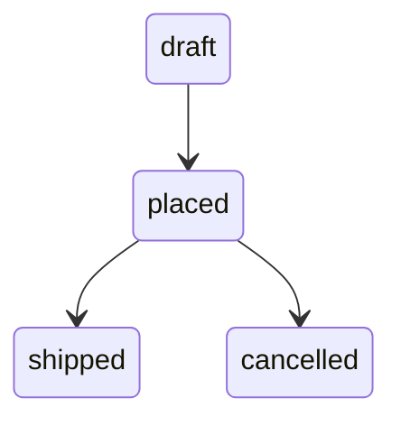

# SM-001: Order Lifecycle

## Description

An authored fixture artifact.

## Properties

| Field | Type | Multiplicity | Constraints |
|-------|------|--------------|-------------|
| current | OrderStatus | 1 | |

## Operations

### advance

| Param | Type | Multiplicity | Constraints |
|-------|------|--------------|-------------|
| to | OrderStatus | 1 | |

Returns: OrderStatus [1]

## States & Transitions

