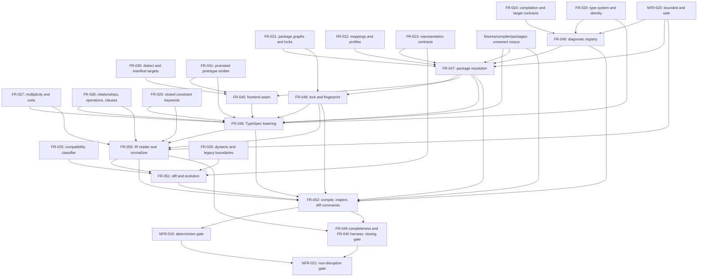

# Dependency review

## Summary

Issue #19 is the first slice in this repository that is mostly *feature* work
rather than contract authoring: FR-046, FR-051, and FR-052 deliver behaviour a
package author can run, and FR-045, FR-047, FR-048, FR-049, and FR-050 are the
enablement they stand on. The requirement graph is acyclic at the requirement
level and its declared spine — FR-049 → FR-047 → FR-048 → FR-046 → FR-050 →
FR-051 → FR-052 — is buildable in that order. Three ordering defects need a
decision before tasking. The seam of FR-045 declares a `FrontendRequest` shape
that cannot carry the resolution FR-046 requires; FR-047 reads mapping and
profile *documents* the published manifest schema does not name, in a slice that
forbids touching `schema/**`; and roughly a hundred of the 169 mapped cases run
against a fixture package corpus that no requirement's Outputs owns. Two further
requirements — FR-045 and FR-049 — are prerequisites whose own acceptance
criteria can only be discharged once the whole slice exists, so they must be
tasked as gates, not as leaves. Issue #20's independence is intact: nothing in
the slice consumes the conformance corpus.

## Findings

| ID | Severity | Summary | Refs |
|---|---|---|---|
| FND-540 | high | The seam and its only implemented frontend disagree on the interface. FR-045's `FrontendRequest` is `{ dialect, packageRoot, entrypoint, sourceIdentity, packagePath, limits }` and carries no resolved package graph, while FR-046's Inputs require "the package manifest resolved by FR-047" and its envelope rules read `package.identity`, `version`, `manifestDigest`, `mappingVersions`, `profileVersions`, and `lockDigest` from that resolution. Either the request gains a resolution member (making FR-047 and FR-048 prerequisites of FR-045, which declares neither) or every frontend resolves internally (making FR-047 a prerequisite of every frontend including issue #36's). FR-045 cannot be built to a stable contract until that is decided. | FR-045, FR-046, FR-047, FR-048, filament-core-data#36 |
| FND-541 | high | FR-047 depends on an upstream artifact it is forbidden to create. Its Inputs name "Mapping documents named by the manifest" and "Profile documents named by the manifest", and it raises `UNKNOWN_MAPPING` for "a mapping document that does not resolve" — but `package-manifest.schema.json` carries `mappings` and `profiles[].mappings` as semantic *identities*, never as paths, so no identity→document resolution exists, and `schema/**` is a prohibited path under NFR-019 and NFR-021. The same Inputs bind the manifest's build profile (`name`, `targets`, `mappings`, `compatibilityPosture`) to `profile.schema.json`, which is FR-023's *representation* profile (`authority`, `editDirection`, `roundTrip`, `allowedOmissions`) — a different artifact. FR-047 therefore has an undeclared dependency on FR-023 and on a resolution mechanism no requirement owns. | FR-047, FR-021, FR-022, FR-023, NFR-019, NFR-021 |
| FND-542 | high | The fixture package corpus is unowned enablement. FR-046-AC-1 compiles `fixtures/compiler/packages/assurance`; FR-047-AC-1..AC-5 resolve the five cases of `fixtures/semantic/v1/package-graph-cases.json`, which are abstract descriptors (`"loci": ["manifest-a:imports[0]"]`) with no package trees behind them; FR-048, FR-049, FR-050, FR-052, NFR-019, and NFR-020 all run against "the fixture package". Only `fixtures/compiler/shared/cases.json` is declared as an Output, by FR-045. Nothing owns `fixtures/compiler/packages/**`, and `fixtures/semantic/**` is prohibited, so the corpus cannot be grown there. This is a prerequisite of nearly every test in the slice and must be tasked first. | FR-045, FR-046, FR-047, FR-048, FR-052, NFR-019, NFR-020 |
| FND-543 | medium | FR-049 is both the slice's prerequisite and its closing gate. FR-049-CON-3 and FR-049-AC-2 require the registry code set to equal the set emitted anywhere under `src/compiler/`, FR-049-AC-3 requires every code reached by a test, and FR-049-AC-9 asserts CLI exit codes and an absent `--out`. None can be discharged until FR-046, FR-047, FR-048, FR-050, FR-051, and FR-052 all exist. Task the registry module as enablement first and TC-459, TC-460, TC-466, TC-471, and TC-558 as the slice's closing gate, or the graph carries the verification cycle FR-049 → FR-046..FR-052 → FR-049. | FR-049, FR-052, TC-459, TC-460, TC-466, TC-471, TC-558 |
| FND-544 | medium | FR-045's own acceptance depends on two requirements it declares downstream or not at all. FR-045-AC-4 verifies the FR-046 TypeSpec frontend, and FR-045-AC-5 plus the harness bullet compare "by the normalized serialization of FR-050"; FR-045 declares only FR-030 in frontmatter and FR-030 plus FR-041 in prose. The seam module is buildable first, but TC-401, TC-402, and TC-550 close only after FR-046 and FR-050, and FR-050 is nowhere in FR-045's graph. | FR-045, FR-046, FR-050, TC-401, TC-402, TC-550 |
| FND-545 | medium | FR-046 consumes FR-047 and FR-048 without declaring either. Its Inputs name "the package manifest resolved by FR-047" and its envelope rule sets `source.digest` "under the canonicalization of FR-048", yet its Upstream lists FR-045, FR-020, FR-027..FR-029, and FR-041 only; FR-047 and FR-048 record FR-046 as Downstream, so both edges exist in one direction only. The build order FR-047 → FR-048 → FR-046 is therefore invisible to `spec-to-plan`. (SR-067 FND-524 records the separate defect that the digest FR-046 names is not the digest FR-048 defines.) | FR-046, FR-047, FR-048 |
| FND-546 | medium | FR-046 and FR-049 disagree on the diagnostic code space. FR-046 derives a per-constraint `diagnosticCode` as `agent-ix.<package name>.<OWNER>_<KEYWORD>` from package data, so the emitted code set is a function of the input, while FR-049-CON-3 and FR-049-AC-2 require the emitted set under `src/compiler/` to equal the closed registry and NFR-020-AC-8 requires a fuzz run to produce "zero non-registry diagnostic codes". Unless the requirements say the derived constraint codes are IR content rather than compiler diagnostics and exclude them from both checks, FR-049 cannot be closed against FR-046 output. | FR-046, FR-049, NFR-020, TC-459, TC-471, TC-536 |
| FND-547 | medium | The machine-readable graph is a subset of the prose graph in eleven artifacts, so any tool reading `relationships:` gets a shorter chain than the one the authors described. Missing `depends_on` edges: US-010 → US-007 (prose names the semantic-core grammar); FR-045 → FR-041; FR-046 → FR-041 (and FR-047, FR-048 per FND-545); FR-047 → FR-022 and FR-023 (FND-541); FR-049 → FR-020; FR-050 → FR-028 and FR-048; FR-051 → NFR-013; FR-052 → FR-047, FR-048, FR-050, FR-051; NFR-019 → NFR-017; NFR-020 → FR-024; NFR-021 → NFR-012. | US-010, FR-045..FR-052, NFR-019..NFR-021 |
| FND-548 | low | FR-051's `profile`, `authority`, `mapping`, and `loss` families read artifacts owned outside its declared graph: `allowedOmissions` and `authority` come from FR-023's representation profile, `editDirection` from FR-022's mapping, and `omittedIdentities` from the FR-026 loss declarations. FR-051 declares FR-025 and FR-050 only, so four of the fourteen report families rest on undeclared upstreams. | FR-051, FR-022, FR-023, FR-026 |
| FND-549 | low | NFR-020-AC-2 puts content into another requirement's artifact: the limit defaults must be "published in the diagnostics registry document", which is FR-049's `docs/semantic-data-system/compiler-diagnostics.md`, while FR-049's Outputs and FR-049-AC-11 describe that document as codes, severities, blocking dispositions, and owners only. Either FR-049 gains the limits section or NFR-020 names its own document. | NFR-020, FR-049, TC-530 |
| FND-550 | low | One issue-level acceptance criterion cannot close inside this ticket. "Independent frontend fixtures produce equivalent IR where semantics agree" needs a second implemented dialect, which is issue #36; `spec/tests.md` records this honestly for TC-402 and TC-550, and FR-045-CON-1 declares the `spec-bundle` frontend out of scope, but no requirement states that the criterion completes with #36 — only the test narrative does. Record the gate on FR-045 so the ticket is not read as fully closing. | FR-045, TC-402, TC-550, filament-core-data#36 |

## Classification

| Requirement | Class | Rationale |
|---|---|---|
| US-010 | Feature | Author-visible outcome: one command, one reproducible IR document with its diagnostics |
| FR-045 | Enablement | The dialect registry and shared fixture harness; no behaviour of its own beyond refusing an unimplemented dialect |
| FR-046 | Feature | The lowering that turns authored TypeSpec into the contract IR — the ticket's substance |
| FR-047 | Enablement | Package graph, exports, profiles, and targets; every later stage consumes its resolution |
| FR-048 | Enablement | Canonicalization, digests, lock build and verify; reused by FR-046, FR-050, FR-051, FR-052 |
| FR-049 | Enablement | The diagnostic registry every other module emits through, plus the slice's closing completeness gate (FND-543) |
| FR-050 | Enablement | Reader, normalizer, and IR fingerprint; the definition of "the same IR" that FR-045, FR-051, and FR-052 all compare by |
| FR-051 | Feature | Compatibility report and version projections — a reviewer-visible verdict |
| FR-052 | Feature | The three commands and the narrow interface; the only surface an author or a downstream generator touches |
| NFR-019 | Enablement | Determinism gate over the whole slice; verified once the commands exist |
| NFR-020 | Enablement | Bounded and safe compilation; its limits shape the resolver, reader, and canonicalizer interfaces, so it is not a late check |
| NFR-021 | Enablement | Non-disruption and rollback gate; a branch-diff obligation verified last |

The enablement-before-feature rule bites in one place: NFR-020's five limits and
its injected reader, writer, and loader are stated as a quality gate but are an
*interface* obligation on FR-047, FR-049, and FR-050. They must be tasked with
those modules, not after them, or every module is rewritten to accept an
injected reader once NFR-019-AC-10 and NFR-020-AC-4 are attempted.

## Dependency Graph

The `FR-047 --> FR-045` edge is the one FND-540 asks the authors to confirm or
remove; the `FR-023` edges are FND-541 and FND-548; the `FIX` node is FND-542.
`GATE` is FR-049-CON-3, FR-049-AC-2, FR-049-AC-3, FR-049-AC-9 and FR-045-AC-4,
FR-045-AC-5 split out per FND-543 and FND-544. Without that split the graph
carries the cycles FR-049 → FR-047 → … → FR-052 → FR-049 and FR-045 → FR-046 →
FR-050 → FR-045.

## Logical Dependency Order

1. Decide the three ordering questions: the `FrontendRequest` shape (FND-540),
   how a manifest names a mapping or profile document without a schema change
   (FND-541), and which requirement owns `fixtures/compiler/packages/**`
   (FND-542). Each gates everything below it.
2. Enablement, parallelizable: `src/compiler/diagnostics.mjs` and the registry
   module (FR-049 minus its completeness gate), `json-locus.mjs` (FR-047's
   locator), `canonical.mjs` (FR-048's canonicalizer), the injected reader,
   writer, and loader plus the five limit constants (NFR-020), and the fixture
   package corpus.
3. FR-047 package resolution (needs the registry, the locator, the limits, and
   the corpus), then FR-048 lock build and verify (needs the resolution).
4. FR-045 seam and dialect registry once the request shape is settled; the
   `spec-bundle` refusal and `FRONTEND_DIALECTS` close here, the harness
   criteria do not.
5. FR-046 TypeSpec lowering (needs FR-045, FR-047, FR-048 and the IR v1.1 node
   shapes of FR-020, FR-027..FR-029).
6. FR-050 reader, normalizer, and IR fingerprint; FR-045-AC-5 and TC-402 close
   with it.
7. FR-051 diff and evolution projections (needs FR-050's fingerprint and the
   FR-025 corpus).
8. FR-052 commands and narrow interface (needs every module above).
9. Closing gate: FR-049 registry completeness and CLI-coupled criteria
   (TC-459, TC-460, TC-466, TC-471, TC-558), then NFR-019 determinism
   (TC-519..528) and NFR-020 safety and fuzz (TC-529..538).
10. NFR-021 branch-diff, revert rehearsal, and publication checks
    (TC-539..546) last, over the finished branch.

## Cycles

None at the requirement level once the FR-049 completeness criteria and the
FR-045 harness criteria are tasked as the closing gate (FND-543, FND-544). Two
declared edges look circular and are not: FR-049 lists FR-047, FR-048, and
FR-046 as Downstream while taking "defects reported by" them as Inputs — the
module dependency runs registry → emitter, and the Inputs sentence describes
the code set, which is why the completeness criteria are a gate. Likewise
FR-047 declares FR-049 upstream and FR-049 declares FR-047 downstream, which is
one edge stated twice, not two.

## External Ordering

- filament-core-data#34 (IR v1.1) and #35 (semantic-core grammar) are closed and
  their schemas, fixtures, and readers are the oracle this slice is measured
  against; NFR-021 and FR-050-CON-2 forbid editing them, so `1.1.0` node shapes,
  `negative/reader-cases.json`, and `compatibility/cases.json` are inputs, not
  work items. The 40 compatibility cases and the 14 report families the schema
  declares are already sufficient for FR-051-AC-1 and FR-051-AC-2.
- filament-core-data#27 is closed and is the base of this branch; issue #19's
  first listed deliverable ("promote the issue #4 `$onEmit` emitter into
  `src/`") is discharged by it, and FR-046-CON-1 deliberately builds a *second*
  lowering rather than editing the frozen prototype. Nothing in the slice
  re-does #27.
- filament-core-data#20 (conformance corpus and differential oracle) is
  independent in both directions: no requirement, acceptance criterion, or test
  case in this slice reads `conformance/`, and NFR-021-AC-5 asserts the branch
  changes nothing there. #20 judges this work; it is not a prerequisite of it.
- filament-core-data#36 (spec-bundle extraction frontend) plugs into FR-045 and
  is gated downstream of #19; it is the first producer of the second dialect, so
  cross-dialect agreement (FND-550) and any change to the `FrontendRequest`
  shape (FND-540) land with it. #36 additionally depends on quoin#286 and
  quire-rs#388, neither of which is a prerequisite of #19.
- filament-core-data#42 (host floor) blocks TC-370 and TC-382 on FR-044 only.
  NFR-019 names it upstream as context; no criterion in this slice is blocked by
  it, because FR-052-AC-1 compares `emit-ir` output on one host against
  `origin/main` rather than replaying the retained cross-language evidence.
- filament-core-data#11 (publish the generated packages) and #21, #22, #23 (the
  Rust, TypeScript, and Python backends) consume FR-046's IR and FR-052's narrow
  interface. FR-052-CON-2 keeps `package.json` `exports` unchanged, so making the
  compiler a runtime entry point stays #11's work and is not a prerequisite here.
- filament-core-data#31 (`$id` alias workaround) concerns the JSON Schema
  projection backend, which no requirement in this slice reads or emits; it stays
  independent.
