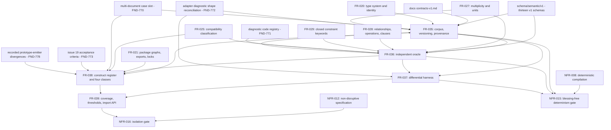

# Dependency review

## Summary

The issue #20 slice is verification enablement: it authors the corpus, the
oracle, the differential harness, the coverage account, and the import surface
that issue #19, issues #21..#23, and the issue #11 publication gate are judged
against. Its parallelism with #27 and #19 is sound in principle — the yardstick
must not be authored by the implementer — and the hard upstream prerequisites
are all merged: IR v1.1 on 014bff7, the semantic-core L3 grammar on d48b8da,
and the thirteen v1 schemas under `schema/semantic/v1/`. Nothing in the slice
waits on #27 or #19 to start.

Three prerequisites are missing rather than late. The corpus case shape — a
semantic IR base document plus a JSON Patch — has no slot for the manifest,
lock, mapping, and profile documents that six of FR-038's mandated negative
cases are about (FND-770). The contract publishes a diagnostic *pattern* but no
diagnostic *code registry* and no `pointer` field, so the oracle's codes and
diagnostic shape are authored by this ticket while NFR-016 forbids it from
touching `schema/` or `docs/` to record them (FND-771, FND-772). And FR-038-CON-2
ties the construct register to issue #19's acceptance criteria, which exist only
in the GitHub issue and are being re-specified by #19 right now — a reverse edge
into the very ticket the parallelism exists to stay independent of (FND-773).
Inside the slice the frontmatter graph carries one cycle: FR-035's own gates are
decided by the FR-036 oracle, while FR-036 declares FR-035 upstream (FND-769).

Against #27 the interference is file-level, not requirement-level: both branches
edit `package.json` and `Makefile`, and #27 is rewriting the only implementation
whose divergences FR-038-AC-5 requires the defect register to reproduce
(FND-778, FND-779). Downstream, #11 and quire-contract-ir#52 are named as
consumers by requirements that do not state what they consume (FND-774,
FND-781), and #36 — the second IR producer — appears in neither the adapter
roster nor the threshold table.

## Findings

| ID | Severity | Summary | Refs |
|---|---|---|---|
| FND-769 | high | FR-035-CON-1, FR-035-AC-2, and FR-035-AC-4 are decided by the oracle — "yields zero oracle diagnostics", "yields exactly one oracle diagnostic" — while FR-036 records FR-035 as its `depends_on` and FR-036-AC-1 needs the authored cases; this is a requirement-level cycle FR-035 → FR-036 → FR-035, broken by tasking the case schema, the base documents, the manifest, and the digest and provenance gates with FR-035, and running the three oracle-decided gates as part of the FR-036 step rather than the FR-035 step. | FR-035-CON-1, FR-035-AC-2, FR-035-AC-4, FR-036, FR-036-AC-1, TC-281, TC-283, TC-289 |
| FND-770 | high | FR-035 constructs every case input as a base document plus an ordered JSON Patch, and FR-035-CON-1 requires every base to validate against `semantic-ir.schema.json`; that schema carries `package` as digests only — `manifestDigest`, `lockDigest`, `mappingVersions`, `profileVersions` — with `additionalProperties: false` and no import list, lock body, mapping body, or profile body. FR-038-AC-2 mandates negative cases for an unresolved import, a package-graph cycle, an unknown mapping identity, a stale lock digest, and an undeclared loss, none of which can be expressed by patching a semantic IR document; the case shape needs a declared multi-document slot naming `package-manifest.schema.json`, `package-lock.schema.json`, `mapping.schema.json`, and `profile.schema.json`, and no requirement in the slice defines one. | FR-035, FR-035-CON-1, FR-038-AC-2, FR-036 Inputs, `schema/semantic/v1/semantic-ir.schema.json`, TC-281, TC-309 |
| FND-771 | high | `common.schema.json#/$defs/diagnostic` constrains `code` to the pattern `^agent-ix\.[a-z0-9-]+\.[A-Z][A-Z0-9_]+$` and publishes no code registry; FR-036 and FR-038 introduce `SCHEMA_VIOLATION`, `INVALID_DOCUMENT`, `DEPTH_LIMIT_EXCEEDED`, five distinct identity/alias/occurrence/union/collection codes, and a package-cycle code distinct from recursion. FR-035-AC-3 requires every case to quote the contract artifact its expectation was read from, so those cases have no quotable source, and NFR-016 prohibits changes under `schema/` and `docs/semantic-data-system/` — the corpus therefore becomes the de facto code authority #19 must match while being barred from recording it in the contract. The registry needs an owner: an amendment to NFR-016's permitted paths, or a companion contract ticket ahead of FR-036. | FR-035-AC-3, FR-036, FR-036-AC-4, FR-038-AC-4, NFR-016 Scope, NFR-015-AC-1, `schema/semantic/v1/common.schema.json`, TC-282, TC-292, TC-325 |
| FND-772 | high | The published diagnostic object requires `code`, `severity`, `message`, `owner`, `blocking`, `causes`, and `related` and forbids additional properties; FR-035 expected diagnostics carry `code`, `pointer`, and `locus`, and FR-036 emits `code`, `pointer`, `severity`, `message`, and `locus`. `pointer` is not an admitted property and `owner`, `blocking`, `causes`, and `related` are dropped, so `adapter-result.schema.json` is a second, corpus-owned diagnostic wire shape that no requirement reconciles with the contract one — and the #19 and #21..#23 adapters, which emit contract diagnostics, must translate into it before FR-037's ordered code-and-pointer comparison can run. | FR-035, FR-036 Outputs, FR-037, `common.schema.json#/$defs/diagnostic`, TC-280, TC-289, TC-298 |
| FND-773 | high | FR-038 takes "the issue #19 acceptance criteria" as an input, FR-038-CON-2 gates on every listed #19 criterion being covered, and TC-315 verifies it statically — but #19's criteria live only in the GitHub issue and #19 is running its own `/specify` in parallel, so the list is unversioned and moving. FR-038-CON-1 simultaneously requires every register `source` to resolve to a path under `schema/semantic/v1/` or `docs/semantic-data-system/`, which the issue text does not. This is the one reverse edge from #20 into #19; it should bind to the merged contract clauses instead, with the #19 criterion recorded as an informative cross-reference. | FR-038 Inputs, FR-038-CON-1, FR-038-CON-2, TC-314, TC-315, filament-core-data#19 |
| FND-774 | medium | NFR-015 and FR-039 name the issue #11 publication gate downstream, but #11's own acceptance criteria are about generated Rust, TypeScript, Python, and JSON Schema packages that "build, install, import, serialize, deserialize, and validate the shared golden corpus" with agreeing serialized names, nullability, defaults, and relation semantics; no case class in FR-038 covers generated-package serialization or round-trip, and FR-039's thresholds cover #19, #21, #22, and #23 only. Whether this corpus *is* #11's "shared golden corpus" is unstated, so the publication gate's consumed artifact is ambiguous. | FR-039, FR-039-AC-2, NFR-015 Dependencies, FR-038, filament-core-data#11 |
| FND-775 | medium | US-008 declares `depends_on` US-005 and US-006, its Dependencies name FR-031..FR-034, and FR-035 lists the declaration grammar and lowering table as an input — yet no output of FR-035..FR-039 consumes them: every case is an IR JSON document, and no register family covers the L3 grammar, its `KernelScalar` library, its JSON Schema projection, or the FR-034 lowering. Either the grammar dependency is soft and should be dropped from the graph, or the corpus is missing the case families for the artifact #11 publishes. | US-008, FR-035 Inputs, FR-038, FR-031, FR-032, FR-033, FR-034 |
| FND-776 | medium | FR-036's enumerated rule set omits the rule families FR-038-AC-2 requires cases for: it names relationship target resolution "to a document type or a lock export" but not import resolution, package-graph cycles, mapping identity resolution, lock digest staleness, or undeclared loss. FR-036 also returns `lossy` "when every diagnostic is a declared-loss diagnostic" while no declared-loss diagnostic code, and no loss vocabulary, exists in `schema/semantic/v1/` — the loss declaration lives in `profile.schema.json`, which the oracle's stated input set does not include. | FR-036, FR-038-AC-2, FR-021, FR-022, `profile.schema.json`, TC-309 |
| FND-777 | medium | NFR-015-AC-4 requires every disagreement with "a merged implementation in this repository" to be recorded in `divergences.json`, while FR-037-AC-5 fails the run for any register entry that no run reproduces. The merged implementations today are the `spikes/typespec-feasibility/` emitter, `test/semantic-ir-v1-1-reader.ts`, `tests/semantic_ir_reader.py`, and `test/semantic-core-lowerer.ts`; FR-037-CON-1 declares adapter rows only for #19, #21, #22, and #23, so a divergence against any of the four can never be reproduced by a run and its register entry fails the gate on the day it is written. Either the roster gains rows for the merged readers, or NFR-015-AC-4 records those disagreements outside `divergences.json`. | NFR-015-AC-4, FR-037-AC-5, FR-037-CON-1, TC-302, TC-328 |
| FND-778 | medium | FR-038-AC-5 requires the `defect` register to reproduce "every prototype-emitter divergence recorded for this issue", and US-008-EX-5 gives the nullability-substring example, but no divergence is recorded anywhere in the repository today — `spikes/typespec-feasibility/evidence/` holds capability, compatibility, toolchain, and validation records only. Discovering the divergences means running the spike emitter that issue #27 is concurrently promoting into `src/` and rewriting, so the discovery step has no owning requirement, no owning ticket, and a target that changes under it. | FR-038-AC-5, US-008-EX-5, `spikes/typespec-feasibility/evidence/`, TC-312, filament-core-data#27 |
| FND-779 | medium | The #20 and #27 branches collide on two permitted files: NFR-016 permits `package.json` for a conformance script, the `./conformance` export, and the `files` entry, while #27 must remove the `@agent-ix/typespec-semantic-ir-emitter-spike` `file:spikes/...` devDependency and add `src/` scripts; both branches also add `Makefile` targets. The changed-path gate detects out-of-scope paths but not a merge conflict on an in-scope one. NFR-016 additionally prohibits `packages/**` outright, which is now the home of the already-published `@agent-ix/semantic-core` 0.1.0 — correct as a prohibition, but it means the corpus cannot add a workspace entry for itself either. | NFR-016 Scope, NFR-016-AC-1, FR-039 Outputs, `package.json`, TC-329, filament-core-data#27, filament-core-data#40 |
| FND-780 | medium | FR-039 adds a `./conformance` subpath export and the `conformance/` directory to the published `files` list, and FR-039-AC-5 verifies a consumer importing `@agent-ix/filament-core-data/conformance` — while US-008's Constraints say the corpus "publishes no package and changes no consumer" and NFR-016-AC-4 verifies that the change publishes nothing. The export surface is additive and the test can run against a local link, but enlarging the published tarball is a packaging decision owned by #11; the requirement should state that the export lands unpublished until #11 releases it. | FR-039 Outputs, FR-039-AC-5, US-008 Constraints, NFR-016-AC-4, TC-322, TC-332, filament-core-data#11 |
| FND-781 | medium | FR-039 names `agent-ix/quire-contract-ir#52` downstream, but #52's frontends bind their type environment to the compiled *domain package* produced by filament-core-data#36, not to corpus cases; no requirement states which of `loadCorpus`, `listCases`, `buildInput`, `oracleVerdict`, or `compare` #52 or its #54 child calls. #36 is itself a second IR producer whose output the corpus is the natural judge of, yet it has no row in FR-037-CON-1's adapter roster and no row in FR-039's threshold table. | FR-039 Dependencies, FR-037-CON-1, FR-039-AC-2, FR-039-AC-7, quire-contract-ir#52, quire-contract-ir#54, filament-core-data#36 |
| FND-782 | low | The machine-readable graph and the prose disagree: FR-036 decides FR-025 compatibility dispositions in FR-036-AC-7 but records only FR-035 in frontmatter and FR-027/FR-029 in prose; FR-038-AC-6 and FR-038-AC-8 are decided by the oracle yet FR-038 does not record FR-036 in either place; FR-038's prose adds FR-021 which its frontmatter omits; NFR-016's prose adds NFR-014 which its frontmatter omits. | FR-036, FR-036-AC-7, FR-038, FR-038-AC-6, FR-038-AC-8, NFR-016 |
| FND-783 | low | The 256-node reference-expansion bound, the byte-wise UTF-8 pointer ordering, and the locale-insensitivity rule are values this ticket chooses; `contracts-v1.md` requires only that "graph depth, reference expansion, collection sizes, input bytes, and diagnostic volume must have declared finite limits", so the `derivedFrom` quote for those cases cites the obligation to declare a limit rather than the limit itself, and #19 is free to declare a different one without failing the contract. | FR-036, FR-036-AC-2, FR-036-AC-3, FR-035-AC-3, `docs/semantic-data-system/contracts-v1.md`, TC-290, TC-291 |
| FND-784 | low | FR-038 declares seventeen register families and FR-038-AC-1 demands four classes per row, a floor of sixty-eight cases before the enumerated extras — six lock and package negatives, four presence-by-nullable combinations, four recursion cases, three evolution cases, two union cases, and one case per defect row — each a separate file with a manifest digest row. No requirement bounds corpus size or states the maintenance route, which is exactly the second risk US-008 names; the 64-node `ops` budget makes the count grow rather than shrink. | FR-038-AC-1, FR-038, FR-035, US-008 Priority and Risk, TC-308 |
| FND-785 | low | NFR-016-AC-3 requires the conformance tests to run from `make test` *and* `poetry run pytest`, and NFR-016's permitted list names `tests/test_conformance_corpus.py`, but every output of FR-035..FR-039 is `.mjs` or JSON; the Python entry point must start a node process and no requirement owns it or its result contract. | NFR-016-AC-3, NFR-016 Scope, FR-036 Outputs, FR-039 Outputs, TC-331 |
| FND-786 | low | FR-035-CON-2 fixes case ids to `^[A-Z][A-Z0-9]*(-[A-Z0-9]+)*-[0-9]{2}$` — uppercase with a two-digit tail, capping any one prefix at one hundred cases — while FR-038's families are lowercase-hyphen tokens such as `field-presence` and `unknown`; no requirement maps a family to its id prefix, so the id allocation scheme that FR-038's coverage gate reports against is unstated. | FR-035-CON-2, FR-038, TC-288, TC-308 |

## Classification

| Requirement | Class | Rationale |
|---|---|---|
| US-008 | Feature | Reviewer outcome: a wrong implementation fails a gate instead of blessing itself; realized by FR-035..FR-039 |
| FR-035 | Enablement | The case, base, and manifest formats plus the provenance and digest gates every later requirement reads; no verdict on its own |
| FR-036 | Enablement | The verdict engine every gate, case, and adapter comparison is decided by; the single authority the harness compares against |
| FR-037 | Feature | The differential judgment a reviewer runs; the first requirement whose output is a pass or fail on a real implementation |
| FR-038 | Feature | The corpus content — the yardstick itself; what makes a green run mean anything |
| FR-039 | Feature | Coverage account, promotion thresholds, and the import surface downstream repositories consume |
| NFR-015 | Enablement | Blessing-free and determinism gate over the corpus, the oracle, and the harness; verified across the whole slice |
| NFR-016 | Enablement | Isolation and changed-path gate that keeps #20 out of #27's and #19's files; verified last |

FR-035 and FR-036 have no business-visible behavior; the US-008 outcome exists
only once FR-037 renders a verdict over the FR-038 corpus and FR-039 accounts
for what the verdict did and did not cover.

## Dependency Graph

The `FR-036 --> FR-035` edge is the cycle of FND-769; it disappears once the
three oracle-decided FR-035 gates are tasked into the FR-036 step. `MULTIDOC`,
`DSHAPE`, `CODES`, `AC19`, and `DEFECTS` are the five prerequisites the slice
depends on without a requirement owning them; the first three block authoring,
the last two only block the gates that cite them. `FR-036 --> FR-038` replaces
the missing frontmatter edge of FND-782: FR-038-AC-6 and FR-038-AC-8 are
decided by the oracle, not by the schema.

## Logical Dependency Order

1. Settle the five unowned prerequisites: the diagnostic code registry and its
   owning contract ticket (FND-771), the reconciliation between
   `adapter-result.schema.json` and `common.schema.json#/$defs/diagnostic`
   (FND-772), the multi-document case slot for manifest, lock, mapping, and
   profile inputs (FND-770), the replacement of FR-038-CON-2's issue-text
   binding with merged contract clauses (FND-773), and the owner of the
   prototype-emitter divergence discovery (FND-778). The first three gate every
   step below.
2. FR-035 case, manifest, and adapter-result schemas, the base documents, and
   the digest, provenance, id, and minimization gates — TC-280, TC-282,
   TC-285..288. Needs the v1 schemas, `contracts-v1.md`, FR-020, FR-027, and
   the FND-770 and FND-772 decisions.
3. FR-036 oracle: schema layer, cross-field layer, compatibility classification,
   determinism and termination — TC-289..296. Needs FR-035's case shape, FR-025,
   FR-027..FR-029, the FND-771 code registry, and the rule families FR-036 does
   not yet enumerate (FND-776). The three oracle-decided FR-035 gates — TC-281,
   TC-283, and the `origin.source` locus gate of TC-284 — run here, not in step 2.
4. FR-038 construct register and the case set — TC-308..317. Parallelizable per
   family once the oracle decides that family; the lock, package, mapping, and
   loss families wait on the FND-770 slot, and the defect family on FND-778.
5. FR-037 harness, adapter registry, and divergence register — TC-297..307.
   Needs FR-035, FR-036, and enough of FR-038 to have a case set; the registry
   rows for #19, #21, #22, and #23 are authored as `unavailable` with owning
   issues and do not wait on those tickets.
6. FR-039 coverage account, mutation catalogue, thresholds, and import API —
   TC-318..324. Needs the harness report and the finished register; the
   `./conformance` export lands unpublished pending #11 (FND-780).
7. NFR-015 verification — TC-325..328: repeat, locale-varied, and
   directory-varied runs, static import and effect analysis, and the divergence
   inspection whose scope FND-777 has to settle first.
8. NFR-016 verification — TC-329..332: changed-path gate, dependency
   inspection, offline run, publication inspection. Run last and re-run after
   any rebase onto #27's `package.json` and `Makefile` changes (FND-779).

## Cycles

One cycle at the requirement level, FR-035 → FR-036 → FR-035 (FND-769),
resolved by leaving the case schema, bases, manifest, digest, and provenance
gates with FR-035 and moving the three oracle-decided gates — FR-035-CON-1,
FR-035-AC-2, and FR-035-AC-4 — into the FR-036 step. No other edge is soft:
every remaining edge names a schema, a rule set, a case file, a register row,
or a report the dependent requirement reads.

## External Ordering

- filament-core-data#34 (IR v1.1, FR-027..FR-030) merged as 014bff7 and #35
  (semantic-core L3 grammar, FR-031..FR-034) merged as d48b8da; both stated
  blockers of the compiler chain are cleared and neither blocks this slice.
  The #35 grammar is a declared but unconsumed dependency here (FND-775).
- The thirteen v1 schemas under `schema/semantic/v1/` and
  `docs/semantic-data-system/contracts-v1.md` are merged and are the only
  authorities the corpus may derive from; `contracts-v1.md` is 256 lines and
  does not carry a diagnostic code registry, a depth bound, or a diagnostic
  ordering rule (FND-771, FND-783).
- filament-core-data#27 (promote the spike emitters into `src/`) is the head of
  the compiler chain and runs now. It does not block #20: no requirement in the
  slice reads `src/` or `spikes/`, and FR-036-AC-5 forbids the oracle from
  importing either. It sequences #20 only through the shared `package.json` and
  `Makefile` edits (FND-779) and through the divergence set of FND-778.
- filament-core-data#19 (compiler core) is judged by this corpus and must not
  author it. The only edge running the wrong way is FR-038-CON-2's binding to
  #19's acceptance criteria (FND-773); once that binds to merged contract
  clauses instead, #19 is purely downstream. #19's adapter row is authored now
  as `unavailable` with its owning issue, and FR-037-AC-4 keeps it visible as
  an unmet row rather than a skip.
- filament-core-data#21, #22, and #23 (Rust, TypeScript, Python backends)
  follow #19 in the chain of record #27 → #19 → {#21, #22, #23} → #11. They
  sequence rather than block: FR-037-CON-1 requires their registry rows today
  and FR-039-AC-2 requires their threshold rows today, both without a runnable
  command.
- filament-core-data#11 (publication) consumes the corpus as its gate and is
  the owner of the `./conformance` export's release (FND-780). What #11's own
  "shared golden corpus" criterion consumes is unstated (FND-774); publication
  still passes agent-ix/quoin#290 human sign-off regardless of this slice.
- filament-core-data#36 (spec-bundle extraction frontend) is a second producer
  of the same IR and the natural third adapter, but appears in neither the
  FR-037 roster nor the FR-039 thresholds (FND-781). It is downstream of #19
  and is not a prerequisite.
- agent-ix/quire-contract-ir#52 and its #54 child consume the compiled domain
  package from #36; their consumption of `conformance/` through the FR-039
  import API is named but unspecified (FND-781). Neither is a prerequisite, and
  neither may narrow the corpus's exported surface without a major
  `corpusVersion` bump under FR-039.
- agent-ix/quoin#286 Wave 4 module tickets and agent-ix/quoin#293 consume the
  grammar and the published packages, not the corpus; they are downstream only.
