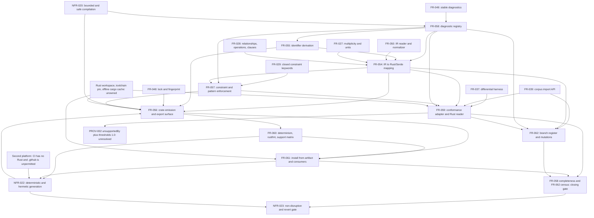

# Dependency review

## Summary

Issue #21 is the first slice in this repository whose deliverable is *another
language's build*. Every upstream it consumes is merged — #9, #19, #20, #27,
#34 and #35 are closed and their schemas, fixtures, corpus and oracle are on
disk — so nothing in FR-054..FR-062 waits on a sibling ticket's design. What it
waits on instead is an environment: there is no `Cargo.toml`, no
`rust-toolchain.toml`, no `crates/` directory, no warm cargo cache and no CI job
that can run `cargo` anywhere in this repository, and no requirement's Outputs
claims any of them. That is the slice's real prerequisite and it is invisible in
the requirement graph.

The internal graph is *not* acyclic as declared. Two two-node cycles are stated
in both directions — FR-054 ↔ FR-055 and FR-057 ↔ FR-058 — and in both cases one
of the two edges is unsupported by either requirement's own Inputs. A third
ordering problem is the familiar one from SR-068 FND-543: FR-058's registry
completeness rules and FR-062's branch register are closing gates over the whole
slice, not leaves, and must be split from the modules they name or the graph
carries a verification cycle.

On the question the brief asks directly: **the `rust-backend` adapter slot is
not blocked by GAP-011.** GAP-011 blocks the `compiler-frontend` slot (issue
#52), because that slot answers with the issue #19 compiler's reading, which is
the reading that disagrees with the oracle. The `rust-backend` slot adopts the
oracle's reading by construction (FR-059 "Divergence and dependency"), so
REF-001..004 agree with the oracle without settling anything. The evidence and
the one genuine defect this leaves behind are recorded as FND-927.

One requirement *is* genuinely blocked on an artifact outside this ticket, and
it is not FR-059's GAP-011 clause — it is FR-059's pass rate. `PROV-002` carries
an `unsupportedBy` entry naming `rust-backend`, `conformance/thresholds.json`
proposes `corpusPassRate: 1.0`, an `unsupported` answer "is never a pass" by the
registry's own rule, and every path under `conformance/` except the adapter
registry is prohibited to this branch. FND-924.

`spec-to-plan` has not run for this issue — `plan/` ends at
Plan-009 — so there is no plan ordering to check against the graph. The
Logical Dependency Order below is what that plan should be built from.

## Findings

| ID | Severity | Summary | Refs |
|---|---|---|---|
| FND-923 | high | The internal graph declares two cycles, and in each case one edge is unsupported by the requirement's own Inputs. **FR-054 ↔ FR-055**: FR-054's frontmatter carries `depends_on FR-055` and its Upstream lists FR-055; FR-055's frontmatter carries `depends_on FR-054` and its Upstream lists FR-054. FR-055's Inputs are a node's `identity`, `displayName`/`name` and the pinned reserved-word set — nothing from the mapping — and FR-055-CON-3 forbids it reading anything else, so the FR-055 → FR-054 direction is the real edge and FR-055's `depends_on FR-054` is spurious. **FR-057 ↔ FR-058**: FR-057's frontmatter carries `depends_on FR-058` while FR-057's own prose Dependencies section lists FR-058 as *Downstream*; FR-058's frontmatter omits FR-057 while FR-058's prose Upstream lists it. FR-058 owns `diagnostics.mjs`, the closed registry FR-057 addresses `UNSUPPORTED_PATTERN` and `UNKNOWN_FORMAT` through, and FR-058's Inputs name only FR-054, FR-049 and the profile — so FR-058 → FR-057 is the real edge, FR-057's frontmatter is right and both prose statements are wrong. Each file also contradicts itself, so a tool reading `relationships:` and a human reading Dependencies get different graphs. | FR-054, FR-055, FR-057, FR-058 |
| FND-924 | high | FR-059 cannot reach the proposed pass rate without a change to a file it is prohibited from touching. `conformance/cases/provenance/PROV-002.json` is the corpus's only case carrying `unsupportedBy`, and it names `rust-backend` with GAP-002 as its rationale; `conformance/adapters/registry.json` states an absent answer "is an unmet row in the coverage account, never a pass"; FR-059-AC-6 requires PROV-002 to be answered `unsupported` and counted unmet; and `conformance/thresholds.json` proposes `corpusPassRate: 1.0` over the 111 cases for the `rust-backend` row. FR-059-AC-1 quietly redefines the measure — "`matched` for every case that is not covered by a registered divergence or an `unsupportedBy` entry" — which is not what the thresholds row states, and no requirement records that the threshold was accepted in that amended form. Meanwhile FR-057 answers GAP-002 exactly, which makes PROV-002's `unsupportedBy` rationale stale; but PROV-002 is prohibited under NFR-023 and its owner, issue #20, is closed. Either #21 accepts the threshold as `110/111` in writing, or the PROV-002 amendment is filed against a live owner and sequenced before FR-059's acceptance. This is a blocking dependency with a named artifact, not a sequencing note. | FR-059, FR-057, NFR-023, `conformance/cases/provenance/PROV-002.json`, `conformance/thresholds.json`, `conformance/adapters/registry.json` |
| FND-925 | high | The whole slice rests on a Rust toolchain and workspace that do not exist and that no requirement owns. The repository has no `Cargo.toml`, no `Cargo.lock`, no `rust-toolchain.toml`, no `crates/` directory and no cargo registry cache; `Makefile` has no `cargo` or `rust` target. NFR-023 *permits* `crates/**`, `Cargo.toml`, `Cargo.lock` and `rust-toolchain.toml`, and NFR-022's Scope names "an offline workstation and an offline CI runner, both with the pinned Rust toolchain and a warm cargo cache" as operational *context* — but permission and context are not ownership. No Outputs section in FR-054..FR-062 names the workspace manifest, the toolchain pin, the MSRV pin itself, or the vendored/cached `serde` that FR-056-AC-1 (`cargo build --offline`), FR-061-AC-1 and FR-061-AC-7 (network denied, cargo offline) require. This is the direct analogue of SR-068 FND-542: a prerequisite of nearly every acceptance criterion in the slice, unowned, and therefore not tasked. | FR-056, FR-059, FR-060, FR-061, FR-062, NFR-022, NFR-023 |
| FND-926 | high | The cross-platform half of the determinism evidence has nowhere to run, and the branch is not permitted to give it one. `.github/workflows/build-test.yml` delegates to the shared Node workflow `agent-ix/nodejs-actions/.github/workflows/build-test.yml@main` and triggers on `workflow_dispatch` only — no Rust toolchain, no cargo step. NFR-023's permitted list contains no `.github/**` entry, and its prohibited list does not name it either, so adding a Rust CI job puts a path in this change's set that NFR-023-AC-1 ("every path in this change's own set is permitted") fails on, while NFR-023-AC-11 forbids widening the permitted list to absorb it. The consequence is that FR-060-AC-8, NFR-022-AC-3 and the issue's own criterion "two clean runs are byte-identical across supported platforms" close in this ticket only by recording every platform row other than the authoring host as unmet with its reason — which FR-060-CON-3 permits and the spec should state as the ticket's declared limit, rather than leaving the criterion reading as satisfiable. | NFR-023, NFR-022, FR-060, TC-717, TC-731 |
| FND-927 | medium | GAP-011 does not block the `rust-backend` slot, and the spec is honest about that — but it hands the dependency to a closed owner. The evidence: `conformance/contract-gaps.json` GAP-011 records `owningIssue: agent-ix/filament-core-data#9`, and its `finding` is about the *issue #19 compiler* emitting `ActorRef` as an unresolvable `reference` while its own `inspect` accepts the document. `plan/Plan-009-conformance-corpus-and-oracle/log.md` (2026-09-04) and issue #52 both say the same: wiring the `compiler-frontend` adapter must settle GAP-011 first, because that adapter answers with the compiler's reading. The `rust-backend` slot is a different slot with a different rationale — `conformance/adapters/registry.json` gives its `unavailable` reason as GAP-002 and `pointerCompatible: false`, and names GAP-011 nowhere — and FR-059 resolves the question by adoption, not by decision: "the adapter's reading … is the oracle's reading … SHALL record the dependency and SHALL NOT decide it". REF-001..004 pin the oracle's reading, so the adapter agrees by construction and consumes no divergence. The defect is downstream of that: issue #9 closed 2026-09-03, so FR-059-AC-14's "with issue #9 named as its owner" and FR-059's "if issue #9 settles it the other way" name an owner who cannot settle it. Either GAP-011 is reassigned to a live issue before FR-059's acceptance, or FR-059 records that the adopted reading stands until a future contract ticket reopens it. | FR-059, `conformance/contract-gaps.json` GAP-011, `conformance/adapters/registry.json`, `plan/Plan-009-conformance-corpus-and-oracle/log.md`, filament-core-data#9, filament-core-data#52 |
| FND-928 | medium | FR-059's three statements about what it may write under `conformance/` do not agree, and two of them require a prohibited path. FR-059-CON-2 permits "`adapters/registry.json`, plus `divergences.json` only where a divergence is genuinely registered"; FR-059-AC-12 requires "the changed-path set under `conformance/` for this branch is exactly `adapters/registry.json`"; FR-059-AC-14 requires "the GAP-011 dependency is recorded in the divergence or gap register", i.e. in `divergences.json` or `contract-gaps.json`. NFR-023's prohibited list is "every path under `conformance/` except `conformance/adapters/registry.json`", and NFR-023-AC-3 requires every other file under `conformance/` byte-unchanged. As written, discharging FR-059-AC-14 fails FR-059-AC-12, NFR-023-AC-1 and NFR-023-AC-3. Decide one home for that record — the natural one is `docs/semantic-data-system/rust-backend.md`, a permitted path — and make CON-2 and AC-12 say the same thing. | FR-059, NFR-023, TC-709, TC-710, TC-739 |
| FND-929 | medium | Two real upstream edges are absent from the machine-readable graph. **FR-039**: FR-059's Inputs read the corpus "through the FR-039 import API and never modified" and FR-062's Inputs read "the corpus bases and cases, read through the FR-039 import API", yet neither declares `depends_on FR-039` in frontmatter nor lists it under Upstream. **NFR-020**: FR-056's Limits section honours `maxInputBytes`, `maxDepth`, `maxNodes`, `maxCollectionItems` and `maxDiagnostics` — the five limits NFR-020 owns — and FR-058's Ordering-and-limits section honours `maxDiagnostics`, but NFR-020 appears in no `relationships:` block, no Upstream list and no `constrained_by` edge anywhere in FR-054..FR-062 or NFR-022..NFR-023. As in SR-068, the limits are an interface obligation on the emitter and the diagnostic collector, not a late gate; leaving the edge uncited means `spec-to-plan` will not sequence them together. | FR-039, NFR-020, FR-056, FR-058, FR-059, FR-062 |
| FND-930 | medium | FR-057 depends on an issue that does not exist, and #21 cannot create the record it would be filed against. FR-057's locus-path section requires the generated crate to record the divergence between the published and intended languages "naming GAP-002 and the follow-up issue that carries the line-terminator finding", and FR-057-AC-7 verifies that naming; `spec/tests.md` EC-74 and EC-75 state the finding (the published pattern's `.` cannot cross a line terminator, so the traversal guard is not actually applied past one). No such issue exists — the open set is #55, #52, #51, #49, #42, #37, #36, #31, #26, #25, #24, #23, #22, #21, #13, #12, #11, #7, #6, #5, #3 — and GAP-002 as recorded covers RE2 non-compilability only, not the line-terminator semantics. #21 owns GAP-002 but `conformance/contract-gaps.json` is a prohibited path under NFR-023, so it cannot amend the row either. File the follow-up before FR-057 is tasked, or FR-057-AC-7 is unclosable by construction. | FR-057, TC-682, TC-683, `conformance/contract-gaps.json` GAP-002, NFR-023 |
| FND-931 | medium | Two requirements are stated as features but are enablement carrying a closing gate, and must be split before tasking. **FR-058**: `diagnostics.mjs` is the registry every other module in the slice emits through, so the module is the slice's *first* task — but FR-058-CON-1 ("every code in it SHALL be reachable from a live code path"), FR-058-AC-1 ("every code in the registry is raised by a constructed input") and FR-058-AC-5 (a degradation scan "over every corpus base") cannot discharge until FR-054, FR-055, FR-056, FR-057 and FR-059 all exist. This is SR-068 FND-543 repeated one slice later. **FR-062**: the branch register and mutation catalogue are by definition a census of the finished mapping — FR-062-AC-8 checks the register against the `kind`, scalar, axis, `defaultKind`, `unknownPolicy`, constraint-keyword, recursion and diagnostic-code vocabularies — so FR-062 is the slice's terminal gate, and its `--check` mode (FR-062-CON-4, wired into `make lint`) must land with the register, not before it. Task both as `module first, completeness criteria last`, or the graph carries FR-058 → FR-054..FR-059 → FR-058. | FR-058, FR-062, TC-690, TC-694, TC-725, TC-726, TC-730 |
| FND-932 | medium | The issue's Licence clause — third-party dependencies "license-compatible, pinned, reviewed, and attributed" — has no artifact in this spec that can be checked, and the one published artifact it could rest on disagrees with the requirements. FR-056 requires `serde` "at an exact `=` version" and FR-054-CON-4/FR-054-AC-14 require it to be the sole `[dependencies]` entry, but no requirement names the version, names serde's licence (`MIT OR Apache-2.0`), or names an attribution file; FR-056's Outputs list `Cargo.toml`, `LICENSE`, `README.md` and the sources, with no `NOTICE` or third-party attribution artifact, and FR-056-CON-4 constrains only the repository's own `LICENSE`. The published `rust` row of `fixtures/semantic/v1/positive/target-contracts.json` carries `runtimeDependencies: ["serde"]` with no `exactVersion`, no `provenance` and empty `securityFindings` — while the sibling `python-pydantic-v2` row records `datamodel-code-generator` with `exactVersion: "0.76.0"` and a `provenance` block, so the shape exists and the `rust` row simply does not use it. That same row also declares `customSourceLicense: "AGPL-3.0-or-later"`, while FR-056-CON-4 and NFR-023-AC-7 require `AGPL-3.0-only`; `fixtures/**` is prohibited to this branch, so the mismatch cannot be repaired here and must be recorded and owned. | FR-054, FR-056, NFR-023, `fixtures/semantic/v1/positive/target-contracts.json`, issue #21 Licence clause |
| FND-933 | medium | The `serde`-only rule is stated over the generated crate's runtime and is silent about the dev-dependency and harness set the verification requires, which is a second unowned offline-cache prerequisite. FR-057-AC-5 and FR-057-AC-6 compare the generated matcher against "an ECMA-262 engine" over 100 000 seeded strings per pattern; FR-059-AC-11 fuzzes the Rust reader over ≥4096 mutated documents under a panic hook; FR-062-AC-5 runs each property over ≥256 generated documents with a printed seed; FR-061-CON-4 builds both consumers with `-D warnings`. In Rust those are `proptest`/`arbitrary`-shaped dev-dependencies plus a reference regex engine, and FR-061-CON-1 forbids any registry *resolve*, not just any publish — so each one is another crate that must already be in the cache FND-925 says nobody owns. FR-056 constrains `[dependencies]` only and no requirement states whether `[dev-dependencies]` are permitted, bounded, or licence-reviewed. Either state the dev-dependency policy and its cache, or state that the ECMA-262 reference engine and the generators run on the Node side against generated Rust — which is buildable, but is not what the criteria currently say. | FR-056, FR-057, FR-059, FR-061, FR-062, NFR-022 |
| FND-934 | low | Two downstream holes. **#11 (publish the generated packages)**: FR-056's Crate manifest rules require `publish = false` "unconditionally, because this issue's safety gate forbids crate publication", NFR-023-AC-5 tests that removing the emission fails, and FR-056-CON-3 says "no code path SHALL emit a manifest without it" — so #11 cannot publish anything this backend emits without editing FR-056's emitter, and neither FR-056 nor NFR-023 records that the unconditional form is expected to become conditional at the #7 gate. State it as the declared handoff, or #11 opens by reverting a constraint that a test defends. **`crates/semantic-ir/`**: FR-059's Outputs add a hand-written, independent Rust IR reader that is not generated output, that FR-059-CON-1 requires stay independent of `conformance/oracle/` and `src/compiler/ir/` forever, and that #22 and #23 have no counterpart for. NFR-023 names #11, #7, #22 and #23 downstream, but nothing says who maintains that reader after #21 closes or that #25's adversarial hardening inherits it. | FR-056, FR-059, NFR-023, filament-core-data#7, #11, #22, #23, #25 |

## Classification

| Requirement | Class | Rationale |
|---|---|---|
| US-011 | Feature | Consumer-visible outcome: a crate whose types are the contract, and a build that fails when the contract changes |
| FR-054 | Enablement | The published total mapping and the pure mapping model; every other requirement in the slice reads it or the table it publishes |
| FR-055 | Enablement | Pure identifier derivation plus the pinned reserved-word list; no behaviour of its own beyond refusing an underivable name |
| FR-056 | Feature | The emitted crate, its static export surface, its provenance constants and its output manifest — the thing a consumer receives |
| FR-057 | Feature | Enforcement at the boundary: fallible constructors, the generated matcher, and the proved validator that answers GAP-002 |
| FR-058 | Enablement | The closed diagnostic registry every module in the slice emits through, plus the slice's closing completeness gate (FND-931) |
| FR-059 | Feature | The conformance answer and the independent Rust reader — the evidence the backend is judged by rather than the backend itself |
| FR-060 | Enablement | Determinism, formatting fixed-point, goldens and the support matrix; a gate over everything FR-056 emits |
| FR-061 | Feature | Install-from-artifact and two real consumers; the only proof that "it generates" and "it is usable" are separate facts |
| FR-062 | Enablement | Branch register, property generators and mutation catalogue; a census gate over the finished mapping, terminal by construction |
| NFR-022 | Enablement | Determinism and hermeticity stated as an obligation on *inputs*, so it shapes the emitter's interfaces and cannot be a late check |
| NFR-023 | Enablement | Non-disruption, permitted-path and revert gate over the branch; verified last, against the finished change set |

The enablement-before-feature rule bites in three places. FR-055's name
derivation and FR-058's diagnostic registry are modules FR-054 and every emitter
call already assume exist, so both must be tasked before FR-054's mapping model
even though the declared graph puts FR-054 first. NFR-022's hermeticity is an
interface obligation — an injected sink, no `process.env`, no `child_process`
(FR-060-AC-6, FR-060-CON-4) — so it lands with `crate.mjs` and `index.mjs`, not
after them; the alternative is rewriting every module once NFR-022-AC-1 is
attempted. And the unowned Rust workspace of FND-925 precedes all of it: no
criterion in FR-056, FR-059, FR-060, FR-061 or FR-062 can be measured before a
`cargo` invocation is possible offline.

## Dependency Graph

`FR-058 --> FR-055`, `FR-058 --> FR-054` and `FR-055 --> FR-054` are the
corrected directions of the two declared cycles (FND-923); the reverse edges
`FR-054 --> FR-055` and `FR-057 --> FR-058` that the artifacts also assert are
omitted deliberately. `ENV` is FND-925, `CI` is FND-926, `PROV` is FND-924, and
`FR-039` and `NFR-020` are the uncited edges of FND-929. `GATE` is FR-058-CON-1,
FR-058-AC-1, FR-058-AC-5 and the whole of FR-062 split out per FND-931; without
that split the graph carries FR-058 → FR-054 → … → FR-059 → FR-058.

## Logical Dependency Order

1. Settle the four ordering questions before any task is written: which
   direction each declared cycle runs (FND-923), which requirement owns the Rust
   workspace, toolchain pin and offline cache (FND-925), what the accepted
   `rust-backend` pass rate is given PROV-002 (FND-924), and where the GAP-011
   dependency record lives now that its owner is closed (FND-927, FND-928).
   File the line-terminator follow-up FR-057-AC-7 names (FND-930).
2. Enablement, parallelizable: the Rust workspace — `Cargo.toml`,
   `rust-toolchain.toml`, the MSRV pin, the vendored or cached `serde` and the
   `make` targets that reach them; `diagnostics.mjs` and the closed registry
   (FR-058 minus its completeness criteria); `names.mjs` and
   `reserved-words.json` (FR-055); and the NFR-022 hermeticity interfaces — the
   injected sink and the five NFR-020 limit constants — as constructor
   parameters rather than as a later retrofit.
3. FR-054 mapping model and `mapping-table.json`, over the FR-050 reader and the
   FR-027/FR-028 node shapes. Pure, testable without any Rust build (TC-645..657).
4. FR-057 constraint lowering, `classifyPattern`, the generated matcher, and the
   `sourceLocus.path` proved validator with its differential harness. This is
   the slice's hardest single task and the one that discharges GAP-002; it needs
   the registry from step 2 and the mapping from step 3, and nothing below it.
5. FR-056 crate emission and output manifest, over FR-054, FR-055, FR-057 and
   the FR-048 fingerprint. First point at which a `cargo build --offline` is
   required, so it cannot start before step 2 lands.
6. FR-060 determinism, `rustfmt` fixed point, goldens and `make rust-check`;
   record every platform row the authoring host did not measure as unmet with
   its reason (FND-926, FR-060-CON-3, TC-717).
7. FR-061 packaging, install-from-artifact and the two consumers, over FR-056
   and FR-060.
8. FR-059 in two parts: `crates/semantic-ir/`, the independent reader derived
   only from `schema/semantic/v1/` and `contracts-v1.md` (FR-059-CON-1, an
   independence obligation that is cheapest to honour by writing it before
   reading any oracle code); then `crates/conformance-adapter/` and the registry
   slot. TC-698..710.
9. Closing gate: FR-058 registry completeness and the degradation scan over
   every corpus base (TC-690, TC-694), then FR-062's branch register, property
   runs and mutation catalogue (TC-725..730), then NFR-022's measured gates
   (TC-731..736).
10. NFR-023 changed-path, byte-comparison, publication, licence and revert
    rehearsals (TC-737..744) last, over the finished branch.

## Cycles

Two, both stated in both directions and both resolvable without a separation
requirement (FND-923):

- **FR-054 ↔ FR-055.** Break by deleting FR-055's `depends_on FR-054` and its
  Upstream entry. FR-055 reads only a node's own `identity`, `displayName`/`name`
  and the pinned reserved-word list, and FR-055-CON-3 forbids it reading
  anything else, so it has no dependency on the mapping model to declare.
- **FR-057 ↔ FR-058.** Break by correcting the prose: FR-057's Dependencies
  should list FR-058 as Upstream, not Downstream, and FR-058's Dependencies
  should drop FR-057 from Upstream and keep it as Downstream. FR-058's frontmatter
  should stay as it is. FR-058 owns the registry FR-057 emits through; FR-058's
  Inputs name only FR-054, FR-049, the profile and the target contract.

A third apparent cycle is not one and must not be "broken" by editing an edge:
FR-058's completeness criteria and FR-062's whole register are gates over the
finished slice, so they are tasked last rather than with the modules they name
(FND-931). FR-059 → FR-062 → (nothing back) is acyclic once that split is made.

## External Ordering

- **filament-core-data#9, #19, #20, #27, #34, #35 are all closed**, and every
  upstream this slice cites is on disk: `schema/semantic/v1/` (13 schemas
  including `compiler-request` and `output-manifest`),
  `fixtures/semantic/v1/positive/target-contracts.json`,
  `fixtures/semantic/v1/target-verdicts.json`, `conformance/` with its 111
  cases, four bases, oracle, thresholds and registry. Nothing in FR-054..FR-062
  waits on a sibling ticket's *design*; the waiting is on the environment
  (FND-925) and on two records whose owners have closed (FND-924, FND-927).
- **filament-core-data#52** is the ticket GAP-011 blocks, and it is a different
  slot: it wires the `compiler-frontend` adapter to the issue #19 compiler,
  whose reading of an unresolvable `reference` target is the one that disagrees
  with the oracle. #21 fills the `rust-backend` slot and adopts the oracle's
  reading, so #52 is neither a prerequisite nor a consequence of #21, and the
  two slots can be filled in either order. Both change the same file,
  `conformance/adapters/registry.json`, in different entries, so they conflict
  textually and not semantically.
- **filament-core-data#22 and #23** allocate ids from their own reserved ranges
  and face the same mapping questions in TypeScript and Python; `spec/tests.md`
  records that `spec/tests.md` conflicts across the three branches are resolved
  by keeping every id block. They share FR-054's *questions* but not its table —
  the mapping table, the diagnostic registry and the branch register are all
  `rust-backend`-namespaced — so no artifact of this slice is a prerequisite of
  theirs, and none of theirs is a prerequisite of this one.
- **filament-core-data#25** (property, fuzz, mutation and adversarial hardening)
  is FR-062's declared Downstream and owns GAP-010. FR-062 delivers the branch
  register, the seeded generators and the mutation catalogue for the Rust
  backend only; #25 inherits them. Nothing in FR-062 waits on #25.
- **filament-core-data#7** (cross-language compatibility gate) and **#11**
  (publish the generated packages) are the two gates the issue's safety clause
  names, and both are downstream. The `publish = false` handoff to #11 is the
  hole recorded in FND-934.
- **filament-core-data#42** (the `spike:typespec:check` reproducibility defect)
  is cited in NFR-022's Rationale as the lesson, not as a dependency: no
  criterion in this slice replays that evidence. It stays independent.
- **filament-core-data#55 and #51** concern permitted-path and changed-path gate
  defects in sibling suites; NFR-023 already lands the fixed-at-both-ends form
  and reuses `changeRange` from `test/changed-paths.ts` (present at line 93), so
  this slice consumes the fix rather than waiting on either ticket.
