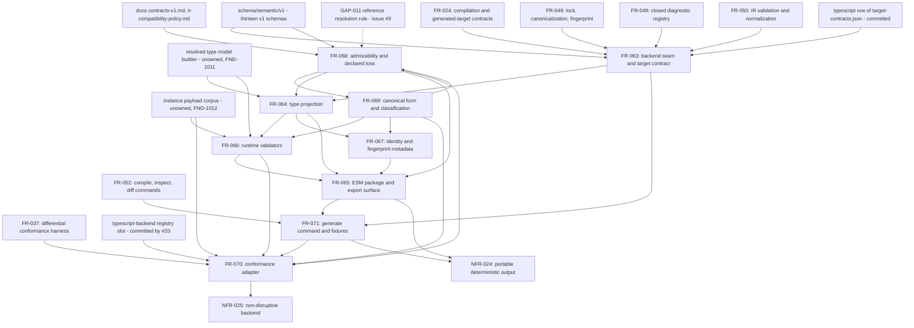

# Dependency review

## Summary

Issue #22 is the first slice in this programme that is mostly *feature* rather
than enablement: seven of its nine functional requirements produce something a
consumer holds — types, validators, identity data, a package, a command — and
only FR-063 and FR-068 are pure enablement. Its hard upstream prerequisites are
all merged and none of them moves: the thirteen v1 schemas, the contract IR
`1.1.0` compiler of issue #19 at `f412bda`, and the conformance corpus and
oracle of issue #20 at `c1b8807`. The `typescript-backend` adapter slot,
`conformance/thresholds.json`'s `typescript-backend` row, and the `typescript`
row of `fixtures/semantic/v1/positive/target-contracts.json` were all authored
in advance by other tickets and name this one as their owner. That is unusually
good ground to start from, and the bundle is right that it does not need issue
#52: #52 wires the `compiler-frontend` slot, and nothing in FR-070 touches it.

Three dependencies are wrong rather than late, and all three are edges into work
that is happening *right now* rather than work that is missing.

The first is issue #21. Its FR-054..FR-062 build `src/compiler/backends/rust-serde/`
with its own entry point `generateRust(request, sink)` — an entry point that
writes — and register with no seam at all. FR-063 meanwhile registers `rust` as
declared-unimplemented and FR-063-AC-3 asserts that `generateTarget("rust")`
returns `state: "unavailable"`. Both branches are correct about their own
ticket; the trunk they merge onto is where `rust` is implemented *and* declared
unimplemented, with two incompatible backend contracts in one directory
(FND-1010). This is the merge-degrading guard family in a new disguise: an
assertion whose subject is a sibling's absence.

The second is that the bundle depends on two artifacts nobody produces. FR-064
and FR-066 both consume "the resolved type model", FR-064 credits FR-068 with
producing it, and FR-068's `## Outputs` produce `{ resultState, diagnostics }`
and a loss list and nothing else (FND-1011) — and under TC-327 an unowned module
under `src/compiler/` fails a gate rather than merely reading oddly. And FR-066
and FR-070 judge the generated validators against "positive payloads" and
"negative payloads" that do not exist: `corpus-case.schema.json` is
`additionalProperties: false` with no payload member, both negative fixture sets
are IR-*document* negatives, and `conformance/coverage.json` already records the
absence as `UA-serialization-parity`, an unmet area co-owned by this issue
(FND-1012).

The third is arithmetic that encodes a merge order. FR-070-AC-8 requires the
regenerated coverage account to record "333 unmet cases". That is true only if
#22 is the first of the three backends to merge; `coverage.json` is generated
from the registry by every harness run, and #21 flips its own slot in the same
window (FND-1013, FND-1015).

Inside the slice the graph is otherwise clean and mostly a fan-out from FR-063
and FR-068, with one requirement-level cycle: FR-068 orders its diagnostics by
"canonical form", which is FR-069's, while FR-069 declares FR-068 upstream
(FND-1014).

Acted on in the review pass: FND-1011's unowned model gained an owner and a
declared shape, FND-1012's absent payload corpus was replaced by an authored one
with a second decider, and every merge-order-dependent count was removed from
the bundle. The two findings no single branch can close — the sibling seam
contract of FND-1010 and the shared generated artifacts of FND-1013 and FND-1015
— were filed as `agent-ix/filament-core-data#63`. The per-finding record is the
disposition table at the end of this document.

## Findings

| ID | Severity | Summary | Refs |
|---|---|---|---|
| FND-1010 | high | Issue #21 builds `src/compiler/backends/rust-serde/` with entry point `generateRust(request, sink)` and registers with no backend seam, while FR-063 registers `rust` as declared-unimplemented and FR-063-AC-3 asserts `generateTarget("rust")` returns `state: "unavailable"` with `BACKEND_NOT_IMPLEMENTED`. After both merge the assertion is false, and the directory holds two incompatible backend contracts — FR-063 requires a backend to return a file map and forbids the seam to write, #21's entry point is "the one entry point that writes". The registration must be a fact about what *this* change set registered, or the two tickets must agree one contract; the resolution belongs above both branches. | FR-063, FR-063-AC-3, FR-063-CON-1, FR-063 Behavior ("The seam SHALL write no file"), filament-core-data#21 FR-056 Outputs, TC-747 |
| FND-1011 | high | FR-064 Inputs name "the resolved model that requirement [FR-068] produces" and FR-066 Inputs name "the resolved type model FR-064 builds", but FR-068's `## Outputs` are `admitIr` returning `{ resultState, diagnostics }` plus `representability` and `REFERENCE_POLICY`, and FR-064's are `renderTypes(model)` and the name helpers — all of which *consume* a model. No requirement owns building it. TC-327 resolves ownership of every file under `src/compiler/` from the `## Outputs` sections, so the module that builds the model would be unowned and fail that gate the day it is written. Give the model builder an owner and a named output. | FR-064 Inputs, FR-064 Outputs, FR-066 Inputs, FR-068 Outputs, TC-327, TC-755, TC-776 |
| FND-1012 | high | FR-066-AC-1, FR-066-AC-2, FR-070-AC-11, and FR-070's "positive payload the case supplies" require instance payloads for the generated types. `conformance/schema/corpus-case.schema.json` is `additionalProperties: false` and carries no payload member; `fixtures/semantic/v1/negative/cases.json` and `reader-cases.json` are IR-document negatives keyed on `agent-ix.semantic-ir.*` codes, not instances of a generated domain type; and `conformance/coverage.json` records `UA-serialization-parity` — "no generated Rust, TypeScript, or Python package exists to serialize; the corpus judges the IR document layer only" — as an unmet area owned in part by #22. FR-070-AC-9 forbids editing `conformance/cases/**`, so the payloads cannot go there either. Either a payload corpus gets an owning requirement and a permitted home under `test/fixtures/backends/typescript/`, or these criteria are restated against what the corpus actually supplies. A payload corpus authored by this ticket is also authored by the implementer, which is the first risk US-012 names. | FR-066-AC-1, FR-066-AC-2, FR-066 Inputs, FR-070-AC-11, FR-070-AC-9, `conformance/schema/corpus-case.schema.json`, `conformance/coverage.json` UA-serialization-parity, US-012 Priority and Risk, TC-776, TC-777, TC-823 |
| FND-1013 | high | FR-070-AC-8 requires the regenerated `conformance/coverage.json` to record "333 unmet cases". That figure is a fact about merge order, not about this change: `coverage.json` is regenerated from the registry on every harness run, and issue #21's FR-059 flips the `rust-backend` slot in the same window. Whichever of #21, #22, #23 merges second finds the committed count already moved and the criterion red for work it did not do. State the criterion as "111 fewer unmet rows than the account carried before this change, and zero unmet rows against `typescript-backend`", which is true whatever else has landed. FR-070-CON-6 already has the right instinct — read the figure from the account rather than restate it — and AC-8 contradicts it. | FR-070-AC-8, FR-070-CON-6, FR-070 Behavior ("111 fewer unmet cases than the committed 444"), filament-core-data#21 FR-059, TC-822 |
| FND-1014 | medium | FR-068 orders diagnostics "by pointer, then code, then message, then canonical form", and the canonical form is FR-069's `canonicalize`; FR-069 declares FR-068 upstream because `classifySurface` returns `invalid` for an inadmissible document. That is a requirement-level cycle FR-068 → FR-069 → FR-068, and FR-068's frontmatter does not declare the edge it depends on. It splits cleanly: `canonical.mjs` needs nothing from admissibility, `classify.mjs` needs all of it. Task `canonicalize`/`digestOf` ahead of FR-068 and leave `classifySurface` after it, and declare the FR-068 → FR-069 edge on the canonicalization half only. | FR-068 Behavior (diagnostic order), FR-068 frontmatter, FR-069 Behavior (`classifySurface` … `invalid`), FR-069 frontmatter, TC-795, TC-806 |
| FND-1015 | medium | `conformance/coverage.json` is machine-generated and all three backend branches regenerate it from a registry each has edited; `conformance/adapters/registry.json`, `src/compiler/inventory.json`, `docs/semantic-data-system/compiler-diagnostics.md` and `spec/tests.md` are the same shape. NFR-025 permits each of them, and FR-070-AC-14 requires the other three registry rows byte-unchanged — correct for this branch, and silent about the rebase. Nothing in the bundle says that the generated files are regenerated rather than merged, that the hand-edited ones keep both id blocks, or that `coverage.json` must be recomputed after any rebase rather than resolved by taking a side. A conflict on a generated file resolved by hand is how a stale account gets committed. | NFR-025 Scope, FR-070 Outputs, FR-070-AC-8, FR-070-AC-14, filament-core-data#21 FR-059, filament-core-data#23, TC-824, TC-839 |
| FND-1016 | medium | The GAP-011 dependency is properly declared and this ticket can land without issue #9 moving — that part is right, and framing `strict` as conformance with the corpus's published reading rather than as a ruling is the correct posture. But FR-068-CON-3's claim that the blast radius is one constant is verified only for the backend's own source. FR-068-AC-12 exercises the two settings against `admitIr` and asserts "no other line of the backend changes"; nothing exercises *generation* under `open` — FR-064 defers reference resolution to FR-068 and never says what a `reference` whose target does not resolve renders as — and nothing accounts for the corpus side, where flipping to `open` makes REF-001..004 diverge and requires a divergence entry with an owner, a verdict, and a review date. Say what `open` generates, and say that the corpus consequence is four divergence rows rather than nothing. | FR-068-CON-3, FR-068-AC-12, FR-068 "The GAP-011 reference policy", FR-064 Behavior (`reference`), FR-070 Open contract questions, `conformance/contract-gaps.json` GAP-011, TC-805, TC-763 |
| FND-1017 | medium | `spec/tests.md`, `spec/spec.md`, `spec/index.md`, and `spec/log.md` are edited by all three backend branches concurrently — #21 holds FR-054..062, NFR-022..023, TC-645..744; #22 holds FR-063..071, NFR-024..025, TC-745..844; #23 holds US-013, FR-072..080, NFR-026..027, TC-845..944 — and the id ranges are disjoint by allocation rather than by anything a gate checks. No artifact in the bundle records the resolution rule, so the first rebase is decided by whoever runs it. Record in `spec/log.md` that a conflict in these four files is resolved by keeping every branch's id block and never by renumbering, and that `scripts/test-matrix-summary.mjs` is re-run after the merge rather than the summary table being merged by hand. | `spec/tests.md`, `spec/spec.md`, `spec/index.md`, `spec/log.md`, NFR-025 Scope, filament-core-data#21, filament-core-data#23 |
| FND-1018 | low | FR-070 correctly leaves the `typescript-backend` row of `conformance/thresholds.json` at `status: "proposed"` — accepting a threshold is the publication gate's act — and the registry-to-thresholds bijection the harness checks in both directions is untouched. What no requirement states is the disposition when a measured figure misses a proposed threshold: `corpusPassRate 1.0` and `permittedDivergences 0` are proposed for this adapter, and FR-070 requires divergences to be recorded rather than resolved, so a run with one divergence satisfies FR-070 and misses the proposal. Say explicitly that the measurement is reported against the proposal and that missing it blocks issue #11 rather than this ticket. | FR-070 Behavior (thresholds), FR-070-AC-4, FR-070-AC-13, `conformance/thresholds.json`, TC-819 |
| FND-1019 | low | `conformance/coverage.json` carries `UA-live-adapters`, an unmet area owned jointly by issues #19, #21, #22, and #23. This ticket narrows it without closing it, and FR-070 says nothing about whether the area's row is expected to change, so a reviewer comparing the regenerated account cannot tell an expected movement from an unexpected one. One sentence in FR-070 naming which unmet-area rows this change is expected to move and which it is not would make the regenerated file reviewable. | FR-070 Behavior (accounting), FR-070-AC-8, `conformance/coverage.json` UA-live-adapters, TC-822 |

## Classification

| Requirement | Class | Rationale |
|---|---|---|
| US-012 | Feature | Consumer outcome: typecheck against the contract at build time and check untrusted input at run time; realized by FR-063..FR-071 |
| FR-063 | Enablement | The seam, the target registry, and the request/manifest boundary; produces no consumer-visible artifact of its own |
| FR-064 | Feature | The generated types — the first thing a consumer holds |
| FR-065 | Feature | The package and its export surface; what a consumer installs and bundles |
| FR-066 | Feature | The runtime validators; the half of US-012 that erased TypeScript types cannot do |
| FR-067 | Feature | Identity and provenance data a consumer reads |
| FR-068 | Enablement | The backend's own admissibility reader and loss register; decides whether anything is generated at all, and is the half the oracle compares against |
| FR-069 | Enablement | Canonical form and IR-surface classification; needed by FR-066's uniqueness rule, FR-067's fingerprint, and the adapter answer |
| FR-070 | Feature | The conformance verdict; the acceptance evidence for everything above it |
| FR-071 | Feature | The command and the committed fixtures; how a person reaches the backend |
| NFR-024 | Enablement | Portability and determinism gate over the generated bytes; verified across the whole slice |
| NFR-025 | Enablement | Non-disruption and change-set gate; verified last |

FR-063 and FR-068 have no consumer-visible behavior of their own, and FR-069 has
none that US-012 names — its canonical form and classification exist because
FR-066, FR-067, and FR-070 read them. Everything else is feature work whose
absence a consumer would notice.

## Dependency Graph

The `FR-069 --> FR-068` edge is the cycle of FND-1014 and disappears once the
canonicalization half is tasked ahead of admissibility and only
`classifySurface` is left downstream of it. `MODEL` and `PAYLOAD` are the two
prerequisites this slice depends on with no requirement owning them; `MODEL`
blocks authoring FR-064 and FR-066, `PAYLOAD` blocks only their acceptance
criteria and FR-070's. `GAP011` is drawn dashed because it is a declared
dependency this ticket may land without, not a blocker.

The graph is a fan-out, not a chain: FR-064, FR-067, and FR-069's
canonicalization half can proceed in parallel once FR-063 and the model builder
exist, and FR-065 is the join. FR-071 is on the critical path to FR-070 only
because FR-070's generation criteria need a command to run.

## Logical Dependency Order

1. Settle the four unowned or misdirected prerequisites: give the resolved type
   model builder an owning requirement and a named output (FND-1011); decide
   where the instance payload corpus lives and who authors it, or restate the
   criteria that consume it (FND-1012); restate FR-070-AC-8's count as a
   relative figure (FND-1013); and split FR-069's dependency so the cycle
   disappears (FND-1014). The first two gate authoring; the second two gate
   only the gates.
2. FR-063 seam, target registry, request validation, manifest assembly, and the
   `target-contract.json` declaration — TC-745..754. Needs only merged work.
   The `rust` registration must be reconciled with issue #21 before it is
   written (FND-1010).
3. FR-069 canonicalization half — `canonicalize`, `IDENTITY_SET_PATHS`,
   `normalizeIrForTarget`, `digestOf`. No dependency on admissibility; needed by
   FR-066's uniqueness rule, FR-067's fingerprint, and FR-070's `normalized`.
4. FR-068 admissibility, the closed code register, declared loss, and
   `REFERENCE_POLICY` — TC-795..805. Needs the canonical form from step 3 for
   its diagnostic tie-break.
5. The resolved model builder, wherever FND-1011 places it.
6. FR-064 type projection and FR-067 identity and metadata — TC-755..765,
   TC-787..794 — in parallel; neither reads the other.
7. FR-066 validators — TC-776..786. Needs FR-064's model and FR-069's canonical
   element form; its acceptance criteria need the FND-1012 payloads.
8. FR-065 package assembly and export surface — TC-766..775. The join: needs
   FR-064, FR-066, FR-067, and FR-068's loss answer.
9. FR-069 classification half — `classifySurface`, `CLASSIFICATION_ORDER` —
   TC-806..814. Needs FR-068.
10. FR-071 `generate` verb, make targets, committed fixtures, type-level
    fixtures, bundle-surface record — TC-825..833.
11. FR-070 adapter, registry row, coverage regeneration, inventory discharge —
    TC-815..824. Last of the functional work, because it consumes every other
    requirement's output and its generation criteria need FR-071's command.
12. NFR-024 determinism and portability verification — TC-834..838 — then
    NFR-025 non-disruption — TC-839..844 — re-run after any rebase onto a
    sibling backend branch (FND-1015).

## Cycles

One cycle at the requirement level, FR-068 → FR-069 → FR-068 (FND-1014),
resolved by splitting FR-069 at its own seam: `canonical.mjs` is a pure utility
over a JSON value and depends on nothing in this slice; `classify.mjs` depends
on FR-068's admissibility answer. No other edge is soft — every remaining edge
names a module, a rendered text, a manifest member, or a verdict the dependent
requirement reads.

FR-070 and FR-071 look mutually dependent and are not: FR-071 declares FR-070
downstream and FR-070 does not declare FR-071 upstream, while FR-070's
generation criteria (AC-10, AC-11, AC-12) run the command FR-071 provides. The
edge is real and one-directional; FR-070's frontmatter is missing it.

## External Ordering

- **filament-core-data#19** (contract compiler) merged at `f412bda` and #20
  (corpus and oracle) at `c1b8807`. Both are hard prerequisites and both are
  merged; nothing in this slice waits on either. FR-068 and FR-069 are
  deliberately *not* allowed to reuse #19's reader, normalizer, or diff, which
  is the right call and is what makes their agreement evidence.
- **filament-core-data#20** additionally pre-authored three artifacts this
  ticket consumes and may not edit: the `typescript-backend` registry slot, its
  `thresholds.json` row, and the `adapter-result.schema.json` contract. The slot
  says in as many words that supplying the command is the owning issue's
  obligation, so FR-070 is discharging a debt rather than negotiating one.
- **filament-core-data#21** is the one genuinely dangerous edge (FND-1010). It
  is a sibling, not an upstream: it neither blocks nor is blocked by #22, and
  the two collide only on the trunk. `src/compiler/inventory.json` is the second
  collision — FR-070 correctly leaves the `rust-serde-backend` component
  byte-unchanged, and #21 must leave `typescript-backend` alone in return, which
  no artifact on either side states.
- **filament-core-data#23** takes a different route entirely — a sandboxed
  `datamodel-code-generator` invocation rather than an owned emitter — so it
  does not collide on the seam. It collides on the same four spec files, on
  `conformance/adapters/registry.json`, and on `coverage.json` (FND-1015,
  FND-1017). Its FR-074-AC-10 measures against `origin/main`, which is the
  silent shape of the merge-degrading guard family; that belongs to #23's review
  and is noted here only because it is the same defect class FND-1013 names.
- **filament-core-data#52** wires the `compiler-frontend` slot and is correctly
  declared as neither blocking nor blocked. FR-070-AC-14 requires that row
  byte-unchanged, which is the right guarantee to give #52.
- **filament-core-data#9** owns GAP-003 (the sealed diagnostic has no location
  member), GAP-004 (the canonicalization algorithm is named and undefined),
  GAP-006 (`resultState` admits unassigned values), and GAP-011 (the
  `reference` resolution rule). All four are cited rather than amended, which is
  correct; only GAP-011 has a behavioural consequence here (FND-1016).
- **filament-core-data#25** owns GAP-010, the unordered unknown-policy
  tightening direction, cited by FR-069. Not a prerequisite.
- **filament-core-data#11** consumes this work as publication evidence behind
  the `agent-ix/quoin#290` human sign-off. The gate has not moved, and
  FR-063-CON-4, FR-065's non-publication rule, FR-070-CON-4, and FR-071-CON-4
  each keep this ticket on the correct side of it.
- **filament-core-data#49** (regenerating committed artefacts in place) is
  correctly treated as a defect not to repeat: FR-071 sends every regeneration
  to a scratch directory and FR-071-AC-12 asserts an unchanged
  `git status --porcelain`. This slice adds no new entry to
  `REGENERATED_IN_PLACE`.
- **filament-core-data#42** (the host floor in the retained issue #4 evidence)
  is not on any path here; FR-071-AC-13 only re-runs the `emit-ir` golden
  comparison, which #42 does not block.

## Review-pass disposition

| Finding | Disposition | Where |
|---|---|---|
| FND-1010 | Acted on, and deferred with owner | FR-063-AC-3 no longer asserts that `rust` is unimplemented; it exercises the *mechanism* over a synthetic registration, and FR-063-AC-19 asserts only that every registry entry carries an owning issue. FR-063's Behavior now decides `isBackendImplemented` from the registry rather than from a restated list, "so that a later ticket registering its own backend needs no edit here", and FR-063-CON-1 says the same. Reconciling issue #21's `generateRust(request, sink)` entry point with this seam's file-map contract sits above both branches and belongs to `agent-ix/filament-core-data#63`. |
| FND-1011 | Acted on | FR-064 now owns `src/compiler/backends/typescript-v1/model.mjs` and `model.d.mts`, and declares the model's shape under its own Behavior sub-heading: the `package` block, `contractVersion`, one entry per definition in code-point identity order, the resolved scalar, fields with the three axes already decided, variants, constraints attached through the alias chain, relationships, operations, occurrences and document-level extensions. `buildModel` is stated pure and total over an admitted document (FR-064-AC-18, FR-064-AC-19, FR-064-CON-6, FR-064-CON-7). FR-065, FR-066 and FR-067 name FR-064 as the producer. |
| FND-1012 | Acted on | FR-066 owns an authored instance corpus at `test/fixtures/backends/typescript/instances/` with a stated case shape and an explicit never-blessed-from-a-run rule, cross-checked against `ajv@8.20.0` — already a pinned devDependency — over a JSON Schema authored beside each case. FR-070 now asserts only what the corpus can decide: that every admitted case generates and typechecks, and that the admissibility answer agrees with the oracle. |
| FND-1013 | Acted on, and filed | The figure is gone from FR-070; the requirement states the slot delta read from the regenerated account, and FR-070-CON-7 and FR-070-AC-20 forbid a whole-corpus absolute returning. The reconciliation across three concurrent branches is `agent-ix/filament-core-data#63`. |
| FND-1014 | Acted on | FR-069 now states plainly that canonicalization depends on nothing from admissibility, so FR-068 and FR-069 do not form a cycle; FR-068's diagnostic ordering consumes `canonicalize` and `canonicalize` consumes no admissibility answer. |
| FND-1015 | Acted on, and filed | NFR-025's Rationale now records that `conformance/coverage.json`, `docs/semantic-data-system/compiler-diagnostics.md` and `src/compiler/inventory.json` are machine-generated or shared with issues #21 and #23, that none is merged textually on a rebase, and that each is regenerated from the rebased tree. The cross-branch owner is `agent-ix/filament-core-data#63`. |
| FND-1016 | Acted on | FR-068 keeps `REFERENCE_POLICY` as the single named GAP-011 constant and now adds the third possibility this review's sibling raised — a reference target may legitimately name an identity in an imported package, so the answer depends on `importedExports`, which a corpus case may not carry, and its absence is a suppression rather than a decision. The citation was corrected: `agent-ix/filament-core-data#9` is closed and can decide nothing, so FR-068 cites the gap row plus `agent-ix/filament-core-data#59`, which records that and asks for a live owner. |
| FND-1017 | Deferred with owner | The four shared `spec/` files remain a merge surface across #21, #22 and #23. This bundle removed the semantic half of the conflict — no criterion here depends on another branch's content — and the textual half is recorded against `agent-ix/filament-core-data#63` alongside the machine-generated artifacts, which have the same resolution rule. |
| FND-1018 | Acted on | FR-070 now records the threshold asymmetry as the corpus's own proposal — `rust-backend` one permitted divergence, `typescript-backend` zero — states that every row stays `proposed`, and states that accepting a row is the publication gate's act and not this ticket's. FR-070-CON-8 and FR-070-AC-17 add the first-run divergence count as the measure this ticket does commit to. |
| FND-1019 | Deferred with owner | `coverage.json`'s `UA-live-adapters` row is narrowed by this adapter without the bundle saying which unmet areas move. It is a fact about the regenerated account rather than about this requirement, and it belongs with the other shared-artifact reconciliation at `agent-ix/filament-core-data#63`. |
