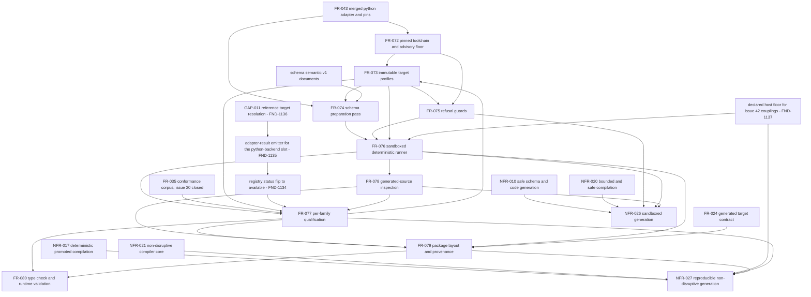

# Dependency review

## Summary

The issue #23 slice is feature work sitting on merged enablement. Every hard
upstream prerequisite is already in the tree: FR-043's adapter and its pinned
constants `DATAMODEL_CODEGEN_VERSION = "0.76.0"` and `PYDANTIC_VERSION =
"2.12.5"` in `src/compiler/backends/python-pins.mjs`, the thirteen published
`schema/semantic/v1/*.schema.json` documents, and the issue #20 conformance
corpus, whose ticket is CLOSED. Nothing in FR-072..FR-080 reads the issue #19
compiler, the issue #21 Rust crate, or the issue #22 TypeScript package, so
none of them gates a start. The slice can be tasked today.

The genuinely blocked obligation is exactly one, and the spec locates it in the
wrong place. `conformance/adapters/registry.json` records the `python-backend`
slot's `owningIssue` as **`agent-ix/filament-core-data#23`** — this ticket —
and its `ownership` note says supplying the adapter command and an emitter "is
the owning issue's obligation, not issue #20's". Issue #52 wires the
`compiler-frontend` slot only, and its own acceptance criteria say "the other
three slots stay `unavailable` with their owning issues". US-013's Context,
`spec.md` §2.2, and the tests.md Coverage Gaps note all assert instead that
"wiring that slot is issue #52 and is blocked on GAP-011", which converts this
ticket's own unowned deliverable into someone else's blocker (FND-1133). The
consequence is that FR-077's corpus obligation is honestly *worded* — "where
the `python-backend` adapter slot is available", unmet rows reported as unmet —
while being unsatisfiable by construction, because the only edit that could
make the slot available is an edit to `conformance/`, which FR-077-AC-10,
FR-077-CON-3, and both NFRs' prohibited-path lists forbid (FND-1134). No
requirement in the slice produces an `adapter-result.schema.json` emitter at
all (FND-1135), and `conformance/thresholds.json` already proposes
`corpusPassRate: 1.0` with `permittedDivergences: 0` for this adapter, a
target generated Pydantic models cannot reach because the oracle's verdicts on
GAP-001, GAP-009, and GAP-011 are cross-field rules no generated model emits.

GAP-011 is a real coupling into this ticket rather than a borrowed one — its
own consequence text names "a generated-package backend" — and the slice
records no disposition for it (FND-1136). The issue #42 host-reproducibility
shape is reproduced verbatim by FR-072-AC-6, the FR-076 fingerprint, and
NFR-027-AC-3, and #42 is named nowhere in the slice (FND-1137). Inside the
slice the graph carries one cycle, FR-073 → FR-077 → FR-073 (FND-1138), and
one ordering conflict where FR-078's hard failure preempts the measurement
FR-077 is required to take (FND-1139). Against #21 and #22 the interference is
file-level, and `spec/tests.md` is a guaranteed conflict rather than a possible
one (FND-1142).

## Findings

| ID | Severity | Summary | Refs | Escape Cause |
|---|---|---|---|---|
| FND-1133 | high | US-013's Context, `spec.md` §2.2, and the tests.md Coverage Gaps note all state that wiring the corpus `python-backend` adapter slot "is issue #52 and is blocked on GAP-011", and §2.2 puts it Out of Scope on that basis. Issue #52 is scoped to the `compiler-frontend` slot alone and its acceptance criteria say "the other three slots stay `unavailable` with their owning issues"; `conformance/adapters/registry.json` records the `python-backend` slot's `owningIssue` as `agent-ix/filament-core-data#23`, and its `ownership` note assigns the adapter command and the result emitter to the owning issue. The obligation is therefore unowned, not blocked — no ticket will discharge it — and the spec's honesty about the slot being `unavailable` rests on an attribution that is false. | US-013 Context, `spec.md` §2.2, `spec/tests.md` Coverage Gaps, `conformance/adapters/registry.json`, filament-core-data#52 | wrong-requirement |
| FND-1134 | high | FR-077's corpus obligation is honestly worded and structurally vacuous. It runs the corpus "where the `python-backend` adapter slot is available", records unrun cases as unmet naming the blocking dependency, and counts no unrun row as a pass — but the slot's `status` lives in `conformance/adapters/registry.json`, which FR-077-AC-10 requires to be unchanged from `origin/main`, FR-077-CON-3 forbids editing, and NFR-026 and NFR-027 both list under prohibited paths (`conformance/**`). The slot is therefore `unavailable` for the whole life of the branch by construction, `conformance/coverage.json` keeps its 111 unmet rows, and TC-903 can only ever assert 111 unmet and zero passes. Issue #23's headline acceptance criterion — "the full conformance corpus imports, validates, serializes, rejects invalid values, and agrees with the independent oracle for every supported output family" — is thus 0% demonstrable under this spec, and no requirement says so in those terms. | FR-077 Behavior, FR-077-AC-9, FR-077-AC-10, FR-077-CON-3, FR-077-CON-4, NFR-026 Scope, NFR-027 Scope, TC-903, TC-904, `conformance/coverage.json`, filament-core-data#23 | wrong-requirement |
| FND-1135 | high | No requirement in the slice produces the artefact the corpus slot actually needs. `conformance/schema/adapter-result.schema.json` requires, per case, `support`, and for a `supported` case a `resultState`, a `diagnostics` array of contract `common.schema.json#/$defs/diagnostic` objects with registry codes and a `pointer`, and a `normalized` string. FR-079's outputs are generated Pydantic, dataclass, TypedDict, and msgspec packages over the meta-schemas; a generated model can decide schema-layer accept or reject but cannot emit `UNRESOLVED_TYPE_REF`, `PRESENCE_MULTIPLICITY_MISMATCH`, or `V1_1_NODE_IN_V1_0`, which are the oracle's cross-field readings recorded as GAP-011, GAP-009, and GAP-001. `conformance/thresholds.json` nonetheless proposes `corpusPassRate: 1.0` and `permittedDivergences: 0` for `python-backend` on the rationale that it "shares the oracle's JSON Schema dialect and pointer scheme". Either an owned reader-and-emitter is a deliverable of this slice, or the proposed threshold has to be answered as unattainable by a generated surface. | FR-079 Outputs, FR-077 Behavior, `conformance/schema/adapter-result.schema.json`, `conformance/thresholds.json`, `conformance/contract-gaps.json` GAP-001, GAP-009, GAP-011 | missing-requirement |
| FND-1136 | high | GAP-011 is a coupling into this ticket, not one borrowed from #52, and the slice records no disposition. Its own consequence text ends "and a generated-package backend must decide whether to emit a type for a reference it cannot resolve"; cases REF-001..004 pin the oracle's reading, and the corpus states that whichever way the contract settles, those cases move under a `corpus-defect` verdict and a major `corpusVersion` bump. FR-073's `--strict-refs` governs an unresolved JSON Schema `$ref`, which is a different construct from a `reference`-kind type whose `target` is a semantic identity, so the profile option does not answer it. This is sequencing rather than blocking — every FR-072..FR-080 gate can be built and run before GAP-011 settles — but the FR-077 verdicts and the FR-077 gap register will be re-opened when it does, and no requirement says which register row carries it. | `conformance/contract-gaps.json` GAP-011, FR-073 Behavior, FR-077 Outputs `gaps.json`, FR-077-AC-4, US-013 Context, filament-core-data#52 | missing-requirement |
| FND-1137 | high | The issue #42 host-reproducibility shape is reproduced by construction and #42 is named nowhere in the slice. FR-072-AC-6 requires every version in `toolchain.json` to equal what its recorded command reports on the running host; FR-076 computes the toolchain fingerprint over the interpreter, Pydantic, msgspec, and formatter versions; FR-077-AC-2 makes every verdict cite that fingerprint; NFR-027-AC-3 requires the *committed* qualification report to reproduce on re-measurement under `--check`. That is exactly #42's Cause 2 — host-observed rows inside a byte-compared set — which already blocks TC-370 and TC-382 and makes NFR-006 and NFR-007 unverifiable off the minting workstation. #42's Cause 3 is the same coupling on the interpreter: `pyproject.toml` pins `python = ">=3.13,<3.14"` and FR-073 profiles carry a `targetPythonVersion`, while #42 records a host whose `python3` is 3.10. NFR-027-AC-1 (same-host double generation) and NFR-027-AC-3 (committed report reproduces anywhere) are two different obligations and the spec states them as one. | FR-072-AC-6, FR-076 Behavior, FR-077-AC-2, NFR-027-AC-1, NFR-027-AC-3, TC-940, TC-941, `pyproject.toml`, filament-core-data#42 | missing-requirement |
| FND-1138 | medium | Requirement-level cycle FR-073 → FR-077 → FR-073. FR-073's Behavior requires each profile to carry "the `verdict` reference into FR-077", FR-073-CON-3 makes adding a profile add a qualification verdict in the same change, and FR-073-AC-10 gates on every profile id appearing in the qualification report and every verdict naming a declared profile — while FR-077 declares FR-073 upstream in both frontmatter and Dependencies and FR-077-AC-2 reads the profile set. Break it by leaving the profile set, the option gates, `profileDigest`, and `loadProfiles` with FR-073 and running FR-073-AC-10 and FR-073-CON-3 as part of the FR-077 step, the way SR-051 broke FR-035 → FR-036 → FR-035. | FR-073 Behavior, FR-073-AC-10, FR-073-CON-3, FR-077, FR-077-AC-2, TC-862, TC-896 | wrong-requirement |
| FND-1139 | medium | FR-078's hard failure sits inside the generation path and preempts the measurement FR-077 is required to take. FR-078 "SHALL inspect every generated Python module and fail generation" on any `degraded` or `unattributed` annotation, and FR-076 lists FR-078 downstream — yet FR-077-AC-1 requires an expected retention for all five families, FR-077-AC-6 requires the stdlib dataclass verdict to enumerate what it drops, FR-077-AC-12 requires a construct no family retains to be reported as a five-family gap, and FR-080-AC-5 requires a test asserting the generated surface really does accept a value a losing family cannot reject. Each of those needs output from a family whose output the inspection may refuse to hand back. FR-078 needs a declared measurement mode — report the census without failing — for the FR-077 caller, with the failing mode kept for FR-076 and FR-079; otherwise the requirement that records the loss cannot observe it. | FR-078 Description, FR-078-AC-3, FR-076 Dependencies, FR-077-AC-1, FR-077-AC-6, FR-077-AC-12, FR-080-AC-5, TC-909, TC-930 | wrong-requirement |
| FND-1140 | medium | US-013 declares `depends_on` US-010 "for the IR and its emitted schemas", but no requirement in the slice consumes the compiler or anything it emits. Every declared input is a committed artefact: `python-pins.mjs` and `python-schema.mjs` from the merged FR-043, the published `schema/semantic/v1/*.schema.json` documents, and the frozen `spikes/typespec-feasibility/generated/custom/python/input.schema.json` golden. Issue #19 is therefore not a prerequisite and this slice does not wait on it; the US-009 edge is real (FR-043 is the adapter seam) and the US-008 edge is real only through FR-077's corpus reference, which FND-1134 shows cannot run. The declared graph should drop or downgrade the US-010 edge rather than imply a wait that does not exist. | US-013 relationships, US-013 Dependencies, FR-072 Inputs, FR-074 Inputs, FR-077 Inputs, FR-078 Inputs, FR-079 Inputs | wrong-requirement |
| FND-1141 | medium | The machine-readable graph and the prose disagree in four places. FR-079's Behavior branches on FR-077's `not-qualified` verdict and FR-079-AC-6 gates on it, its README output records the family verdict, and neither FR-079's frontmatter nor its Dependencies names FR-077. FR-074's Behavior writes an unclosable gap into FR-077's retained-gap register and FR-077-AC-7 reads rules out of `prepare.mjs`, while FR-077's frontmatter records only FR-076 and FR-035. NFR-026's Dependencies add NFR-020 upstream, which its frontmatter omits. NFR-027 constrains the outputs of FR-074 and FR-078 through its `python_backend/**` scope while its frontmatter constrains FR-076, FR-077, and FR-079 only. | FR-079, FR-079-AC-6, FR-074 Behavior, FR-077 relationships, FR-077-AC-7, NFR-026 relationships, NFR-026 Dependencies, NFR-027 relationships | wrong-requirement |
| FND-1142 | medium | Interference with the concurrent #21 and #22 branches is file-level and understated. `spec/tests.md` is a guaranteed conflict, not a possible one: this branch appends TC-845..TC-944 immediately after TC-644, and also rewrites the shared StR-001 traceability row, the Coverage Gaps prose, and the Test Execution Summary — which `scripts/test-matrix-summary.mjs` recomputes under `make lint --check` — all three of which #21 and #22 must rewrite for TC-645..TC-844 and for FR-054..FR-071, NFR-022..NFR-025, and US-011..US-012. The id reservation itself is correct (`origin/main` tops out at TC-644 and this branch starts at TC-845), so the conflict is textual, not an allocation error. NFR-026's permitted list additionally names `Makefile`, `pyproject.toml`, `poetry.lock`, and `biome.json`, which the Rust and TypeScript branches also touch; the changed-path gate detects an out-of-scope path but not a merge conflict on an in-scope one. `poetry.lock` and the `python-backend` dependency group are this branch's alone, so #23 should rebase last or the lock is resolved twice. | `spec/tests.md` lines 59, 149..157, 184..185, Coverage Gaps, NFR-026 Scope, NFR-027 Scope, TC-942, filament-core-data#21, filament-core-data#22 | correct-requirement-no-evidence |
| FND-1143 | low | FR-072-AC-8's third leg is a first-landing obligation rather than a check over existing state, and the spec does not say so. `poetry.lock` today contains no `datamodel-code-generator` entry — the `python-backend` dependency group is created by this ticket — so "agree with the resolved lock" cannot be evaluated until FR-072 lands its own outputs, and FR-072-CON-2's upgrade procedure has nothing to compare against before then. The pin arithmetic itself checks out against the two advisories: `>= 0.17.0, <= 0.60.1` first patched `0.60.2` and `>= 0.11.6, <= 0.63.0` first patched `0.64.0` give the derived floor `0.64.0`, and the pinned `0.76.0` in `python-pins.mjs` sits above it and outside both ranges. | FR-072-AC-8, FR-072-CON-2, `poetry.lock`, `src/compiler/backends/python-pins.mjs`, TC-852 | correct-requirement-no-evidence |

## Classification

| Requirement | Class | Rationale |
|---|---|---|
| US-013 | Feature | Consumer outcome: Python types carry the contract's constraints rather than a generator's defaults; realized by FR-072..FR-080 |
| FR-072 | Enablement | The pinned toolchain, the advisory floor, and the dependency group every later requirement runs against; no user-visible behavior |
| FR-073 | Enablement | The immutable profile set, the option allow-list, and `profileDigest`; the argument vector every run and every guard reads |
| FR-074 | Enablement | The owned schema-to-schema preparation pass, additive to FR-043's normalizer; produces no Python and no verdict |
| FR-075 | Enablement | The refusal guards and the closed refusal register; a safety seam every invocation passes through |
| FR-076 | Enablement | The single sandboxed runner and the toolchain fingerprint; the mechanism the qualification, the inspection, and the layout all call |
| FR-077 | Feature | The measured per-family verdicts, the probe corpus, and the retained-gap register — the judgment this ticket exists to produce |
| FR-078 | Feature | The degradation verdict on generated source; the first requirement that fails a real artefact for losing a contract constraint |
| FR-079 | Feature | The consumable package tree, its provenance, and the ordinary import-and-validate examples |
| FR-080 | Feature | The static and runtime falsification of every recorded verdict; what makes a `qualified` verdict mean something |
| NFR-026 | Enablement | Security gate over the guards, the runner, the profiles, and the inspection; verified across the whole slice |
| NFR-027 | Enablement | Reproducibility and non-disruption gate over generation, the report, and the branch's path set; verified last |

FR-072..FR-076 and both NFRs have no business-visible behavior on their own.
The US-013 outcome exists only once FR-077 renders a per-family verdict,
FR-078 refuses a degraded surface, FR-079 emits a package a consumer can
import, and FR-080 proves the verdict falsifiable.

## Dependency Graph

The `FR-077 --> FR-073` edge is the cycle of FND-1138 and disappears once
FR-073-AC-10 and FR-073-CON-3 are tasked into the FR-077 step. The
`FR-078 --> FR-077` edge is the ordering conflict of FND-1139 and is missing
from FR-077's declared graph; `FR-077 --> FR-079` is the missing frontmatter
edge of FND-1141. `EMIT`, `SLOT`, `GAP011`, and `HOST` are the four
prerequisites the slice depends on without any requirement owning them.
`EMIT` and `SLOT` block only FR-077's corpus obligation, not its probe
qualification; `GAP011` blocks nothing today and re-opens verdicts later;
`HOST` blocks the cross-host half of NFR-027 only.

## Logical Dependency Order

1. Settle the four unowned prerequisites, none of which blocks the code below
   except where noted: reassign the `python-backend` slot from #52 back to this
   ticket in US-013, `spec.md` §2.2, and the tests.md Coverage Gaps note
   (FND-1133); decide whether an owned reader-and-emitter is a deliverable here
   and answer the `corpusPassRate: 1.0` / `permittedDivergences: 0` proposal in
   `conformance/thresholds.json` (FND-1134, FND-1135); record a GAP-011
   disposition row (FND-1136); and split NFR-027-AC-1 from NFR-027-AC-3 with a
   declared host floor (FND-1137). Only the second gates FR-077's corpus half.
2. FR-072 toolchain record, advisory floor, and the `python-backend` dependency
   group — TC-845..TC-852. Needs only the merged `python-pins.mjs`; this is
   where `poetry.lock` first carries the generator (FND-1143).
3. FR-073 profile set, option allow-list, and `profileDigest` — TC-853..TC-862,
   less TC-862, which runs in step 7 (FND-1138). Needs FR-072.
4. FR-074 preparation pass and FR-075 guards — TC-863..TC-882. Parallelizable:
   FR-074 needs FR-073's profile ids and the published v1 schemas, FR-075 needs
   FR-073's prohibited-option set and the two advisories. FR-074-AC-10 and
   FR-074-CON-3 keep `python-schema.mjs` and the frozen spike golden untouched.
5. FR-076 runner, scratch root, environment, limits, and fingerprint —
   TC-883..TC-894. Needs FR-073, FR-074, FR-075. FR-076-CON-1 keeps it outside
   `src/compiler/` so FR-043-AC-8 stays green.
6. FR-078 inspection, in both its reporting and its failing modes —
   TC-907..TC-916. Needs FR-076. Build it before FR-077 rather than after,
   because FR-077 measures through it (FND-1139).
7. FR-077 probe corpus, per-family verdicts, and the retained-gap register —
   TC-895..TC-906, plus the deferred TC-862. Needs FR-076 and FR-078. TC-903 is
   the corpus row: it reports 111 unmet and zero passes until step 1's second
   decision lands, and no later step can change that from inside this branch.
8. FR-079 layout, provenance, README, examples, and fingerprint —
   TC-917..TC-925. Needs FR-076, FR-078, FR-024, and FR-077's verdicts for the
   `not-qualified` branch.
9. FR-080 strict type checking, runtime validation, and falsification —
   TC-926..TC-934. Needs FR-077 and FR-079.
10. NFR-026 verification — TC-935..TC-939: malicious-schema corpus, advisory
    gate, socket and filesystem instrumentation, non-executing inspection, and
    the provisioning-failure census.
11. NFR-027 verification — TC-940..TC-944: double generation, report `--check`,
    changed-path and manifest analysis, guard-range static check, revert
    rehearsal, and skip census. Run last and re-run after any rebase onto the
    #21 and #22 `spec/tests.md`, `Makefile`, and `biome.json` edits (FND-1142).

## Cycles

One cycle at the requirement level: FR-073 → FR-077 → FR-073 (FND-1138). It is
broken by leaving the profile declarations, the option gates, `profileDigest`,
and `loadProfiles` with FR-073 and moving FR-073-AC-10 and FR-073-CON-3 — the
two obligations decided by the qualification report — into the FR-077 step.

FR-077 ↔ FR-078 is not a cycle but an unstated edge in the wrong direction:
FR-078 is declared purely downstream of FR-076, yet FR-077 cannot measure a
family without the inspection census, and the inspection's failing mode
suppresses the very measurement FR-077 must record (FND-1139). Adding the
`FR-078 → FR-077` edge and a non-failing measurement mode resolves it without
introducing a cycle.

No other edge is soft: every remaining edge names a pinned constant, a profile
option, a schema document, a file map, a fingerprint, a verdict, or a register
row that the dependent requirement reads.

## External Ordering

- filament-core-data#27 merged FR-043 and its pins; `python-pins.mjs` carries
  `DATAMODEL_CODEGEN_VERSION = "0.76.0"` and `PYDANTIC_VERSION = "2.12.5"`, and
  `python-schema.mjs` carries `normalizeJsonSchemaForPython` with a committed
  byte-golden. Both are merged prerequisites, and FR-074-CON-3, FR-074-AC-10,
  and FR-076-CON-1 keep FR-043-AC-1 and FR-043-AC-8 green. Nothing here waits.
- filament-core-data#20 is CLOSED and `conformance/` is on `origin/main`, so
  FR-077's `depends_on` FR-035 is satisfied. What is not satisfied is the
  `python-backend` slot, whose owning issue the registry records as #23 itself
  (FND-1133) and whose activation this branch's own prohibited-path lists
  forbid (FND-1134).
- filament-core-data#52 wires the `compiler-frontend` slot only and is blocked
  on GAP-011. It is not this ticket's blocker and it will not clear this
  ticket's slot. GAP-011 nevertheless couples to #23 through cases REF-001..004
  and through its own stated consequence for a generated-package backend
  (FND-1136); it sequences the FR-077 verdicts rather than blocking them.
- filament-core-data#19 is not a prerequisite: no requirement in the slice
  reads the compiler, its IR, or its emitted schemas, so the declared US-010
  edge is unconsumed (FND-1140). The slice reads only merged, committed
  artefacts and can be tasked immediately.
- filament-core-data#21 and #22 run concurrently and hold FR-054..FR-071,
  NFR-022..NFR-025, US-011..US-012, and TC-645..TC-844. They sequence rather
  than block: the id reservation is correct against `origin/main`'s TC-644 top,
  and the collision is textual in `spec/tests.md`, `Makefile`, `biome.json`,
  and the recomputed Test Execution Summary (FND-1142). Because `poetry.lock`
  and the `python-backend` dependency group belong to #23 alone, #23 should
  rebase after them.
- filament-core-data#11 is downstream and gated. The safety gate forbids PyPI
  publication and backend consumer migration here; FR-079-CON-1, FR-079-AC-7,
  FR-079-AC-8, NFR-027-AC-10, TC-923, TC-924, and TC-944 all hold that line,
  and publication additionally passes agent-ix/quoin#290 human sign-off. This
  is the one downstream edge the slice states correctly and completely.
- filament-core-data#42 records three host couplings in the retained issue #4
  evidence and already blocks TC-370 and TC-382. The slice names it nowhere
  while reproducing its Cause 2 and Cause 3 shapes in FR-072-AC-6, the FR-076
  fingerprint, FR-077-AC-2, and NFR-027-AC-3 (FND-1137). It is not a blocker —
  the gates can be written and run on one host — but the cross-host half of
  NFR-027 inherits #42's defect until a host floor is declared.
- filament-core-data#36 and agent-ix/quire-contract-ir#52 consume the compiled
  domain package rather than anything this slice produces, and neither is a
  prerequisite nor a consumer of the generated Python tree while #11 is unmet.
