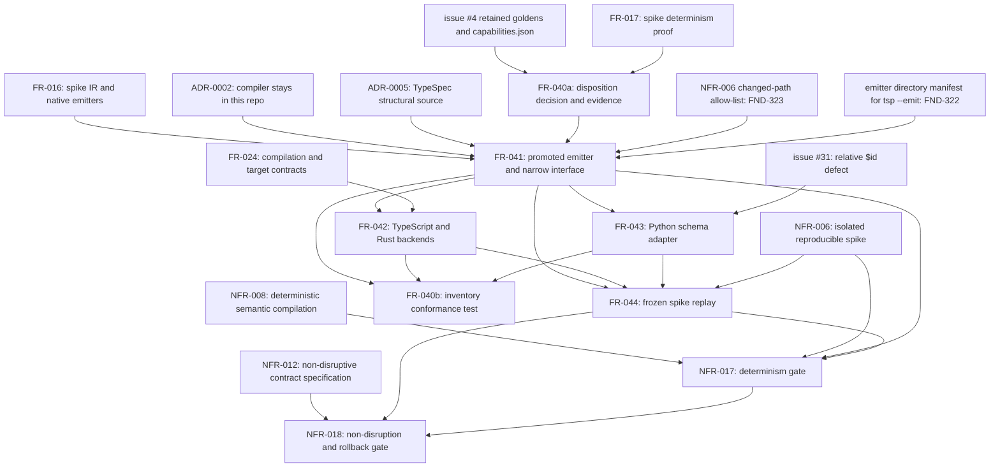

# Dependency review

## Summary

Issue #27 is enablement in full: it moves the issue #4 prototype into
`src/compiler/`, publishes nothing, and changes no consumer. The external
ordering is honest in the direction that matters most — nothing in the slice
reads the issue #20 conformance corpus or oracle, and nothing needs the issue
#19 compiler. Every oracle is a retained issue #4 golden already in the tree
(`generated/custom/semantic-ir.json`, `typescript/index.ts`, `rust/src/lib.rs`,
`python/input.schema.json`), so the slice is verifiable standalone against
`origin/main`. The removal of the `file:` devDependency is also safe as an
install concern: the root importer is the lockfile's only importer, the spike's
own manifest is never installed, and no workflow, Makefile target, test, or
source file outside the two manifests and the spike runner names the emitter
package.

Three problems are structural. First, FR-040 is declared upstream of FR-041,
FR-042, and FR-043 but four of its six acceptance criteria can only be evaluated
after those three have produced files, so the declared edge runs against the
verification edge and the slice has a cycle. Second, FR-040-AC-5 demands that
every file under `src/compiler/` be the target of exactly one of thirteen
prototype-component records, while FR-041 outputs three files (the narrow
interface, its declarations, the CLI) that have no prototype ancestor at all.
Third, the existing NFR-006 changed-path guard is a hard-coded allow-list in
`test/typespec-feasibility.test.ts` that contains no `src/` entry, no
`tsconfig*.json`, and no new test file, so the promotion branch turns that gate
red before any of TC-320..375 runs, and no requirement in the slice owns the
edit. Beyond the slice, the promoted compiler stays frozen at IR `schemaVersion`
1.0.0 while the merged #34/#35 line produces 1.1.0, so "the package tickets
build from a supported compiler" holds only for the 1.0.0 shape.

## Findings

| ID | Severity | Summary | Refs |
|---|---|---|---|
| FND-320 | high | FR-041, FR-042, and FR-043 declare FR-040 upstream, but FR-040-AC-3 (`retain`/`rewrite` targets must exist under `src/compiler/`), FR-040-AC-5 (every `src/compiler/` file owned by exactly one record), FR-040-AC-6 (doc counts) and FR-042's own `src/compiler/inventory.json` output can only be evaluated once FR-041..FR-043 have written those files; the requirement-level graph therefore holds FR-040 → FR-041 → FR-040. Break it by tasking the disposition decision and its evidence with FR-040 and the inventory-conformance test after FR-043, or the inventory is authored against files that do not yet exist. | FR-040-AC-3, FR-040-AC-5, FR-040-AC-6, FR-041 Dependencies, FR-042 Outputs, FR-042-AC-6, TC-322, TC-326, TC-327, TC-346 |
| FND-321 | high | FR-040-AC-5 requires every file under `src/compiler/` except the inventory to be the target of exactly one of the thirteen prototype-component records, but FR-041 outputs `src/compiler/index.mjs` (the narrow re-export interface), `src/compiler/index.d.mts`, and `src/compiler/cli.mjs`, none of which is a promoted issue #4 component — the spike has no narrow interface, no declarations, and no CLI. As written the AC is unsatisfiable: either the inventory grows records with no `source`, which FR-040 Behavior forbids ("no record whose `source` is absent or empty"), or three promoted files are unowned and the test fails naming them. | FR-040-AC-1, FR-040-AC-5, FR-040 Behavior, FR-041 Outputs, TC-320, TC-326, ERR-052 |
| FND-322 | medium | FR-041-AC-5 verifies `tsp compile <entrypoint> --emit ./src/compiler/emitters/semantic-ir`. Today `--emit` resolves the emitter by package name through the `file:spikes/typespec-feasibility/emitter` link; once FR-044 removes that link, the path form is the only remaining route, and TypeSpec loads a directory target through node resolution, which needs a `package.json` with `main`/`exports` in `src/compiler/emitters/semantic-ir/`. FR-041-CON-3 and NFR-018-AC-3 both speak of "package metadata" and "every added package manifest", so such a manifest is assumed, yet no requirement lists it as an output and it collides with FND-321 as another unownable `src/compiler/` file. | FR-041-AC-5, FR-041 Outputs, FR-041-CON-3, NFR-018-AC-3, FR-044 Behavior, TC-334, TC-338 |
| FND-323 | medium | The machine gate for NFR-006 is the hard-coded `allowed` array in `test/typespec-feasibility.test.ts` (TC-123..124), which lists no `src/` prefix, no `tsconfig*.json`, no `plan/Plan-007*`, and only the six existing test files by name. Every path FR-041..FR-043 create (`src/compiler/**`, new `test/*.test.ts`) and every path NFR-017 permits (`tsconfig*.json`, `plan/**`) fails that assertion, so the promotion branch is red on an existing gate before TC-320 runs. Reconciling that array with the NFR-017 permitted-path list is a prerequisite of FR-044-AC-1 and NFR-018-AC-1 that no requirement in the slice owns. | NFR-006, NFR-017 Scope, NFR-018-AC-1, FR-044-AC-1, TC-123, TC-124, TC-357, TC-371 |
| FND-324 | medium | FR-042 declares FR-024 upstream, but FR-024 Behavior states "Retained custom codegen SHALL live in the separately versioned reusable AGPL compiler/codegen repository defined by its own tickets", which is exactly what FR-042 does not do — ADR-0002 keeps the compiler here and FR-042 places `backends/typescript.mjs` and `backends/rust.mjs` under this repository's `src/compiler/`. The declared prerequisite contradicts its dependent; FR-024 needs an amendment or an explicit ADR-0002 supersession note before FR-042 can claim it as upstream. | FR-042 Dependencies, FR-024 Behavior, ADR-0002, TC-340, TC-341 |
| FND-325 | medium | NFR-018 Dependencies list issue #11 and `agent-ix/quoin#290` as **Upstream** and issues #19, #21, #22, #23 as Downstream. The direction is inverted for the first pair: US-009 records that this slice *blocks* publication (#11), and NFR-018's own Rationale says publication "stays gated on issue #11", i.e. #11 is a downstream gate the promotion must not trip, not a prerequisite. A plan generated from these Dependencies would schedule #27 behind publication and behind quoin#290, reversing the sequence of record. | NFR-018 Dependencies, NFR-018 Scope, US-009 Dependencies, NFR-018-AC-5, TC-375 |
| FND-326 | medium | FR-041-CON-1 freezes the promoted emitter at IR `schemaVersion` `1.0.0`, and the promoted walker admits `AgentIx.Semantic` and its descendants — which includes `packages/semantic-core` (`namespace AgentIx.Semantic.Core`). The repository therefore gains a second IR producer over the same TypeSpec source: the promoted CLI emitting 1.0.0 and the merged FR-034 lowering emitting 1.1.0 through `test/semantic-core-lowerer.ts`. FR-042's backends are qualified against 1.0.0 node shapes only, so #21/#22/#23 "building from a supported compiler" holds for the 1.0.0 shape alone; reconciling the two producers is unowned work that lands on #19 without being stated anywhere in the slice. | FR-041-CON-1, FR-041 Behavior, FR-042 Inputs, FR-034, packages/semantic-core/main.tsp, TC-331, TC-336, TC-337 |
| FND-327 | medium | The issue #31 `$id` defect now has three workaround owners moving in different directions: `packages/semantic-core/scripts/generate.mjs` rewrites relative `$id` values to absolute ones under the package base (FR-033), FR-043 rewrites `$ref` to local `#/$defs` pointers and strips `$id` entirely, and issue #31 option 3 places the step in the JSON Schema projection backend (#24). FR-043 declares FR-033 upstream but reuses nothing from it — the adapter reads the spike's official bundle, and FR-043-AC-1 compares against the retained spike golden — so the edge is soft while the real coupling (one removal, one change, when #31 lands) is unstated. | FR-043 Dependencies, FR-043-CON-2, FR-043-AC-1, FR-033-CON-2, packages/semantic-core/scripts/generate.mjs, issue #31, TC-349, TC-355 |
| FND-328 | medium | `package.json` `files` already contains `src/`, so promoting the compiler into `src/compiler/` changes the contents of the published tarball. NFR-018-AC-2 compares only `exports`, `main`, `module`, and `types`, and NFR-018's metric is "public export surface changed: 0 entries", so the gate cannot see the change. Nothing publishes during #27, but #11 inherits a tarball whose shipped surface grew by an entire compiler that no requirement decided to ship. | NFR-018-AC-2, NFR-018 Measurement, package.json `files`, TC-372 |
| FND-329 | medium | `src/compiler/**` will `import` `@typespec/compiler` and `@typespec/versioning`, which are **devDependencies** in `package.json`, while FR-041-CON-4 and NFR-017-AC-4 forbid the promotion from adding any dependency. That is consistent for #27, where the compiler is only ever run from the repository, but it makes the promoted code unresolvable for any installer of the published package; #11 and #19 must either move the pins to `dependencies` (against NFR-017-AC-4) or declare the compiler build-time-only, and neither requirement records the choice. | FR-041-CON-2, FR-041-CON-4, NFR-017-AC-4, package.json devDependencies, TC-339, TC-369 |
| FND-330 | low | FR-043 Inputs name "the pinned `datamodel-code-generator` 0.76.0 and `pydantic` 2.12.5 versions recorded by the issue #4 evidence". Those values exist only as two constants at the top of `spikes/typespec-feasibility/scripts/run-experiment.mjs` — `pyproject.toml` pins neither. FR-044 rewrites that runner and FR-040 dispositions its harness functions, so the only home of the Python pins is a file the slice is editing while the requirement that depends on them promotes nothing to hold them; #23 inherits a pin with no manifest. | FR-043 Inputs, FR-044 Outputs, FR-040 Inputs, pyproject.toml, TC-349 |
| FND-331 | low | FR-042-CON-3 keeps the "absent conformance corpus, property/fuzz suite, compatibility matrix, and downstream adoption" limitation "until issues #21 and #22 discharge it", but the conformance corpus and oracle are issue #20's deliverables (FR-035..039, NFR-015..016, TC-280..319), which this slice deliberately does not consume. #21 and #22 cannot discharge a corpus gate without #20, so the real edge is #20 → {#21, #22}; leaving it unstated invites either a premature discharge or a false dependency of #27 on #20. | FR-042-CON-3, FR-042-AC-6, EC-040, tests.md scope note, TC-346 |
| FND-332 | low | Frontmatter and prose disagree throughout the slice: US-009 `depends_on` US-005 only, while its Dependencies name the #4 evidence, ADR-0002, ADR-0005, US-006 and US-007; FR-040 names FR-017, FR-041 names FR-016/ADR-0002/ADR-0005, FR-042 names FR-024, FR-043 names FR-033 and issue #31, NFR-017 names NFR-006, and NFR-018 names NFR-014, issue #11 and quoin#290 — none of those appear in the corresponding `relationships` blocks. Any tool reading the machine graph gets a strictly smaller and differently shaped DAG than the one the prose describes. | US-009, FR-040, FR-041, FR-042, FR-043, NFR-017, NFR-018 frontmatter |
| FND-333 | low | Nothing outside the two manifests, the spike runner, and the retained evidence depends on `spikes/typespec-feasibility/emitter/`: no workflow, Makefile target, tsconfig include, or test references it, and the lockfile carries it only as the root importer's `file:` entry, so `pnpm install` still resolves after the deletion. The one stale reference is `plan/Plan-003-typespec-feasibility/tasks/Task-019-semantic-ir-native-emitters.md`, which lists the directory as a deliverable path; FR-044 deletes the directory without recording that the historical plan record then names an absent path, and `plan/**` is outside the NFR-006 guard's allow-list in any case (FND-323). | FR-044 Outputs, FR-044-AC-4, plan/Plan-003-typespec-feasibility/tasks/Task-019-semantic-ir-native-emitters.md, pnpm-lock.yaml, TC-362, TC-363 |

## Classification

| Requirement | Class | Rationale |
|---|---|---|
| US-009 | Enablement | The user-visible outcome belongs to #19/#21/#22/#23; this story only moves the generator under the repository's gates |
| FR-040 | Enablement | The disposition record that decides what is promoted; its conformance half is a gate over FR-041..FR-043 output (FND-320) |
| FR-041 | Enablement | The owned emitter and the narrow build interface every later ticket calls; the root of the slice's internal graph |
| FR-042 | Enablement | Pure IR-to-source backends consumed by #21 and #22; no behavior of its own |
| FR-043 | Enablement | Security-constrained JSON Schema adapter consumed by #23; the official generator stays upstream |
| FR-044 | Enablement | Retained-evidence replay; the promotion's only honest oracle, and the change that removes the `file:` link |
| NFR-017 | Enablement | Determinism and reproducibility gate over `src/compiler/**` and the replay |
| NFR-018 | Enablement | Non-disruption and rollback gate over the whole change set; verified last |

No requirement in the slice has business-visible behavior on its own. US-009 is
realized only when #19 compiles a real package or #21/#22/#23 generate one from
`src/compiler/`.

## Dependency Graph

The graph is acyclic only after FR-040 is split into `FR-040a` (the written
disposition, which precedes the promotion) and `FR-040b` (the inventory
conformance test, which follows it). As authored, FR-040 is a single node with
both edges and the slice contains the cycle FR-040 → FR-041 → FR-040
(FND-320); FR-042 adds a second arm through its `inventory.json` output.
`GUARD` and `MANIFEST` are prerequisites no requirement owns.

## Logical Dependency Order

1. Resolve FND-320 (split FR-040), FND-321 (who owns `index.mjs`, `index.d.mts`, `cli.mjs` in the inventory), FND-322 (the emitter directory manifest), and FND-324 (amend FR-024 or record the ADR-0002 supersession). These are decisions, not code, and the first two gate everything below.
2. Extend the NFR-006 allow-list in `test/typespec-feasibility.test.ts` to the NFR-017 permitted-path list (FND-323); without it every subsequent test run is red for reasons unrelated to the change.
3. FR-040a: write the thirteen dispositions and their evidence and limitations from `capabilities.json` and the issue #4 record (TC-321, TC-325, TC-328). No `src/compiler/` file needs to exist yet.
4. FR-041: `ir.mjs`, the emitter entry point and its manifest, `index.mjs`, `index.d.mts`, `cli.mjs` (TC-329..339). Needs only the pinned `@typespec/compiler` 1.15.0 and `@typespec/versioning` 0.85.0 already in `package.json`, and the retained `generated/custom/semantic-ir.json` as its oracle.
5. FR-042 (TC-340..348) and FR-043 (TC-349..356) in parallel; both are pure functions over a retained golden and share no state.
6. FR-040b: the inventory conformance test over the now-existing file set (TC-320, TC-322, TC-323, TC-324, TC-326, TC-327, TC-346).
7. FR-044: rewrite `run-experiment.mjs` onto the promoted modules, seed the retained `Cargo.lock`, delete `spikes/typespec-feasibility/emitter/`, drop the `file:` specifier from both manifests, regenerate the lockfile (TC-357..365).
8. NFR-017 (TC-366..370) then NFR-018 (TC-371..375), including the revert rehearsal, last.

## Cycles

One cycle at the requirement level: FR-040 → FR-041 → FR-040, with a second arm
FR-040 → FR-042 → FR-040 through FR-042's `inventory.json` output and
FR-042-AC-6 (FND-320). Both are broken by the FR-040a/FR-040b split; no other
edge in the slice is bidirectional. Every remaining internal edge is hard —
FR-042 and FR-043 consume an IR document and the narrow interface that FR-041
defines, and FR-044 consumes all three plus the retained evidence.

## External Ordering

- **issue #19 (semantic compiler)** is downstream. Nothing in FR-040..FR-044 or NFR-017/NFR-018 needs it: every oracle is a retained issue #4 artifact already committed under `spikes/typespec-feasibility/generated/`, so the slice is verifiable against `origin/main` alone. FR-041-CON-1 explicitly defers IR shape revision to #19, and #19 inherits the unowned 1.0.0/1.1.0 reconciliation (FND-326).
- **issue #20 (conformance corpus and oracle)** is genuinely not consumed. `spec/tests.md` reserves TC-280..319, FR-035..039, NFR-015..016 and US-008 for #20, and no TC in TC-320..375 reads a corpus artifact. The only latent coupling is FR-042-CON-3's discharge route (FND-331), which belongs to #21/#22 and not to #27.
- **issues #21, #22, #23** are downstream consumers of FR-042 and FR-043; the qualification limitation is what they must discharge before shipping.
- **issue #11 and `agent-ix/quoin#290`** are downstream gates, not prerequisites; NFR-018 records them in the wrong direction (FND-325). #11 additionally inherits the tarball growth (FND-328) and the devDependency-only import question (FND-329).
- **issue #31** stays open and is consumed as a pinned workaround, as it already is on the merged #35 branch; the two workarounds move `$id` in opposite directions and must be removed in one change (FND-327).
- **issues #34 and #35** are merged and are true prerequisites of nothing in this slice except by adjacency: the promoted compiler neither reads `packages/semantic-core` nor emits IR v1.1. That independence is what makes #27 schedulable now, and it is also what defers FND-326 to #19.
- **ADR-0002 and ADR-0005** are normative inputs of FR-041; ADR-0002 is also the reason FR-024's separate-repository clause must be amended (FND-324).
