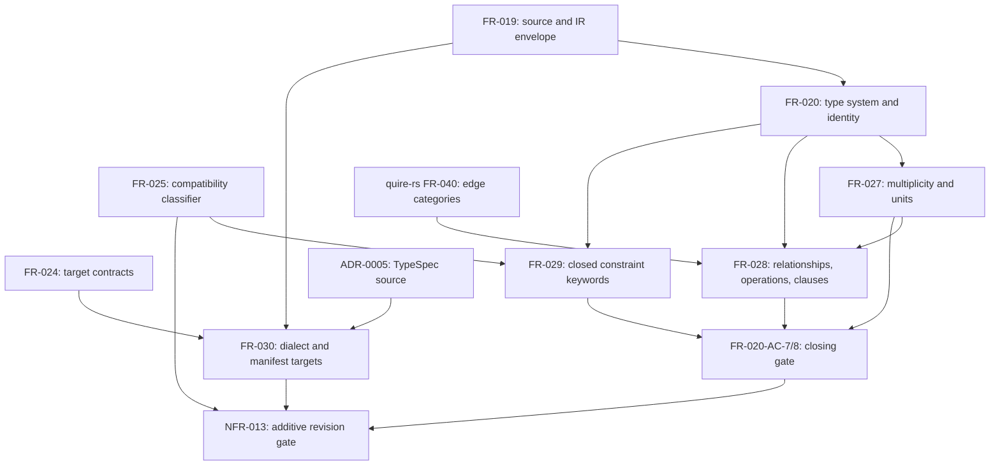

# Dependency review

## Summary

The issue #34 slice is enablement work: it adds node shapes to the semantic IR
that the semantic-core grammar (#35), the module contract (quoin#293), the
extraction frontend (#36), and the formal-clause frontends
(quire-contract-ir#52) consume. The requirement graph is acyclic at the
requirement level; FR-027, FR-029, and FR-030 are mutually independent and
FR-028 follows FR-027. Two ordering defects need a decision before tasking: the
slice depends on a v1.1 `contractVersion` discriminator that no requirement
defines, and the amended FR-020 acceptance criteria verify the downstream
requirements, so FR-020 is both prerequisite and closing gate.

## Findings

| ID | Severity | Summary | Refs |
|---|---|---|---|
| FND-068 | medium | Every v1.1 rule that is version-conditional (v1 fixtures valid unchanged, retired dialect constant rejected on v1.1 only, v1.1 documents rejected under v1) depends on a `contractVersion` discriminator; the v1 schema pins `contractVersion` to the constant `1.0.0` and no requirement in the slice states the v1.1 value or the version-conditional validation rule. | FR-019-CON-2, FR-027-CON-1, FR-030, FR-030-CON-1, NFR-013-AC-1, TC-208, TC-228, TC-231 |
| FND-069 | medium | FR-020 is the declared prerequisite of FR-027..029, but its amended FR-020-AC-7 and FR-020-AC-8 verify the nodes those requirements define, so FR-020 cannot be closed before its dependents; this is a verification-order cycle, resolved by tasking TC-232 and TC-233 as the slice's closing gate rather than as FR-020 work. | FR-020-AC-7, FR-020-AC-8, FR-027, FR-028, FR-029, TC-232, TC-233 |
| FND-070 | low | FR-029-CON-2 requires the FR-025 compatibility classifier and its corpus to classify keyword changes, so FR-025 is a prerequisite of FR-029; FR-029 records FR-025 as downstream only. | FR-025, FR-029-CON-2, TC-225 |
| FND-071 | low | FR-028 copies the quire-rs FR-040 edge-category enumeration by value (identical to `EdgeCategory` today) with nothing pinning the copy, and resolving `category` from a declared verb needs the FR-040 verb registry at frontend time, a dependency neither FR-028 nor its consumers (#35, #36) name. | FR-028, quire-rs FR-040, filament-core-data#35, filament-core-data#36 |
| FND-072 | low | FR-030 forward-declares the `spec-bundle` dialect for issue #36 with no producer, so the NFR-013 fixture-inventory metric will demand a golden fixture nothing emits; and FR-030 binds the manifest target enumeration to `target-contract.schema.json`, which FR-024 prose never enumerates, so the real upstream is the schema artifact rather than FR-024. | FR-030, FR-024, NFR-013, filament-core-data#36, TC-227, TC-230 |
| FND-073 | low | The #35 grammar sketch places `multiplicity` and `unit` on `TypeRef` and omits `category` and `composite` from `RelationDecl`, while FR-027 and FR-028 place them on `field` and `relationships[]`; #35 lands after #34 and states the shapes must agree, so the lowering table is a #35 obligation to record, not a #34 defect. | FR-027, FR-028, filament-core-data#35 |
| FND-074 | low | NFR-013 frontmatter records only NFR-012 as `depends_on` while its body names FR-025 as upstream, so the machine-readable graph lacks the FR-025 edge that NFR-013-AC-3 relies on. | NFR-013, FR-025, TC-235 |

## Classification

| Requirement | Class | Rationale |
|---|---|---|
| US-006 | Feature | Module-author outcome: a declaration survives into the IR without loss; realized by FR-027..030 |
| FR-020 (amended) | Enablement | Type-system and identity model every v1.1 node extends; AC-7 and AC-8 are the closing gate (FND-069) |
| FR-027 | Enablement | `field.multiplicity` and `unit` shapes reused by FR-028 relationships, operation params, and returns |
| FR-028 | Enablement | `relationships[]`, `operations[]`, `clauses[]` node shapes consumed by #35, #36, and quire-contract-ir#52 |
| FR-029 | Enablement | Closed constraint keyword vocabulary consumed by #35 `ConstraintDecl` and the FR-025 classifier corpus |
| FR-030 | Enablement | Dialect and target enumerations shared by the IR, manifest, and target-contract schemas; consumed by #36 and issue #11 |
| NFR-013 | Enablement | Additivity gate over the whole slice; verified last |

No requirement in the slice has business-visible behavior on its own; the
feature outcome (US-006) is delivered only when a consumer lowers a declaration
through the new nodes, which is #35 and #36 work.

## Dependency Graph

The `FR-025 --> FR-029` edge is the one FND-070 asks FR-029 to record as
upstream. The `GATE` node is FR-020-AC-7 and FR-020-AC-8 split out of FR-020 per
FND-069; without that split the graph has the cycle
FR-020 → FR-027 → FR-020.

## Logical Dependency Order

1. Decide the v1.1 `contractVersion` value and the version-conditional rule (FND-068); it gates every step below.
2. FR-027, FR-029, FR-030 (enablement, parallelizable; FR-030 additionally needs ADR-0005 and the existing target-contract enumeration).
3. FR-028 (needs the FR-027 multiplicity shape and the FR-040 category list).
4. FR-020-AC-7 and FR-020-AC-8 as the closing gate (TC-232, TC-233) once all four node families exist.
5. NFR-013 verification (TC-208, TC-234..236): unchanged v1 fixture suite, spike byte comparison, compatibility-corpus entry, changed-path gate.

## Cycles

None at the requirement level once FR-020-AC-7/8 are tasked as the closing
gate (FND-069). No other edge is soft: every edge above names a shape, an
enumeration, or a fixture that the dependent requirement reuses.

## External Ordering

- filament-core-data#35 (semantic-core L3 grammar) consumes FR-027..029 node shapes and lands after #34; the lowering table between #35 declarations and IR nodes is its obligation (FND-073).
- quoin#293 (module packages and exports) and quire-rs#388 (extraction contracts) consume the v1.1 IR through #35; neither is a prerequisite of #34.
- quire-contract-ir#52 (formal-clause frontends EPIC) and #53 (clause-language ADR) consume `clauses[]`; FR-028's `ocl | sysml | fretish | <ns>:<name>` language set is the input #53 decides against, so #53 must not narrow it without amending FR-028.
- quire-rs FR-040 edge vocabulary is a prerequisite of FR-028 (FND-071).
- ADR-0005 is a prerequisite of FR-030 and is already accepted.
- filament-core-data#31 (`$id` alias workaround) concerns the JSON Schema projection backend; no requirement in this slice reads or emits that projection, so #31 is not a prerequisite and stays independent.
- filament-core-data#36 (extraction frontend) is the first producer of the `spec-bundle` dialect (FND-072) and consumes FR-028 and FR-030; it follows #34 and #35.
