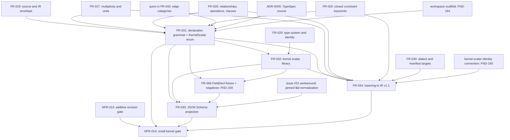

# Dependency review

## Summary

The issue #35 slice is enablement work: it authors the declaration grammar and
kernel scalar library that quoin#293, the Wave 4 module tickets, the extraction
frontend (#36), issue #11 publication, and quire-contract-ir#53 consume. Every
external prerequisite is satisfied today: IR v1.1 (FR-027..030) merged on
PR #38, ADR-0005 is normative, the `@typespec/compiler`, `@typespec/json-schema`,
and `@typespec/versioning` pins are mutually compatible, and the #31 `$id`
defect is consumed as a pinned workaround rather than waited on. Inside the
slice the frontmatter graph has one cycle: FR-031 cannot compile without the
`KernelScalar` enumeration that FR-032 defines, while FR-032 declares FR-031 as
its prerequisite. Two further prerequisites have no owner: the FR-006
`FieldDecl[]` fixture and its nine negative siblings that FR-032, FR-033, and
US-007 verify against, and the identity convention for kernel scalar type
definitions that FR-034, the #34 fixture, and the #36 worked example each
state differently.

## Findings

| ID | Severity | Summary | Refs |
|---|---|---|---|
| FND-158 | medium | FR-031-AC-1 (zero-diagnostic compile) and FR-031-AC-2 (nine grammar models including `KernelScalar`) need the `KernelScalar` enumeration that FR-032 defines, and FR-032 records FR-031 as its `depends_on`; this is a requirement-level cycle FR-031 → FR-032 → FR-031, broken by tasking the `KernelScalar` enum declaration with FR-031 and leaving FR-032 the representation table, `kernel-scalars.json`, and FR-032-CON-1. | FR-031-AC-1, FR-031-AC-2, FR-032, TC-248, TC-249, TC-255 |
| FND-159 | medium | The FR-006 `ConfigVersion` `FieldDecl[]` fixture and the nine per-model negative fixtures are verified by FR-032-AC-5, FR-033-AC-2, FR-033-AC-3, and US-007-EX-1/EX-4, but no requirement in the slice lists them as an output; issue #35 names them as deliverables, so the fixtures are a prerequisite artifact with no owning requirement. | FR-032-AC-5, FR-033-AC-2, FR-033-AC-3, US-007-EX-1, US-007-EX-4, TC-259, TC-262, TC-263 |
| FND-160 | medium | FR-034 lowers a `KernelScalar` target to "the identity of a kernel scalar type definition in the package"; the #34 fixture materializes per-package identities (`ix://agent-ix/config-service/type/UUID`) that FR-034-AC-3 pins to, while the #36 worked example and the quoin#293 resolver use `semantic-core:UUID`; the kernel-scalar identity scheme is a shared prerequisite of #35, #36, and quoin#293 that none of them defines. | FR-034, FR-034-AC-3, TC-268, TC-269, EC-033, filament-core-data#36, quoin#293 |
| FND-161 | low | FR-034-AC-2/AC-3 require a lowered FR-006 document whose `clauses[]` carry `text` "supplied by the extractor" (issue #36, gated) and whose `source` envelope must agree with the #34 fixture's `dialect: spec-bundle`; until #36 lands the only source of that text and envelope is the #34 fixture itself, so the AC-3 exclusion list (two extensions) understates what the lowering fixture inherits rather than produces. | FR-034-AC-2, FR-034-AC-3, FR-028, FR-030, EC-034, TC-268, TC-269, filament-core-data#36 |
| FND-162 | low | `UnitSymbol` is declared and pattern-constrained by FR-031, but the pattern's content (case-sensitive UCUM symbols) is stated only in FR-034 Behavior and verified by TC-270 under FR-034-AC-4; the definition flows against the dependency direction, so FR-031 cannot emit `TypeRef.json` with a fixed pattern until FR-034 is read. | FR-031, FR-034-AC-4, FR-027, TC-270 |
| FND-163 | low | The machine-readable graph and the prose disagree: FR-031 and FR-034 name FR-029 upstream in the body but not in frontmatter; FR-032 names FR-020 in the body only; FR-033 declares `depends_on` FR-030 although no FR-030 shape or enumeration is reused, and omits FR-032 although FR-033-AC-1 emits `KernelScalar.json`; NFR-014 records only NFR-013. | FR-031, FR-032, FR-033-AC-1, FR-034, NFR-014 |
| FND-164 | low | FR-031 outputs `packages/semantic-core/package.json` and NFR-014 permits root `package.json`/`pnpm-lock.yaml` edits "for the workspace entry", but the repository has no `pnpm-workspace.yaml` or `workspaces` field; the workspace scaffold is unstated enablement that precedes FR-031-AC-1 and TC-248. | FR-031, FR-031-CON-1, NFR-014, TC-248, TC-254 |
| FND-165 | low | The #31 normalization has two candidate owners: issue #31 option 3 places the pinned post-processing step in the JSON Schema projection backend (#24), while FR-033 places it in the semantic-core build with FR-033-CON-2 removing it on the upstream fix; both must remove the same step at the same time or the two projections diverge. | FR-033, FR-033-AC-5, FR-033-CON-2, TC-265, TC-266, filament-core-data#31 |
| FND-166 | low | The NFR-014 kernel inventory gate admits "the nine grammar models and four support types", but FR-031 also declares the `EdgeCategory`, `ClauseLanguage`, and `Versions` enumerations; the allowed inventory that TC-249 and TC-273 compare against is a gate input no requirement records. | NFR-014-AC-1, FR-031-AC-2, TC-249, TC-273 |

## Classification

| Requirement | Class | Rationale |
|---|---|---|
| US-007 | Feature | Module-maintainer outcome: one grammar imported instead of a per-module dialect; realized by FR-031..034 |
| FR-031 | Enablement | The grammar models every module, quoin#293, #36, and quire-contract-ir#53 import; must carry `KernelScalar` to compile (FND-158) |
| FR-032 | Enablement | Closed leaf-scalar library and representation table consumed by FR-034 lowering and quire-contract-ir#53 bounded types |
| FR-033 | Enablement | JSON Schema projection that quoin#293 `data_schema` references by path and digest; the first artifact issue #11 publishes |
| FR-034 | Enablement | Lowering table from grammar to IR v1.1 nodes consumed by the #36 frontend; zero-loss gate over FR-031/FR-032 |
| NFR-014 | Enablement | Kernel-scope and non-disruption gate over the whole slice; verified last |

No requirement in the slice has business-visible behavior on its own; the
feature outcome (US-007) is delivered only when a module imports the grammar
(quoin#293, Wave 4 tickets) or a frontend lowers through it (#36).

## Dependency Graph

The `FR-031 --> FR-032` edge holds only once the `KernelScalar` enumeration is
tasked with FR-031 (FND-158); with the enum left in FR-032 the graph has the
cycle FR-031 → FR-032 → FR-031. The `FR-030 --> FR-034` edge replaces the
frontmatter `FR-030 --> FR-033` edge: FR-034-AC-2 needs the `1.1.0`
`contractVersion` and `source.dialect` rules, FR-033 reuses nothing from FR-030
(FND-163). `WS`, `FIX`, and `IDS` are the three prerequisites the slice depends
on without a requirement owning them.

## Logical Dependency Order

1. Decide the FND-158 split (`KernelScalar` enum in FR-031), the kernel-scalar identity convention (FND-160), and the `UnitSymbol` pattern owner (FND-162); the first gates every step below.
2. Workspace scaffold (FND-164), then FR-031 including the `KernelScalar` enumeration (TC-248..254); needs FR-027..029, FR-040, ADR-0005, and the pinned compiler and versioning library.
3. FR-032 representation table and `kernel-scalars.json` (TC-255..260) and the FR-006 `FieldDecl[]` fixture plus nine negatives (FND-159), parallelizable once FR-031 compiles.
4. FR-033 projection (TC-261..266): needs the compiled program, `KernelScalar.json`, the fixtures from step 3, and the pinned #31 normalization.
5. FR-034 lowering table and fixture (TC-267..272): needs FR-031, FR-032, the #34 `config-version-v1-1.json` fixture, both IR readers (`test/semantic-ir-v1-1-reader.ts`, `tests/semantic_ir_reader.py`), and the FND-160 convention.
6. NFR-014 verification (TC-273..276): inventory against the recorded allowed list (FND-166), changed-path gate, `spike:typespec:check`, emitter inspection, ARCH-005 and ADR-0002 amendments.

## Cycles

One cycle at the requirement level, FR-031 → FR-032 → FR-031 (FND-158),
resolved by tasking the `KernelScalar` enumeration with FR-031. No other edge
is soft once the FR-033 → FR-030 frontmatter edge is dropped (FND-163): every
remaining edge names a model, an enumeration, a fixture, or a toolchain pin
that the dependent requirement reuses.

## External Ordering

- filament-core-data#34 (IR v1.1, FR-027..030) merged on PR #38 with `contractVersion` accepting `"1.0.0"` and `"1.1.0"`, the `config-version-v1-1.json` fixture, and both IR readers; every #34 prerequisite of this slice is satisfied.
- ADR-0005 is normative and pins the TypeSpec source; `@typespec/compiler` 1.15.0, `@typespec/json-schema` 1.15.0, and `@typespec/versioning` 0.85.0 (peer `^1.15.0`) are compatible, so FR-031's `@versioned` grammar and FR-033's official emitter need no new pin.
- filament-core-data#31 (`$id` defect) stays open; FR-033 consumes it as a pinned workaround and does not wait on the fix, but the removal owner must be one place (FND-165).
- quire-rs FR-040 edge vocabulary is a prerequisite of FR-031-AC-4 (seven categories copied by value, as SR-030 FND-071 already records for FR-028).
- quoin#293 (module packages, `data_schema` by path and digest) consumes FR-031 and FR-033 and is blocked by this slice; it also depends on the FND-160 convention through its type-token resolver.
- filament-core-data#36 (extraction frontend) consumes FR-031, FR-032, and FR-034 and follows #35 and quoin#293; it is the producer of clause `text` and the `spec-bundle` envelope that FR-034's fixture inherits meanwhile (FND-161).
- filament-core-data#11 (publication) consumes the private `@agent-ix/semantic-core` package from FR-031 and the FR-033 projection; it is gated downstream and is not a prerequisite.
- quire-contract-ir#53 consumes the FR-031 `ClauseLanguage` set and the FR-032 bounded-scalar policy early; it is not a prerequisite, and it must not narrow either without amending FR-031 or FR-032.
- quoin#286 Wave 4 module tickets import the grammar through quoin#293 and are downstream only.
