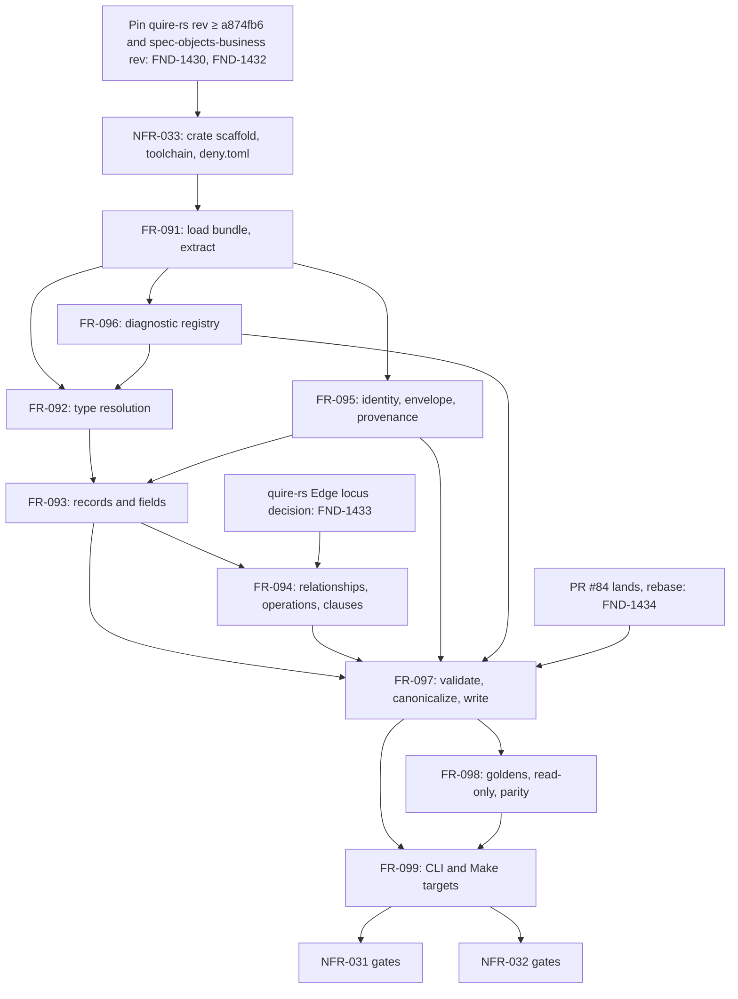

# Dependency review

## Summary

The issue #36 slice is one new Rust workspace crate that consumes the
quire-rs extraction contract in-process and lowers it to semantic IR 1.1.0.
The frontmatter `relationships:` graph over US-015, FR-091..099, and
NFR-031..033 is acyclic; every `depends_on` target (FR-019, FR-020, FR-021,
FR-027, FR-028, FR-029, FR-030, FR-031, FR-032, FR-034, FR-045, FR-046,
FR-048, FR-049, FR-050, FR-052, US-006, US-007, US-010, NFR-019..023) exists
under `spec/`. Five of the nine FRs are enablement (bundle read, resolver,
identity, diagnostic registry, canonical writer) and four are feature or
evidence work. Two ordering defects gate the first task: FR-091 names a
quire-rs API (`Registry::load_module_set`) that is not in the revision
NFR-033 pins, and FR-098 assumes the FR-045 TypeScript harness can run the
`spec-bundle` dialect when the seam that decides that and the test file are
both NFR-032 prohibited paths. Two more need an external decision before
FR-094 and FR-097 can close: the quire-rs FR-040 `Edge` carries no locus, and
PR #84 moves the FR-050 reader the slice uses as its oracle.

## Findings

| ID | Severity | Summary | Refs |
|---|---|---|---|
| FND-1430 | high | FR-091 requires modules to load only through `quire_rs::Registry::load_module_set`, but that function landed in quire-rs `a874fb6` (#411, closed module set) five commits after `17b80e4` (#388); at `17b80e4` neither `src/registry.rs` nor `src/loader/mod.rs` defines it. NFR-033 pins "the revision containing #388", which is one revision too early; the pin must be an exact `rev` at or after `a874fb6` (origin/main is `8b8020e` today), and no release tag contains either commit. | FR-091, FR-091-AC-4, NFR-033, NFR-033-AC-3, quire-rs#388, quire-rs#411 |
| FND-1431 | high | FR-098-AC-6 states "the harness of FR-045-AC-5 runs the implemented dialects and records the outcome", but that harness (`test/compiler-core.test.ts:379`) selects dialects through `isImplemented` in `src/compiler/frontend/seam.mjs`, which the same file asserts is `false` for `spec-bundle` (line 353), and `src/compiler/frontend/spec-bundle/frontend.mjs` returns `FRONTEND_NOT_IMPLEMENTED` by design (FR-045-CON-1). Every one of those paths is prohibited by NFR-032 and FR-099-CON-2, so the TypeScript harness can never observe a spec-bundle lift; the parity of FR-098-AC-7 is only reachable from the Rust suite by shelling to `node src/compiler/cli.mjs compile` and applying `normalizeIr` through a node process. This hidden dependency — a `pnpm install`ed Node tree present when `cargo +1.98.1 test` runs — is named for FR-097's `inspect` gate but not for the parity test, and the criterion as written verifies nothing. | FR-098-AC-6, FR-098-AC-7, FR-045-AC-5, FR-045-CON-1, NFR-032, FR-099-CON-2, TC-1290, TC-1291 |
| FND-1432 | medium | FR-091-AC-1 and FR-098 depend on "the spec-objects-business `0.3.0` module", but `0.3.0` is the manifest `version` on untagged `main` (`567e5c4`, 2026-09-03, `d1840b8` HEAD); `git tag --contains 567e5c4` is empty, the three published tags (v0.5.0, v0.5.1, v0.6.0) all carry manifest `0.2.0` with no `semantic` block, and spec-objects-business#4 is still OPEN. NFR-033 pins quire-rs and ix-trace-rs but not the module; FR-098's `PROVENANCE.json` covers copied documents, not the module the copies are lifted under. The module root must be pinned by git rev (or vendored under `fixtures/` with a provenance row) or FR-091-AC-1 is a claim about a moving checkout. | FR-091-AC-1, FR-098, FR-095-AC-5, NFR-033, spec-objects-business#4 |
| FND-1433 | medium | FR-094 takes FR-040 edges "each with verb, target, and locus" and sets `origin.source` "to the FR-040 edge's own locus" (FR-094-AC-7 prefers the bullet's locus over it). quire-rs `corpus::resolve::Edge` carries `source`, `target`, `edge_type`, and `resolution` only — no line or column. Satisfying the locus rule needs either a quire-rs change (external, unruled) or the frontend re-reading frontmatter for line numbers, which FR-091-CON-2/CON-3 forbid. FR-094 is blocked on that decision; the `## Relationships` bullet path is not. | FR-094, FR-094-AC-3, FR-094-AC-7, FR-091-CON-2, FR-091-CON-3, quire-rs FR-040 |
| FND-1434 | medium | PR #84 (open, mergeable, base `main`) rewrites FR-046-AC-11 and FR-050-AC-11, changes `src/compiler/ir/reader.mjs` (`UNRESOLVED_TYPE_REF` against supplied export sets), and appends to `spec/tests.md`. FR-092-AC-10, FR-093-AC-11, FR-094-AC-15, and FR-097-AC-11 are all gated on that reader returning zero diagnostics, so the slice's oracle moves underneath it. No id collision: this slice's TC-1200..1329 do not appear in `tests.md` yet and #84's highest row is TC-1110. FR-097 and the FR-050-gated criteria should be tasked after #84 lands and this branch rebases. | FR-092-AC-10, FR-093-AC-11, FR-094-AC-15, FR-097-AC-11, FR-050, filament-core-data#84 |
| FND-1435 | low | Rust `1.98.1-x86_64-unknown-linux-gnu` is installed beside the active `1.94.1`, and `cargo-deny` and `cargo-audit` are on the path, so NFR-033's gates can run today. The sweep NFR-033 says it "consumes" (quire-rs#417, quire-cli#82, ix-trace-rs#6, quire-contract-ir PR #62) is entirely open, and quire-rs at the pinned rev declares `rust-version = "1.75"`, so the engine is compiled but not qualified on 1.98.1; this does not block any task, but the claim "qualified on 1.98.1" covers the crate, not its engine, until the sweep closes. quire-rs `AGPL-3.0-or-later` and ix-trace-rs tag `v0.1.1` are verified. | NFR-033, NFR-033-AC-4, quire-rs#417, ix-trace-rs#6 |
| FND-1436 | low | Five external rulings are open and each requirement declares its own reading and cites the issue: #85 (no IR-reading `json-schema` backend, FR-098 carries #36 AC-5 as a declared gap), #77 (FR-095 stamps `spec-bundle`), #78 (FR-093 `losses.json`), #67 (FR-097 JCS form), #61 (FR-096 locus). None blocks a task; a contrary ruling reopens the citing FR. | FR-093, FR-095, FR-096, FR-097, FR-098, #85, #77, #78, #67, #61 |
| FND-1437 | low | Four upstream edges appear in a body `## Dependencies` list but not in frontmatter, so the machine-readable graph lacks them: FR-093 → FR-050, FR-095 → FR-030, FR-098 → FR-096, FR-099 → FR-091. The graph stays acyclic with them added. | FR-093, FR-095, FR-098, FR-099 |
| FND-1438 | low | FR-096's `Code` enum is the type every diagnostic of FR-091..095 and FR-097 is emitted through (FR-096-AC-3 forbids string-literal codes), so FR-096 is enablement that precedes FR-092, not a feature that follows FR-095; its frontmatter records only FR-091 upstream, and FR-092's body lists FR-096 as downstream. Task the registry enum immediately after FR-091. | FR-096, FR-096-AC-3, FR-092 |
| FND-1439 | low | FR-097 runs the fixture documents through `agent_ix_semantic_ir::decide` via a `dev-dependency` on `crates/semantic-ir` and through `node src/compiler/cli.mjs inspect`; both exist (`crates/semantic-ir/src/lib.rs:75`, `cli.mjs` `COMMANDS`), as do `extract_semantic(raw, ctx, schema_digest, required)`, `RequiredSections::from_dsl`, `BundleIndex::from_documents`, `Registry::semantic_module`, `Registry::edge_types`, and `packages/semantic-core/kernel-scalars.json`. The API surface FR-091..094 name is real at origin/main except for FND-1430 and FND-1433. | FR-091, FR-092, FR-094, FR-097-AC-11, FR-097-AC-12 |

## Classification

| Requirement | Class | Rationale |
|---|---|---|
| US-015 | Feature | The domain author's outcome: one bundle lifts to one IR document; realized only when FR-099 runs end to end |
| FR-091 | Enablement | `Bundle::load` and per-artifact `SemanticExtraction`; every other FR consumes its output, and it has no user-visible result alone |
| FR-092 | Enablement | The `Resolution` enum every field, return, and relationship target goes through |
| FR-093 | Feature | Record and field lowering — the first byte of domain IR; the table/fence parity of #36 AC-5 is asserted here |
| FR-094 | Feature | Relationship, operation, and clause nodes on the records FR-093 emits |
| FR-095 | Enablement | Identity minters and the `source`/`package` envelope every node and FR-097 need; the slug and pattern minters are pure functions and can be built beside FR-091 |
| FR-096 | Enablement | Closed `Code` registry every emitter uses (FND-1438); the docs page is written last per NFR-032's sentinel rule |
| FR-097 | Enablement | Validation, JCS serializer, fingerprint, and atomic write — the writer FR-098 goldens and FR-099 `lift` sit on |
| FR-098 | Feature | Evidence: fixtures, goldens, read-only proof, cross-frontend parity, backend acceptance |
| FR-099 | Feature | The `lift`/`inspect` binary and Make targets that deliver US-015 |
| NFR-031 | Enablement | Determinism, hermeticity, and limits gate over FR-091..097; `limits.json` is data the lowering reads, so it is authored early and verified last |
| NFR-032 | Enablement | Change-set and isolation gate over the whole slice; verified last from the two sentinels |
| NFR-033 | Enablement | Crate manifest, toolchain, `deny.toml`, notices — the scaffold the first commit lays down |

## Dependency Graph

Edges from FR-091..099 to FR-019..052 are omitted; all sixteen targets exist
and are landed on `main`. The `FR-095 --> FR-093` edge is not in frontmatter:
FR-093's field `typeRef` and constraint `diagnosticCode` are minted by the
FR-095 patterns (FR-093 Behavior, FR-095 Node identities), so the minters must
exist before a record can be lowered.

## Topological Order (suggested implementation sequence)

1. Decisions before the first commit: pin quire-rs at an exact `rev` ≥ `a874fb6` (FND-1430) and the spec-objects-business module at `d1840b8` or a vendored copy with a provenance row (FND-1432); rule FND-1433 (edge locus) so FR-094's scope is fixed.
2. NFR-033 scaffold: `crates/extraction-frontend/Cargo.toml` (`rust-version = "1.98.1"`, `publish = false`, exact pins), `deny.toml`, `LICENSE`, the `members` line, and the Makefile toolchain check. This is the US-015 sentinel commit under NFR-032.
3. FR-091, then FR-096 registry enum and FR-095 slug/identity minters (parallelizable once `Bundle::load` returns).
4. FR-092 resolver.
5. FR-093 record and field lowering; `limits.json` (NFR-031) authored here because `maxFieldsPerRecord` is enforced in this path.
6. FR-094 relationships, operations, clauses (bullet path first; FR-040 edge path after FND-1433).
7. FR-097 writer, after PR #84 lands and the branch rebases (FND-1434); FR-095 envelope and provenance close here.
8. FR-098 fixtures may be authored from step 3 onward; goldens, read-only, parity, and backend tests run after step 7. Rewrite FR-098-AC-6 per FND-1431 before the parity test is written.
9. FR-099 binary and Make targets; FR-096 docs page as the closing sentinel commit.
10. NFR-031 and NFR-032 gates last, over the whole range.

## Cycles

None. The frontmatter graph over the twelve requirements plus US-015 is a DAG;
the only back-reference is prose (FR-092 lists FR-096 downstream while FR-096
depends on FR-091 only), which FND-1438 resolves by ordering, not by an edge.

## External Ordering

- quire-rs: `17b80e4` (#388) is on `origin/main` and in no tag; `a874fb6` (#411) is required for `Registry::load_module_set` (FND-1430). `version = "0.46.0"`, `rust-version = "1.75"`, `license = "AGPL-3.0-or-later"` verified.
- ix-trace-rs: tag `v0.1.1` exists; quire-rs pins it the same way, which is the shape NFR-033 copies.
- spec-objects-business: `semantic` block (`contract_version 1.0.0`, `semantic_core 0.1.0`, ten exports) present only on untagged `main`; #4 OPEN (FND-1432).
- Rust 1.98.1: installed; sweep issues quire-rs#417, quire-cli#82, ix-trace-rs#6, quire-contract-ir PR #62 all OPEN (FND-1435); nothing in the slice waits on them.
- filament-core-data#85, #77, #78, #67, #61: open, each carried as a declared reading (FND-1436); #85 blocks only #36 AC-5, not any FR.
- filament-core-data PR #84: open, mergeable; moves FR-050 and `reader.mjs` under the slice's oracle (FND-1434); land it first.
- Downstream: issue #37 (SysML target) and quire-contract-ir#52 consume FR-098/FR-099 output; neither is a prerequisite.
