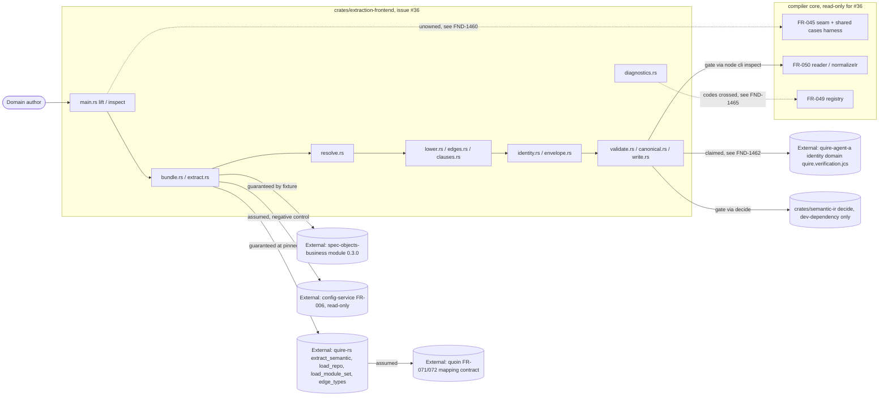

# Scope and boundary review

## Summary

Issue #36 owns one new Cargo workspace member, `crates/extraction-frontend`,
and nothing else: bundle and module loading through `quire-rs` in-process
(FR-091), the closed type-token resolver (FR-092), the lowering of fields,
relationships, operations, and clauses to IR v1.1 (FR-093, FR-094), envelope
and identity minting with a provenance sidecar (FR-095), the
`agent-ix.extraction-frontend.*` registry (FR-096), canonical serialization,
validation, and atomic write (FR-097), provenance-tracked fixtures, goldens,
and the shared-case parity gate (FR-098), and the `extraction-frontend`
binary with its Make block (FR-099), under NFR-031..033. The charter fences
are stated consistently in `spec.md` 2.2, US-015 Constraints, NFR-032's
permitted and prohibited lists, and FR-098-CON-1/FR-099-CON-1..2: the
TypeSpec frontend, the archetype packages, `packages/semantic-core`,
`crates/semantic-ir`, `src/compiler/**`, `schema/**`, every corpus repository,
and every consumer are read-only, and nothing is published.

The findings below are of three kinds. Three are responsibilities nobody
owns because the ticket's own fence puts them outside the crate: wiring the
`spec-bundle` dialect into the FR-045 seam and its harness, the projection
under which cross-frontend parity is compared, and the rulings of #77, #78,
#67, #61 (all open, unassigned) plus the quire-rs tag the pin waits on.
Four are re-implementations of something owned elsewhere: a third JCS
writer and a digest scheme that misnames the quire-agent-a identity domain,
a third JSON Schema validator plus a hand copy of the FR-050 applicability
table, relationship harvesting and a `## Relationships` grammar that no
mapping contract owns, and a `composite` rule derived from verb spelling.
Two are diagnostic-code and IR-kind allocations that two FRs contradict.
NFR-032 also repeats the SR-042 FND-192 path defect (`reviews/**` where
reviews live under `spec/reviews/**`); it is not re-filed here.

## System Context

## In-Scope Responsibilities

- Load one bundle and an explicit module set through `quire-rs` loaders only, and obtain every declaration from `extract_semantic` (FR-091).
- Resolve every `TypeRef.target` to a closed `Resolution` and turn every non-resolution into one blocking diagnostic (FR-092).
- Lower records, fields, constraints, relationships, operations, and clauses to IR v1.1 nodes with identity and origin, and register every representability loss (FR-093, FR-094).
- Mint `source`, `package`, node identities, and a host-free provenance record (FR-095).
- Report through a closed `agent-ix.extraction-frontend.*` registry and carry engine diagnostics through unchanged (FR-096).
- Validate, canonicalize, fingerprint, and atomically write the document (FR-097).
- Carry provenance-tracked fixtures, goldens, negatives, the read-only proof, and the shared-case parity gate (FR-098).
- Expose `lift` and `inspect` and the `extraction-frontend-*` Make block on Rust 1.98.1 (FR-099, NFR-033).
- Be deterministic, hermetic, bounded, and revertible as one range (NFR-031, NFR-032).

## External Dependencies

| Dependency | Type | Assumed or Guaranteed | Contract |
|---|---|---|---|
| `quire-rs` at the exact `rev` containing #388: `extract_semantic`, `SemanticContext`, `BundleIndex::from_documents`, `RequiredSections::from_dsl`, `load_repo`, `Registry::load_module_set`, `semantic_module`, `edge_types` | Rust crate, git dependency | Guaranteed | FR-091-AC-1..10 over the vendored fixtures; NFR-033-AC-3 exact pin; tag hand-off unowned, FND-1467 |
| quire-rs FR-040 edge set per document with locus | Rust API | Assumed, and absent: `harvest_edges` returns `(target, edge_type)` only | None, FND-1463 |
| quoin FR-071/FR-072 Markdown to semantic-core mapping | Contract, consumed through quire-rs | Assumed | `mappingVersions` `["1.0.0"]` (FR-095-AC-5); no row for `## Relationships`, FND-1463 |
| spec-objects-business `0.3.0` module and skeletons | Module fixture | Guaranteed | FR-091-AC-1, FR-093-AC-2, FR-098-AC-3 |
| config-service FR-006 live file | Corpus, read-only | Assumed, negative control | FR-091-AC-10, FR-098 `legacy` PROVENANCE.json |
| quire-rs vendored `config-version.table.md` / `fence.md` | Fixture copies | Guaranteed | FR-098-AC-1 provenance rows, FR-093-AC-1 |
| `packages/semantic-core/kernel-scalars.json` | Table, read-only | Guaranteed | FR-092-AC-1 scalar mapping |
| `schema/semantic/v1/semantic-ir.schema.json`, `common.schema.json` | Published schema, embedded | Guaranteed | FR-097-AC-1 SHA-256 equality with the tree |
| FR-050 reader and `normalizeIr` via `node src/compiler/cli.mjs` | Oracle, run only | Guaranteed | FR-097-AC-11, FR-098-AC-7 |
| FR-050 applicability table `src/compiler/ir/applicability.mjs` | Table the crate must restate in Rust | Assumed | None, FND-1466 |
| `crates/semantic-ir::decide` | Independent oracle, dev-dependency | Guaranteed | FR-097-AC-12, NFR-032-AC-2 |
| FR-045 seam and shared-case harness (`test/compiler-core.test.ts`) | Prohibited path | Assumed | FR-098-AC-6 names an outcome it cannot produce, FND-1460 |
| FR-049 registry `src/compiler/diagnostics.mjs` | Prohibited path | Assumed | FR-093 and FR-097 emit its codes, FND-1465 |
| quire-agent-a identity domain `quire.verification.jcs` / `rfc8785-v1` / `sha256` (quire-specification FR-018) | Cross-repo identity contract | Claimed, not matched | FND-1462 |
| Rust 1.98.1 toolchain, `jsonschema ~0.18`, `sha2`, `clap`, `ix-trace-rs v0.1.1` | Toolchain and crates | Guaranteed | NFR-033-AC-1..10 |
| Issues #77, #78, #67, #61 rulings; #85 json-schema backend | Open decisions, unassigned | Assumed by declared reading | None, FND-1468 |

## Responsibility Allocation

| Requirement | Owning Component | Class |
|---|---|---|
| US-015 | `crates/extraction-frontend` (issue #36) | core |
| FR-091 loading, bundle index, extraction calls | `crates/extraction-frontend` `bundle.rs`, `extract.rs`; parsing and declaration types owned by quire-rs FR-069..072 | core |
| FR-092 type-token resolver | `crates/extraction-frontend` `resolve.rs`; placeholder and reason vocabulary owned by quire-rs FR-070; scalar table owned by FR-032 | core |
| FR-093 record and field lowering, `losses.json` | `crates/extraction-frontend` `lower.rs`; IR node shapes owned by FR-027..029 (issue #34); lowering rows owned by FR-034 (issue #35); applicability table owned by FR-050, see FND-1466 | core |
| FR-093 `CONSTRAINT_NOT_APPLICABLE` emission | FR-049 registry (`agent-ix.semantic-ir.*`), crossed, see FND-1465 | cross-cutting |
| FR-094 `## Relationships` grammar and FR-040 edge harvest | Unowned: quoin mapping contract has no row, quire-rs exposes no located edge set, see FND-1463 | core |
| FR-094 `category` | quire-rs FR-040 `edge_types` registry, consumed | core |
| FR-094 `composite` rule | Unowned, derived from verb spelling in the crate, see FND-1464 | core |
| FR-094 operations and clauses | `crates/extraction-frontend` `clauses.rs`; text and spans owned by quire-rs FR-071 | core |
| FR-095 envelope, identities, provenance | `crates/extraction-frontend` `identity.rs`, `envelope.rs`; identity grammar owned by FR-020; `spec-bundle` value owned by FR-030/`common.schema.json` | core |
| FR-095 `source.dialect` reading of #77 | Issue #77, open and unassigned, see FND-1468 | cross-cutting |
| FR-096 registry, engine pass-through, locus | `crates/extraction-frontend` `diagnostics.rs`; diagnostic shape owned by `common.schema.json`; locus rule reading of #61 owned by #61, see FND-1468 | cross-cutting |
| FR-097 schema validation (`validate.rs`) | `crates/extraction-frontend`, third validator beside FR-050 and `crates/semantic-ir` `schema.rs`, see FND-1466 | infrastructure |
| FR-097 canonical form (`canonical.rs`) and fingerprint sidecar | `crates/extraction-frontend`, third JCS writer; identity domain claimed from quire-agent-a but not matched, see FND-1462; #67 reading owned by #67, see FND-1468 | infrastructure |
| FR-097 `INVALID_IR` emission | FR-049 registry (`agent-ix.compiler.*`), crossed, see FND-1465 | cross-cutting |
| FR-097 atomic write | `crates/extraction-frontend` `write.rs` | infrastructure |
| FR-097 cross-reader gates | FR-050 reader and `crates/semantic-ir`, run as oracles | cross-cutting |
| FR-098 fixtures, goldens, negatives, read-only proof | `crates/extraction-frontend/fixtures/**`, `tests/` | infrastructure |
| FR-098 `spec-bundle` column of `cases.json` and `shared/spec-bundle/**` | `crates/extraction-frontend` (FR-045 `$comment` reserves it for #36); the single-dialect `reason` member crosses NFR-032-AC-4, see FND-1460 | infrastructure |
| FR-098 parity comparison rule | Unowned: harness in `test/compiler-core.test.ts` is prohibited, envelopes differ by construction, see FND-1461 | cross-cutting |
| FR-098 backend acceptance and payload check | `crates/extraction-frontend/tests/`; `json-schema` target owned by #85 | cross-cutting |
| FR-099 binary and Make block | `crates/extraction-frontend` `main.rs`, root `Makefile` block, `members` line | infrastructure |
| FR-045 seam entry for `spec-bundle` after #36 | Unowned, see FND-1460 | core |
| NFR-031 | `crates/extraction-frontend` `limits.json`, lints, audits | cross-cutting |
| NFR-032 | Change-set gate over the sentinel range | cross-cutting |
| NFR-033 | `crates/extraction-frontend/Cargo.toml`, `deny.toml`, notices; quire-rs tag hand-off to quire-agent-c unticketed, see FND-1467 | infrastructure |
| Enumeration and alias lowering asserted by FR-098-AC-3 | Unowned, see FND-1469 | core |
| Rulings #77, #78, #67, #61; declared gap #85 | Unowned, see FND-1468 | cross-cutting |

## Findings

| ID | Severity | Summary | Refs |
|---|---|---|---|
| FND-1460 | high | The FR-045 seam entry for `spec-bundle` has no owner after #36. FR-045-CON-1 assigns the `spec-bundle` frontend to "issue #36", but NFR-032 and FR-099-CON-2 prohibit `src/compiler/**` and every `test/*.test.ts`, so `src/compiler/frontend/spec-bundle/frontend.mjs` keeps returning `FRONTEND_NOT_IMPLEMENTED` naming #36 after #36 lands, `isImplemented("spec-bundle")` stays false, and the FR-045-AC-5 harness in `test/compiler-core.test.ts` (lines 386-408) can neither invoke the Rust binary nor see the column FR-098 fills. FR-098-AC-6 nevertheless asserts that "the harness of FR-045-AC-5 runs the implemented dialects and records the outcome". The single-dialect `reason` member FR-098 adds to `cases.json` is also outside the "`spec-bundle` source entries" NFR-032-AC-4 permits. No ticket owns the Node-to-Rust bridge or the seam's second implementation. | FR-045-CON-1, FR-045-AC-3, FR-045-AC-5, FR-098 Cross-frontend parity, FR-098-AC-6, NFR-032 Prohibited paths, NFR-032-AC-4, FR-099-CON-2 |
| FND-1461 | high | The parity projection is owned by nobody and, as written, cannot be met. FR-098-AC-7 requires `normalizeIr` of the lift to equal `normalizeIr` of the TypeSpec compile "string for string", but FR-046 stamps `source.identity` `ix://<pkg>/source/typespec`, `source.dialect` `typespec`, `source.digest` as FR-048 `contentDigest`, and `package.lockDigest` from the FR-048 lock, while FR-095 stamps `ix://<org>/<name>/spec`, `spec-bundle`, a path/NUL/bytes digest, and its own `lockDigest` recipe; every `origin.source` path and line differs too. The existing harness masks nothing, lives on a prohibited path, and FR-045 says compare "by the normalized serialization of FR-050". Which members the parity comparison excludes, and who defines that projection, is stated nowhere. | FR-098-AC-7, FR-098 Cross-frontend parity, FR-046 Behavior (source and package blocks), FR-048 Behavior, FR-095 Behavior, FR-045 Behavior, `test/compiler-core.test.ts` |
| FND-1462 | high | FR-097 re-implements canonicalization and misattributes its digest scheme. `canonical.rs` is a third RFC 8785 writer beside `src/compiler/packages/canonical.mjs` (FR-048) and `crates/semantic-ir/src/json.rs` `to_canonical_string` (`agent-ix-conformance-jcs-v1`), neither of which the crate may share at runtime. The sidecar `{"algorithm":"rfc8785-v1","digest":"sha256:…"}` is said to match the quire-agent-a domain `quire.verification.jcs`, but that domain (quire-specification FR-018) is a `{domain, version: rfc8785-v1, algorithm: sha256}` triple whose output is prefixed `sha256-jcs:`, with FR-018-AC-2 refusing a raw `sha256` substitute. FR-097 therefore defines the second scheme it says it does not, naming a third algorithm label beside `RFC8785-JCS-with-identity-sorted-sets-v1` and `agent-ix-conformance-jcs-v1`, and issue #67 remains the only owner of which one a document carries. | FR-097 Canonical form, FR-097 Fingerprint, FR-097-AC-6, FR-097-CON-1, FR-048 Outputs, `crates/semantic-ir/src/json.rs`, quire-specification FR-018 |
| FND-1463 | medium | FR-094 harvests relationships that no owner has mapped. The `## Relationships` bullet grammar `- \`<name>\`: <verb> → <Target> (<id>) [n..m]` appears in no quoin mapping requirement (FR-071 and FR-072 cover `## Properties`, `## Invariants`, `## Operations` only) and in no quire-rs requirement; it is authored only in the quire-rs fixture. The "FR-040 edge set … each with verb, target, and locus" is not a quire-rs surface either: `harvest_edges` returns `(target, edge_type)` pairs with no locus, and relative links are resolved separately. The frontend must therefore parse Markdown and frontmatter itself, which is the second reading FR-091-CON-3 forbids for the other three sections, and the mapping row belongs to quoin#293, which does not have it. | FR-094 Inputs, FR-094 Relationships, FR-094-AC-1, FR-094-AC-7, FR-091-CON-3, US-015 Options, `quire-rs/src/corpus/resolve.rs`, quoin FR-071, quoin FR-072 |
| FND-1464 | medium | `composite` is decided by the frontend from verb spelling. FR-094 sets `composite: true` for the closed set `contains`, `aggregates`, `composes`, `owns` while FR-094-CON-2 says the value is read "never from the verb's spelling". quire-rs FR-040's `EdgeTypeDef` carries `category` and `inverse` only, and no module `edge_types` entry declares containment, so the set is a vocabulary rule this crate now owns beside quire-rs's, with no contract test against the registry; adding `part_of`'s inverse or a module verb such as `composed_of` silently changes `composite` and the FR-050 `COMPOSITE_CYCLE` outcome. | FR-094 Relationships, FR-094-CON-2, FR-094-AC-2, FR-094-AC-14, `ix://agent-ix/quire-rs/FR-040`, `quire-rs/src/vocab.rs` |
| FND-1465 | medium | Two FRs emit codes the FR-049 registry owns, against FR-096-CON-2. FR-093 raises `agent-ix.semantic-ir.CONSTRAINT_NOT_APPLICABLE` at the row and FR-097 raises "one blocking `agent-ix.compiler.INVALID_IR` per schema error", while FR-096 closes the registry over `agent-ix.extraction-frontend.*`, lists `INVALID_IR` as its own variant, and forbids emitting any `agent-ix.compiler.*` or `agent-ix.semantic-ir.*` code as the frontend's own. FR-049-CON-3 and FR-049-AC-2 make the registry set equal to the set emitted under `src/compiler/`, so a Rust emitter of those spellings is outside the gate that keeps them stable. | FR-093 The fields, FR-093-AC-6, FR-097 Validation, FR-097-AC-2, FR-096 The registry, FR-096-CON-2, FR-049 The registry, FR-049-CON-3 |
| FND-1466 | medium | FR-097 adds a third JSON Schema validator and FR-093 a hand copy of the FR-050 applicability table. `validate.rs` validates with the `jsonschema` crate over embedded schema copies while the same requirement already runs `node src/compiler/cli.mjs inspect` (FR-050 `validateIrDocument`) and `agent_ix_semantic_ir::decide` (`schema.rs`) over every document; FR-093 applies "the FR-050 applicability table" (`src/compiler/ir/applicability.mjs`, prohibited path) which the crate must restate in Rust with no test tying the copy to the original, repeating the SR-042 FND-189 pattern of a closed table owned elsewhere and copied here. | FR-097 Validation, FR-097 Cross-reader gate, FR-097-AC-1, FR-093 Inputs, FR-093 The fields, FR-050 Outputs, `crates/semantic-ir/src/schema.rs`, SR-042 FND-189 |
| FND-1467 | medium | The quire-rs tag and pin migration have no ticket. NFR-033 pins an exact git `rev` because no tag contains #388 (confirmed: `v0.45.0` is the latest tag and no tag contains the #388 commit) and says the pin "moves to a tag when quire-agent-c cuts one", but no quire-rs issue is named for cutting it, no requirement here owns the pin move, and FR-095-AC-9 asserts the provenance names the "git revision that `Cargo.lock` pins", a recipe that changes once a tag replaces the `rev`. The re-golden that follows any engine move is FR-098-CON-2's "deliberate rewrite" with no owner named. | NFR-033 Rationale, NFR-033-AC-3, FR-095 Provenance, FR-095-AC-9, FR-098-CON-2, `ix://agent-ix/quire-rs/FR-072` |
| FND-1468 | medium | The four rulings and the declared gap have no ruler. `spec.md` 2.2 places ruling #77, #78, #67, #61 out of scope and each FR "takes a reading"; all four issues are open with no assignee, and no requirement names who rules them, what trigger reopens the reading, or what happens to the committed goldens, `losses.json` rows, the sidecar `algorithm` label, and the locus rule when a ruling contradicts the reading. The same holds for #85, whose gap FR-098 carries in a test-only helper. The readings become de-facto rulings fixed by golden bytes under FR-098-AC-2. | spec.md 2.2, US-015 Priority and Risk, FR-093 Declared losses, FR-095 The `source` block, FR-096 Locus, FR-097 Canonical form, FR-098 Backend acceptance, FR-098-AC-2 |
| FND-1469 | medium | Enumeration and alias lowering is asserted but allocated to no requirement. FR-098-AC-3 requires the `business` golden to carry "at least one `record`, `enum`, `alias`, and `scalar` definition", and FR-092 resolves a token to `Enumeration(ArtifactRef)` with "the enumeration's identity", but FR-093 lowers only `kind: record` and FR-092 mints only `scalar` definitions; no FR lowers an `enumeration` artifact (spec-objects-business `enumeration` object type) to an IR `enum` with `variants`, and nothing in FR-091..099 produces an `alias`. A `typeRef` to an enumeration therefore points at an identity no `types[]` entry declares, which FR-092-AC-10 and FR-050 `UNRESOLVED_TYPE_REF` then reject. | FR-098-AC-3, FR-092 Outputs, FR-092-AC-7, FR-092-AC-10, FR-093 Description, FR-093 The record |
