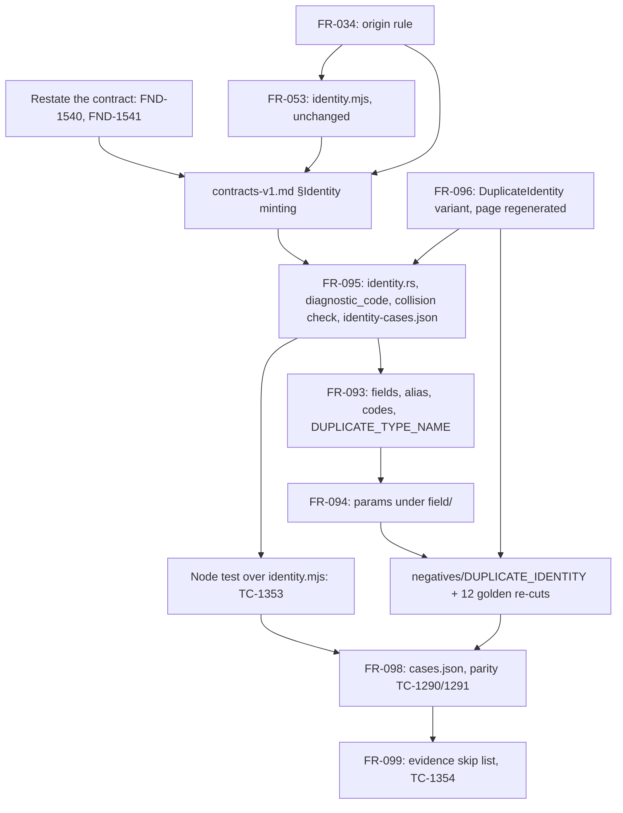

# Dependency review

## Summary

Issue #87 makes one identity-minting rule — FR-053's, which is FR-034's —
the rule FR-095 implements, stated once in `contracts-v1.md` §Identity
minting. The requirement graph after the change is acyclic: FR-034 → FR-053 →
FR-095 → FR-093 → FR-094 → FR-098 → FR-099, with FR-096 the registry every
emitter goes through, and neither FR-034 nor FR-053 depends on anything in
FR-091..099. The rule choice is not reopened here. What this analysis finds
is that the contract section depends on two things it misstates: FR-031's
`Identifier` admits `_`, so "an `Identifier` slugs to itself" is false and
the verbatim `type/<Name>` FR-095 keeps diverges from the slugged one
`identity.mjs` mints; and the two "closing rules" (`DUPLICATE_IDENTITY`,
`UNSLUGGABLE_NAME`) are not what FR-053 and `lower.mjs` do, so the sentence
"implemented unchanged by every frontend" is false for the TypeSpec frontend
on the day it is written, while FR-095-CON-4 forbids changing that frontend.
Three medium findings are ordering and tracing: the registry page and the
negatives inventory were edited ahead of the enum with their rows left green,
the two new AC-16 files sit outside every declared change set with the node
test unnamed, and AC-16 duplicates the shared table FR-053-AC-6 already asks
TC-417 for. Verdict: CONDITIONAL.

## Findings

| ID | Severity | Summary | Refs |
|---|---|---|---|
| FND-1540 | high | The contract sentence "For a name that is already an `Identifier`, the slug is the name verbatim" and FR-095's "verbatim and slugged are the same string, because a `displayName` is an `Identifier` and `slug` maps an `Identifier` to itself" depend on FR-031, whose `Identifier` is `^[A-Za-z_][A-Za-z0-9_]*$` — `_` is admitted — while `semanticIdentity` (`common.schema.json`, `[A-Za-z0-9._~:/-]`) rejects `_`. `identity.mjs` `mintIdentity` slugs the `type` part like every other part (a model `Config_Version` mints `type/Config-Version`) and `constraintAliasIdentity` uses `slug(owner)`; FR-095's "type: `.../type/<Name>`, where `<Name>` is the record's `displayName` verbatim" (and FR-093's alias `type/<DisplayName><Field>` with `<DisplayName>` verbatim) would emit `type/Config_Version`, which fails `semanticIdentity` (FR-095 "SHALL mint identities that match `semanticIdentity`") and differs from FR-053's for the same declaration. FR-093 line 51 lets such a name through: `displayName` is frontmatter `name` "when that value is a semantic-core `Identifier`". Restate the `type` slot in the contract, FR-095, and FR-093 as `slug(Name)` and the alias as `slug(owner)` + capitalised `slug(field)`, and drop the verbatim claim. | contracts-v1.md §Identity minting, FR-095 Node identities, FR-093 The record / The fields, FR-031, common.schema.json `semanticIdentity` |
| FND-1541 | high | The contract's "Two rules close the function" — any identity collision is `DUPLICATE_IDENTITY` raised by the frontend at the later declaration; `UNSLUGGABLE_NAME` only when a name slugs to the empty string — is claimed "implemented unchanged by every frontend", but FR-053 and its code do the opposite mapping: "If slugging two distinct declaration names produces one identity, then the frontend SHALL raise `agent-ix.compiler.UNSLUGGABLE_NAME` at the later declaration's locus" (FR-053 Identity minting, AC-10, TC-421; `lower.mjs` 325–340 raises it before anything is minted), `DUPLICATE_IDENTITY` in the TypeSpec pipeline is `agent-ix.semantic-ir.DUPLICATE_IDENTITY` raised by the reader (`src/compiler/ir/reader.mjs` 449, 464), not the frontend, and an empty slug raises nothing in `identity.mjs` (`mintIdentity` filters empty parts). The spec-bundle side follows the contract instead: EC-161 files `created_at`/`created-at` under `DUPLICATE_IDENTITY` (TC-1351..1353) where FR-053-AC-10 files the same pair under `UNSLUGGABLE_NAME`. Because FR-095-CON-4 forbids changing `src/compiler/**`, the contract must state the closing rules FR-053 actually has (slug collision among declaration names → `UNSLUGGABLE_NAME` at the later declaration; any other collision, the `NoteRevision` alias case included, → `DUPLICATE_IDENTITY`), or scope the closing rules as per-frontend and say so; FR-095, FR-096, ERR-281, and EC-161 then follow. | contracts-v1.md §Identity minting, FR-053 Identity minting, FR-053-AC-10, FR-095 Node identities, FR-095-AC-14, FR-095-CON-4, EC-161, ERR-281, src/compiler/frontend/typespec/lower.mjs, src/compiler/ir/reader.mjs |
| FND-1542 | medium | `docs/semantic-data-system/extraction-frontend-diagnostics.md` ("rendered from `diagnostics.rs`. 27 codes") and the FR-098 negatives inventory ("`DUPLICATE_IDENTITY` ... hold two-document bundles") were edited ahead of the enum, which has no `DuplicateIdentity` variant today, while their gates stay green in the matrix: TC-1271 (FR-096-AC-13) asserts the committed page equals `render_registry_doc()` byte for byte (`tests/docs.rs` 23–33) and is red at this commit; TC-1260 (FR-096-AC-2, now naming `DUPLICATE_IDENTITY`), TC-1272 (FR-096-AC-14, negatives set equals enum variants), and TC-1288 (FR-098-AC-4, every code has a fixture) changed meaning and keep `✅ passed`, and FR-096's coverage row keeps `✅ Complete`. Mark the four rows pending CR-087-1 and sequence: enum variant and severity → regenerate the page → `negatives/DUPLICATE_IDENTITY/` → goldens. | FR-096-AC-2, FR-096-AC-13, FR-096-AC-14, FR-098-AC-4, TC-1260, TC-1271, TC-1272, TC-1288, spec/tests.md FR-096 row, extraction-frontend-diagnostics.md |
| FND-1543 | medium | FR-095 Outputs and AC-16 add `test/fixtures/compiler/shared/identity-cases.json` and "a node test against `src/compiler/frontend/typespec/identity.mjs`" whose path no sentence names. Neither file is in the change set FR-098-AC-10 declares ("exactly `cases.json`, `test/fixtures/compiler/shared/typespec/records-and-scalars/`, and files under `test/fixtures/compiler/shared/spec-bundle/`") nor in FR-099-CON-1's "exactly six paths", and FR-095-CON-4 gates only `src/compiler`, `packages`, `conformance`, `schema`, so `test/**` is ungated for #87; TC-1294 and TC-1299 stay green only because they measure the squashed #36 range. Name the node test file in FR-095 Outputs and state #87's outside-the-crate set (the two files, the registry page, `cases.json`, the shared spec-bundle tree, and the spec artifacts) in FR-095-CON-4 or widen FR-098-AC-10 and FR-099-CON-1 to it. | FR-095 Outputs, FR-095-AC-16, FR-095-CON-4, FR-098-AC-10, FR-099-CON-1, FR-099-AC-5, TC-1294, TC-1299, TC-1354 |
| FND-1544 | medium | FR-053-AC-6 already requires identities "computed by a shared table rather than by two hand-written lists" and its row TC-417 (`test/compiler-core.test.ts` 711) is a hand-written expectation list, not a table. FR-095-AC-16 now creates the table and TC-1353 traces to FR-053-AC-6 beside TC-417, but the FR-053 coverage row (`spec/tests.md` line 224: `TC-412..TC-431, TC-604`) is unchanged and TC-417 is neither restated to read `identity-cases.json` nor retired, so one criterion has two rows with different oracles. Restate TC-417 to read the table (or fold it into TC-1353) and add TC-1353 to FR-053's coverage row. | FR-053-AC-6, FR-095-AC-16, TC-417, TC-1353, spec/tests.md FR-053 row |
| FND-1545 | low | Graph edges after the change. Added and correct: FR-095 `depends_on` FR-034 and FR-053, FR-053 Downstream FR-095. Missing: FR-098's parity (AC-7 names `identity.mjs` and the `type/NoteRevision` alias) has no edge to FR-053 in frontmatter or body; FR-098 Downstream still lists filament-core-data#87 as downstream although its ruling is now an upstream input; FR-034 Downstream still reads "extraction frontend (issue #36)" while its body now names FR-095; FR-093's body Upstream lists FR-034 but not FR-095, the edge SR-163 FND-1437 asked for. The graph is acyclic with all of them added. | FR-098 frontmatter and Dependencies, FR-034 Dependencies, FR-093 Dependencies, SR-163 FND-1437 |
| FND-1546 | low | The rule's root is stated in a loop: the contract says "It is stated here once"; FR-034 says its rules "are the one identity-minting rule of `contracts-v1.md`"; FR-053 says "SHALL mint identities by the rules of FR-034" and "This rule is stated once, in `contracts-v1.md`"; FR-095 says "the rule FR-034 states and FR-053 implements". Four statements, and the contract's sentences have no test binding — AC-16's table checks the two implementations against each other, not against the contract text — which is how FND-1540 and FND-1541 entered. Declare the contract section normative, make the FR-034/FR-053 sentences citations only, and state that `identity-cases.json` is authored from the contract section with each row citing its sentence. | contracts-v1.md §Identity minting, FR-034 Behavior, FR-053 Identity minting, FR-095 Node identities, FR-095-AC-16 |
| FND-1547 | low | FR-034's form `diagnosticCode` `agent-ix.<repo>.<NAME>_<FIELD>_<KEYWORD>` is coarser than the contract's (`slug(package name) lower-cased`, `UPPER_SNAKE` through `slug`): read literally for a package `core.data` it gives `agent-ix.core.data.…`, which fails `^agent-ix\.[a-z0-9-]+\.[A-Z][A-Z0-9_]+$`. FR-053-AC-9 (TC-420) covers the case, and FR-034's new sentence defers to the contract, so this is a wording gap in the requirement the contract calls its origin, not a divergence. | FR-034 Behavior, FR-053-AC-9, contracts-v1.md §Identity minting |
| FND-1548 | low | FR-095-CON-4 / TC-1354 measures "`git diff --stat origin/main -- src/compiler packages conformance schema` is empty for the change"; after the branch merges, `origin/main` contains the change and the diff is empty for any tree, so the gate is vacuous exactly when it is recorded as evidence. Fix the range as NFR-032 does (the CR-087-1 commit's parent through the branch tip), or record the gate as a one-time pre-merge measurement in `spec/log.md`. | FR-095-CON-4, TC-1354 |
| FND-1549 | low | External ordering, unchanged by #87 and blocking nothing: TC-1291 still needs `node` and a `pnpm install`ed tree when `cargo test` runs (SR-163 FND-1431 applied), the TypeSpec half of `records-and-scalars` already mints `type/NoteRevision` (Phase 0 G5), and #88 gates only FR-098-AC-8's TypeScript half (`generate`, not `compile`), so parity is reachable once FR-095's `identity.rs` and the 12 golden re-cuts land. | FR-098-AC-7, FR-098-AC-8, TC-1291, TC-1292, filament-core-data#88 |

## Classification

| Requirement | Class | Rationale |
|---|---|---|
| contracts-v1.md §Identity minting | Enablement | The one rule statement; every implementation below cites it; no behaviour of its own |
| FR-034 | Enablement | Origin of the rule; unchanged behaviour, one citing sentence added |
| FR-053 | Enablement | The reference implementation (`identity.mjs`); unchanged behaviour by FR-095-CON-4 |
| FR-096 | Enablement | `DUPLICATE_IDENTITY` joins the closed `Code` enum every emitter uses; must precede FR-095's collision check |
| FR-095 | Enablement | `identity.rs` rewrite, `diagnostic_code`, collision check, shared table; every FR-093/FR-094 node identity is minted here |
| FR-093 | Feature | Field, alias, `diagnosticCode`, and `DUPLICATE_TYPE_NAME` lowering under the new slug |
| FR-094 | Feature | Parameter identities move to `field/`; relationship, operation, clause patterns restated |
| FR-098 | Feature | Evidence: `negatives/DUPLICATE_IDENTITY`, 12 golden re-cuts, `cases.json`, parity TC-1290/1291 |
| FR-099 | Feature | Skip list of `extraction-frontend-evidence` shrinks to TC-1292 |

## Dependency Graph

Edges to FR-091, FR-092, FR-097, and NFR-031..033 are unchanged from SR-163
and omitted.

## Topological Order (suggested implementation sequence)

1. Text before code: apply FND-1540 and FND-1541 to the contract section, FR-095, FR-093, ERR-281, EC-161; mark TC-1260, TC-1271, TC-1272, TC-1288 pending (FND-1542); name the node test path and #87's outside-the-crate set (FND-1543).
2. FR-096: `Code::DuplicateIdentity`, severity row, regenerate `extraction-frontend-diagnostics.md` (TC-1260, TC-1271).
3. FR-095: `identity.rs` (case-preserving `slug`, `type`/alias through `slug`, `field_identity` for parameters, drop `param_identity`, `diagnostic_code`), the collision check, `identity-cases.json`, the Rust table test (TC-1252, TC-1352).
4. In parallel with 3 once the table exists: the node test over `identity.mjs` (TC-1353), and TC-417 restated to read it (FND-1544).
5. FR-093 and FR-094 lowering (TC-1223, TC-1224, TC-1241, TC-1251, TC-1333, TC-1334, TC-1347).
6. `negatives/DUPLICATE_IDENTITY/` and the 12 golden re-cuts in one commit under FR-098-CON-2 (TC-1351, TC-1272, TC-1288).
7. FR-098 `cases.json` with both dialects and the parity run (TC-1290, TC-1291; needs `node`).
8. FR-099 skip list; TC-1354 measured over a fixed range before merge (FND-1548).

## Cycles

None. FR-034 and FR-053 depend on FR-027..FR-032, FR-045, NFR-019, NFR-020
only; FR-095 now depends on both; FR-093, FR-094, FR-098, FR-099 depend on
FR-095 and never the reverse. The prose loop of FND-1546 (the contract cites
FR-034, FR-034 cites the contract) is a statement-of-origin loop, not a
prerequisite edge.

## External Ordering

- filament-core-data#87: ruled (option a) and Phase 0 chose FR-053's rule; this review does not reopen it.
- filament-core-data#88: gates FR-098-AC-8's TypeScript half only; not a prerequisite of TC-1290/1291 (FND-1549).
- `node` and the installed workspace at `cargo test` time: unchanged prerequisite of TC-1291 (SR-163 FND-1431).
- quire-rs: no API change is needed; `identity.rs` is pure over names the engine already returns.
