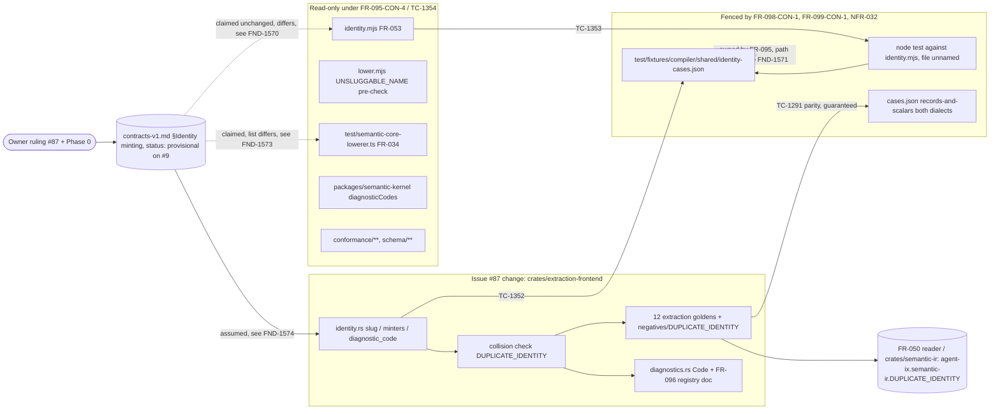

# Scope and boundary review

## Summary

Issue #87 (CR-087-1, commit `86320f0`) moves the ownership of identity
minting from three requirements to one contract section:
`docs/semantic-data-system/contracts-v1.md` §Identity minting states the
slots, the case-preserving `slug`, the alias `type/<Name><Field>`, the
`diagnosticCode` form, and the two closing rules (`DUPLICATE_IDENTITY`,
`UNSLUGGABLE_NAME`), and names FR-034 (semantic-core reference lowerer),
FR-053 (`src/compiler/frontend/typespec/identity.mjs`), and FR-095
(`crates/extraction-frontend/src/identity.rs`) as its three implementations.
The rule choice is the owner's and Phase 0's and is not reviewed here; what is
reviewed is whether each responsibility the change touches has exactly one
owner and whether every boundary it crosses is stated.

The system boundary the change draws is sound in its main line: the TypeSpec
side is read-only (FR-095-CON-4, TC-1354), the extraction crate is the only
code that moves, and the parity gate of FR-098 becomes the cross-frontend
contract test. The findings are of two kinds. Two are ownership conflicts the
text creates: the contract claims one collision rule while FR-053, left
"unchanged otherwise", keeps a different one for the same input, and the
shared table plus its node test are assigned to FR-095 on paths that FR-098,
FR-099, and NFR-032 fence off and that TC-1294 measures. Three are
responsibilities stated in more than one place with different content, or
claimed by the contract but enforced by nothing that reads the contract. Two
are low: the registry namespace of the collision codes, and the literal
`agent-ix.` prefix of a `diagnosticCode` for a package of any other org.

## Verdict

**CONDITIONAL** — the shared rule has one stated home and one enforced home,
and they are different documents with different owners; FND-1570 and FND-1571
must be resolved in the text before the plan is cut, because the first leaves
`created_at`/`created-at` refused under two codes by the two frontends the
contract says agree, and the second puts the deliverable that proves agreement
on paths an un-ignored test forbids.

## System Context

## In-Scope Responsibilities

- State the identity-minting rule once, in `contracts-v1.md` §Identity minting, and name its three implementations (contract, FR-034 sentence, FR-053 sentence).
- Re-implement `slug`, the alias identity, the `field/<Name>-<operation>-<param>` parameter slot, and `diagnosticCode` in `crates/extraction-frontend/src/identity.rs`, and drop `param_identity` (FR-095 Outputs, Node identities; FR-093 The fields; FR-094 Operations).
- Add the collision check and the `DUPLICATE_IDENTITY` code to the closed extraction registry, severity `error`, blocking (FR-095, FR-096, `extraction-frontend-diagnostics.md`).
- Narrow `DUPLICATE_TYPE_NAME` to equal verbatim `displayName` and kernel-scalar shadowing (FR-093 The record).
- Re-cut the 12 extraction goldens once and add `negatives/DUPLICATE_IDENTITY` (FR-098 inventory, FR-095-AC-14).
- Author the shared identity table and prove both implementations against it (FR-095-AC-16, TC-1352, TC-1353).
- Make `records-and-scalars` a two-dialect case and let TC-1290/TC-1291 hold unconditionally (FR-098 Cross-frontend parity, AC-6, AC-7; FR-099 evidence skip list).
- Change no byte of `src/compiler/**`, `packages/**`, `conformance/**`, `schema/**` (FR-095-CON-4, TC-1354).

## External Dependencies

| Dependency | Type | Assumed or Guaranteed | Contract |
|---|---|---|---|
| `contracts-v1.md` §Identity minting (the stated rule) | Prose in a `status: provisional` document gated on issue #9 | Assumed: no test reads the section; `test/semantic-contract.test.ts` checks five unrelated phrases of the file | None, FND-1574 |
| `src/compiler/frontend/typespec/identity.mjs` (`slug`, `mintIdentity`, `constraintAliasIdentity`, `constraintDiagnosticCode`) | Read-only reference implementation, FR-053 | Guaranteed against the table by TC-1353; its collision pre-check in `lower.mjs` is not in the table | FR-095-AC-16; collision clause unbound, FND-1570 |
| `test/semantic-core-lowerer.ts` (FR-034 reference lowerer) | Read-only third implementation the contract names | Assumed: reached only through FR-053-CON-1's differential test, not through the table | FR-053-CON-1, TC-417; FND-1573, FND-1574 |
| `packages/semantic-kernel/semantic-ir.json` `diagnosticCode`s | Published package the rule must not move | Guaranteed | FR-095-CON-4, TC-1354 |
| FR-050 reader and `crates/semantic-ir` `agent-ix.semantic-ir.DUPLICATE_IDENTITY` | Consumer-side refusal of a colliding document | Guaranteed | FR-093-AC-11, FR-095-AC-13, FR-097 cross-reader gate |
| `common.schema.json` `diagnostic.code` pattern `^agent-ix\.[a-z0-9-]+\.[A-Z][A-Z0-9_]+$` | Schema owning the `diagnosticCode` form | Guaranteed | FR-053-AC-9, FR-095 Node identities; the literal `agent-ix.` prefix is the schema's, FND-1576 |
| `test/fixtures/compiler/shared/cases.json`, `shared/typespec/records-and-scalars/**`, `shared/spec-bundle/**` | Shared-case corpus the parity gate reads | Guaranteed | FR-098-AC-6, AC-10; NFR-032-AC-4 |
| NFR-032 permitted/prohibited lists, FR-098-CON-1, FR-099-CON-1 | Standing fences over the crate's change set | Guaranteed by TC-1294 and TC-1299, which the #87 deliverables trip | FND-1571 |
| Owner ruling and Phase 0 comment on #87 | Decision record | Assumed, recorded in `spec/log.md` CR-087-1 and FR-098 Rationale | Not reviewed |

## Responsibility Allocation

| Requirement | Owning Component | Class |
|---|---|---|
| `contracts-v1.md` §Identity minting: slots, `slug`, alias, `diagnosticCode`, two closing rules | Contract document (provisional, issue #9); the enforced form is the FR-095 table, see FND-1574 | core |
| FR-034 identity, alias, `diagnosticCode` bullets + the #87 sentence | `test/semantic-core-lowerer.ts`, read-only; states a shorter slot list than the contract, see FND-1573 | core |
| FR-053 Identity minting (slots, `slug`, `DUPLICATE_IDENTITY`, `UNSLUGGABLE_NAME`) + the #87 sentence | `src/compiler/frontend/typespec/identity.mjs`, `lower.mjs`, read-only; collision clause differs from the contract, see FND-1570 | core |
| FR-053-AC-6 shared-table form | `test/compiler-core.test.ts` TC-417 today (inline expectations); TC-1353 dual-tags it to the FR-095 table, file unnamed, see FND-1571 | cross-cutting |
| FR-095 Node identities, `slug`, `diagnosticCode`, `UNSLUGGABLE_NAME` | `crates/extraction-frontend/src/identity.rs` | core |
| FR-095 collision check, `DUPLICATE_IDENTITY` | `crates/extraction-frontend/src/identity.rs` + `diagnostics.rs`; the same-name half of the contract rule is FR-093's `DUPLICATE_TYPE_NAME`, see FND-1572 | core |
| FR-095 Outputs `test/fixtures/compiler/shared/identity-cases.json` and the node test of AC-16 | FR-095, on a path outside every fence that names the crate, see FND-1571 | cross-cutting |
| FR-095-CON-4 read-only fence | `crates/extraction-frontend/tests/` static test TC-1354 | cross-cutting |
| FR-093 `DUPLICATE_TYPE_NAME` (equal `displayName`, kernel shadow, enumeration rows) | `crates/extraction-frontend/src/lower.rs`; carves the contract's collision rule by name equality, see FND-1572 | core |
| FR-093 alias `type/<DisplayName><Field>`, `diagnosticCode` via FR-095 | `lower.rs` through `identity.rs` | core |
| FR-094 parameter identity via `field_identity`; relationship, operation, clause forms | `lower.rs` / `clauses.rs` through `identity.rs` | core |
| FR-096 registry gains `DUPLICATE_IDENTITY`; `extraction-frontend-diagnostics.md` 27 codes | `crates/extraction-frontend/src/diagnostics.rs` and the registry document; wire namespace per frontend, see FND-1575 | cross-cutting |
| FR-098 two-dialect `records-and-scalars`, unconditional parity, `negatives/DUPLICATE_IDENTITY` | `crates/extraction-frontend/tests/` parity test and fixtures; `cases.json` under NFR-032-AC-4 | cross-cutting |
| FR-099 evidence skip list (TC-1292 only) | Root `Makefile` `extraction-frontend-evidence` target | infrastructure |
| `spec/tests.md` retitled rows, TC-1351..1354, ERR-281, EC-161 | Matrix, pending implementation | cross-cutting |

## Findings

| ID | Severity | Summary | Refs |
|---|---|---|---|
| FND-1570 | high | The contract's collision rule and FR-053's are two rules for one input, and the contract says they are one. `contracts-v1.md` §Identity minting closes the function with "If two declarations mint one identity, the frontend raises `DUPLICATE_IDENTITY` … If a name slugs to the empty string, the frontend raises `UNSLUGGABLE_NAME`", and opens with "implemented unchanged by every frontend". FR-053, edited only by the one citing sentence, keeps "If slugging two distinct declaration names produces one identity, then the frontend SHALL raise `agent-ix.compiler.UNSLUGGABLE_NAME` at the later declaration's locus rather than emitting a colliding identity", bound by FR-053-AC-10, ERR-074, and TC-421, and `lower.mjs` lines 325–340 implement it as a pre-mint slug-collision scan. FR-095 and EC-161 put the same input (`created_at` beside `created-at`) under `DUPLICATE_IDENTITY` (TC-1351..1353). So `created_at`/`created-at` is refused as `agent-ix.compiler.UNSLUGGABLE_NAME` by one implementation the contract names and as `agent-ix.extraction-frontend.DUPLICATE_IDENTITY` by the other, the sentence "Distinct names with distinct slugs — `Status` and `status` — are distinct identities, not a collision" leaves the distinct-names-same-slug case to the two FRs, and the shared table of FR-095-AC-16 holds identity rows only, so nothing measures that the closing rules agree. The contract must either own the collision clause and FR-053 cite it, or say the closing rules are per-frontend. | contracts-v1.md §Identity minting ("Two rules close the function…"), FR-053 Identity minting (last bullet), FR-053-AC-10, FR-095 Node identities (`DUPLICATE_IDENTITY` bullet), FR-095-AC-16, EC-161, ERR-074, ERR-281, TC-421, TC-1351, TC-1353 |
| FND-1571 | high | The shared table and its node test are allocated to FR-095 on paths every standing fence excludes. FR-095 Outputs adds `test/fixtures/compiler/shared/identity-cases.json` and FR-095-AC-16 "a node test … against `src/compiler/frontend/typespec/identity.mjs`" naming no file; the only node suite that imports `identity.mjs` is `test/compiler-core.test.ts`. FR-098 Cross-frontend parity says the frontend "SHALL NOT edit … `test/compiler-core.test.ts`"; FR-098-CON-1 and FR-098-AC-10 close the outside-the-crate set to `cases.json`, `shared/typespec/records-and-scalars/`, and `shared/spec-bundle/`, and TC-1294 (`tests/fixtures.rs`, un-ignored) diffs `test/fixtures/compiler` against `merge-base HEAD main` and fails on any other path; NFR-032 prohibits every `test/*.test.ts` and permits under `test/fixtures/compiler/shared/**` only the same three entries; FR-099-CON-1 closes the remaining set to six paths. FR-095-CON-4 fences only `src/compiler/**`, `packages/**`, `conformance/**`, `schema/**`, so the #87 change is unfenced exactly where the #36 fences bite, and no requirement restates them for #87. The table, the node test's file, and the fence entries that admit them need one owner. | FR-095 Outputs, FR-095-AC-16, FR-095-CON-4, FR-098 Cross-frontend parity (`SHALL NOT edit` bullet), FR-098-CON-1, FR-098-AC-10, FR-099-CON-1, NFR-032 Permitted paths / Prohibited paths, NFR-032-AC-4, TC-1294, TC-1299, TC-1353 |
| FND-1572 | medium | The contract's collision rule is partitioned by FR-093 on a criterion the contract does not state. The contract says a frontend that mints one identity for two declarations "raises `DUPLICATE_IDENTITY` … it never emits a colliding identity". FR-093 The record keeps `DUPLICATE_TYPE_NAME` for "two documents in one bundle lower to the same `displayName` (verbatim…)" and for a `displayName` equal to a kernel scalar the bundle uses — both are `type/<Name>` identity collisions — and adds "two distinct names that nonetheless mint one identity are FR-095's `DUPLICATE_IDENTITY`". The same-name/distinct-name split lives only in that FR-093 sentence and in FR-095-AC-14's last clause; FR-096's registry now carries two blocking codes for one contract rule, and `extraction-frontend-diagnostics.md` describes them as "two artifacts lower to one `displayName`" and "two declarations mint one identity" without saying the second excludes the first. The contract should state which collisions a frontend may refuse under a name-level code. | contracts-v1.md §Identity minting, FR-093 The record (`DUPLICATE_TYPE_NAME` bullets), FR-093-AC-13, FR-095-AC-14, FR-096 The registry, extraction-frontend-diagnostics.md rows `DUPLICATE_TYPE_NAME` / `DUPLICATE_IDENTITY`, ERR-261, ERR-281 |
| FND-1573 | medium | The slot table is stated three times with three contents, and two of the statements claim to be the rule. The contract says the rule "is stated here once"; FR-034's new sentence says "the identity, alias, and `diagnosticCode` rules above are the one identity-minting rule", but FR-034's list is rooted at `<org>/<repo>`, has no `variant`, no parameter form, no type-constraint form, and writes the code as `agent-ix.<repo>.<NAME>_<FIELD>_<KEYWORD>` with no slug and no lower-casing; FR-053 says "the `variant` slot is this requirement's addition to FR-034's list" and writes the code namespace as `agent-ix.<slug(package name)>.` without the lower-casing the contract states and the `diagnostic.code` pattern (`[a-z0-9-]+`) requires, which `identity.mjs` applies. A reader of FR-034 alone gets a different function from a reader of the contract; which document an added slot is written to first is unstated. FR-034 and FR-053 should cite the contract as the list and keep only what they add or restrict. | FR-034 Behavior (identity bullet, alias bullet, #87 sentence), FR-053 Identity minting (first and third bullets), FR-053 Constraints and minted aliases (`diagnosticCode` bullet), contracts-v1.md §Identity minting (slot table, `diagnosticCode` paragraph), common.schema.json `diagnostic.code` |
| FND-1574 | medium | The contract is the stated owner and is enforced by nothing; the FR-095 table is the enforced owner and is owned by one implementation. `contracts-v1.md` is `status: provisional` with a `resolution_gate` on issue #9, and the only test reading it (`test/semantic-contract.test.ts` line 270) asserts five phrases unrelated to identity. `identity-cases.json` is an FR-095 Output authored on the extraction side; TC-1352 and TC-1353 check `identity.rs` and `identity.mjs` against the table, nothing checks the table against the contract prose, and the third named implementation (FR-034's `test/semantic-core-lowerer.ts`) is not read against the table. A row added to the table changes the rule with no contract edit, and a contract edit changes nothing measurable. Name who owns the table's rows and require the contract's worked examples (`Config Version`, `created_at`, `versionNumber`, `NoteRevision`, `NOTE_REVISION_MIN`) to be rows of it. | contracts-v1.md frontmatter (`status: provisional`), contracts-v1.md §Identity minting, FR-095 Outputs (`identity-cases.json`), FR-095-AC-16, FR-034 Outputs (`test/semantic-core-lowerer.ts`), FR-053-CON-1, TC-417, TC-1352, TC-1353 |
| FND-1575 | low | The contract names the collision codes without a registry, and three registries spell them. "the frontend raises `DUPLICATE_IDENTITY`" resolves to `agent-ix.semantic-ir.DUPLICATE_IDENTITY` in FR-053 (the FR-050 reader's code, per FR-050's rule table and `reader.mjs`), to `agent-ix.extraction-frontend.DUPLICATE_IDENTITY` in FR-095/FR-096, and to the reader's own emission in `crates/semantic-ir/src/rules.rs`; `UNSLUGGABLE_NAME` is `agent-ix.compiler.*` in FR-053 and `agent-ix.extraction-frontend.*` in FR-096. The contract should say the code is the emitting frontend's registry entry and the reader's is the consumer-side refusal of a document that escaped. | contracts-v1.md §Identity minting, FR-053 Identity minting, FR-050 rule table (`DUPLICATE_IDENTITY` row), FR-096 The registry, FR-096-CON-2 |
| FND-1576 | low | The `diagnosticCode` form drops the org and hard-codes `agent-ix.` for every package. The contract writes `agent-ix.<slug(package name) lower-cased>.…` and defines `<package name>` as "the part of the package identity after `<org>/`", so packages `acme/foo` and `agent-ix/foo` share the namespace `agent-ix.foo`; the `diagnostic.code` pattern of `common.schema.json` owns the literal prefix, and neither the contract nor FR-095 says the org is deliberately not part of the code or who owns a cross-org collision. Pre-existing in FR-034 and `identity.mjs`; the contract is now the single statement and should say so. | contracts-v1.md §Identity minting (`diagnosticCode` paragraph), FR-034 alias bullet, FR-095 Node identities (`diagnosticCode` bullet), common.schema.json `diagnostic.code` |
| FND-1577 | low | FR-053 Outputs state `mintIdentity(slot, parts, packageIdentity)` while `identity.mjs` exports `mintIdentity(packageIdentity, slot, parts)`; FR-095-AC-16's node test binds to the exported surface FR-053 names, so the table-driven test will be written against a signature the requirement misstates. One-line restatement in FR-053, no code change. | FR-053 Outputs (`identity.mjs` bullet), FR-095-AC-16, `src/compiler/frontend/typespec/identity.mjs` |
