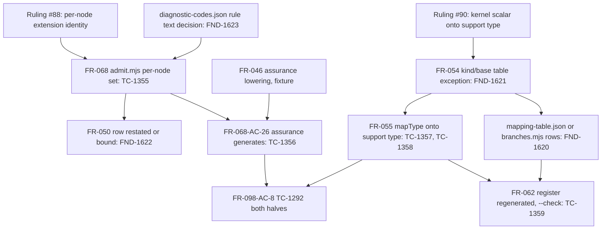

# Dependency review

## Summary

Commit b97813b records two owner rulings (issues #88 and #90) as spec-only
changes to FR-068 and FR-050 (per-node extension identity, TypeScript backend
`admit.mjs`) and to FR-055 and FR-062 (kernel scalar mapped onto its support
type, Rust backend `mapping.mjs` and the branch register). The two slices are
independent of each other — they touch disjoint backends — and both are
prerequisites of the already-blocked TC-1292 (FR-098-AC-8). The rulings
themselves are not questioned here. Four ordering and tracing defects were
found in how the rules are stated and bound: FR-062's new register rows are
attributed to a vocabulary (`names.mjs`) that cannot produce them under
FR-062's own one-way generation rule, so TC-1359 has no reachable
prerequisite; the mapping exception FR-055 introduces is a mapping behaviour
whose unconditional counter-rule in FR-054 (downstream of FR-055) and in
`mapping-table.json` is not amended; FR-050's amended row describes a
declaration-identity set the FR-050 reader does not keep and binds no test;
and `spec/log.md` misquotes the corpus rule text that FR-068 must stay in
bijection with. Frontmatter graphs stay acyclic; no new edge was declared and
two implicit ones (FR-055 → FR-054 for the exception, FR-046 → FR-068-AC-26 for
the fixture) are missing.

## Findings

| ID | Severity | Summary | Refs |
|---|---|---|---|
| FND-1620 | high | FR-062 "The branch register" bullet "The register SHALL carry one `name-derivation` row per support scalar — `date`, `datetime`, `duration`, and `uuid` — contributed by `names.mjs`" and FR-062-AC-15 ("exactly four `name-derivation` rows ... each contributed by `names.mjs`") name a row the register cannot generate. `src/compiler/backends/rust-serde/branches.mjs` enumerates `names.mjs` as exactly one `name:<renderer>` row per exported `*Name` function and one `scope:<key>` row per `names.SCOPES` entry (axis `name`, ten rows in the committed `branch-register.json`); there is no `name-derivation` axis, no per-scalar vocabulary in `names.mjs`, and FR-055-CON-3 forbids `names.mjs` reading anything but its argument, so it cannot know a definition's `scalar`. FR-062-AC-8 and the register header forbid a transcribed row. The four rows therefore require a vocabulary change first — a `mapping-table.json` row per support-type mapping (FR-054's table, axis `scalar`, which today carries `scalar:uuid` as "generated 8-4-4-4-12 newtype") or a new source in `branches.mjs` — and neither FR-054 nor that source is amended or sequenced. As written, TC-1359 waits on a prerequisite the spec does not name, and `register --check` cannot "pass after the register is regenerated with those rows". | FR-062 (branch-register bullets), FR-062-AC-15, FR-062-AC-8, FR-054, FR-055-CON-3, TC-1359 |
| FND-1621 | medium | FR-055 "Scopes and collisions" bullet "the backend SHALL map the definition onto the support type: it SHALL emit no newtype for it, SHALL render every `typeRef` to it as `crate::support::<Support>`" states a mapping behaviour, not an identifier derivation. FR-054's kind table row "`scalar` \| `pub struct N(B);` newtype over the kernel base `B`, with `try_new`" and its base table rows "`uuid` \| `Uuid`, the generated 8-4-4-4-12 newtype" (and `date`, `datetime`, `duration`) remain unconditional, as does `mapping-table.json` `kind:scalar` ("newtype over the kernel base with try_new"). FR-054 depends on FR-055 (FR-055 lists FR-054 downstream), so the exception flows into FR-054 with no sentence there admitting it, and the code the ruling targets is `mapType` in `mapping.mjs` (FR-054's output), which `names.mjs` cannot influence. The FR-054 row must carry the exception (or cite FR-055's bullet) before implementation, or FR-054-AC-2 "each of the eight supported kernel scalars maps to its declared Rust base" and FR-055-AC-15 contradict each other for a `UUID` definition. | FR-055 (Scopes and collisions), FR-055-AC-15, FR-054 (kind table, scalar base table), FR-054-AC-2, mapping-table.json |
| FND-1622 | medium | FR-050's amended code-table row (line 78) "an extension `identity` is unique per node ... and is never entered into the declaration-identity set" is stated for `readContractIr`, but `src/compiler/ir/reader.mjs` decides `DUPLICATE_IDENTITY` with one per-list set over `fields`, `variants`, `constraints`, `relationships`, `operations`, `clauses` and one over `types`, never over `extensions` and with no document-wide declaration set — so the sentence describes a set the reader does not keep and a rule it satisfies vacuously. The change binds no FR-050 criterion or test (the FR-050 summary row stays `FR-050-AC-1..13`, TC-510..526; EC-162 cites FR-050 but lists only FR-068's TC-1355/1356), FR-068 declares no `depends_on` FR-050, and FR-068-CON-1/AC-13 forbid `admit.mjs` importing the reader, so the two rows are one rule copied into two requirements with no edge and no shared oracle. Either bind the FR-050 row to a reader test (FR-050-AC-11 "every rule of the code table fires" cannot fire a positive rule), or state it as the reading FR-050 already has and let FR-068 own the per-node decision. | FR-050 (code table, line 78), FR-050-AC-11, FR-068 (rule table), FR-068-CON-1, FR-068-AC-13, EC-162 |
| FND-1623 | medium | `spec/log.md` CR-088-1 entry: "`conformance/diagnostic-codes.json` is unchanged (its \"within each list\" rule text is correct as written)". The file's `DUPLICATE_IDENTITY` entry (line 148) reads "A semantic identity declared twice anywhere in one document." — the document-wide reading the ruling overturned — with `provenance: "frozen"` and `sources` naming `contracts-v1.md`. FR-068 "That register SHALL stand in exact bijection with the `agent-ix.semantic-ir.` codes of `conformance/diagnostic-codes.json`" makes that file the citation FR-068's rule table is checked against, so the log's quotation is false and the frozen corpus text now contradicts both FR-068's and FR-050's rows. The corpus text is a contract artefact outside this change's scope; the log must say so rather than assert agreement, and the discrepancy needs an owner before the #88 fix lands under TC-796's "derivation ledger names ... the corpus register". | spec/log.md (CR-088-1), conformance/diagnostic-codes.json (DUPLICATE_IDENTITY), FR-068 (register bijection bullet), TC-796 |
| FND-1624 | low | The consumer of both slices is TC-1292 (FR-098-AC-8), still recorded as "Rust half blocked on the rust-serde `NAME_COLLISION` defect (issue to be filed)" in `spec/tests.md` line 1459 and in FR-098-AC-8; the issue is #90 and FR-098 "Downstream" names #88 but not #90. No matrix row records that TC-1292 unblocks after TC-1356 and TC-1357; only the two log entries do. The commit leaves FR-098 untouched by design, so this is recorded as the missing edge, not as a defect of the change. | TC-1292, FR-098-AC-8, FR-098 (Dependencies) |
| FND-1625 | low | FR-068-AC-26 / TC-1356 run `generate --target typescript` over "the IR lowered from `test/fixtures/compiler/packages/assurance`", which depends on the FR-046 TypeSpec lowering (`main.tsp` types `revision: int32` and `at: utcDateTime` directly, minting at least two kernel-scalar definitions per FR-046 line 78) and on the FR-052 `generate` command; FR-068's frontmatter lists FR-063, FR-029, FR-036 only. The invariant the ruling restores — every package-local kernel scalar definition carries `ext/kernel-scalar` — is FR-046's and FR-034's, and the new FR-068 bullet cites only #88. Adding FR-046 as the fixture edge, and citing FR-046 in the bullet, makes the test's prerequisite and the rule's origin visible. | FR-068-AC-26, TC-1356, FR-046 (kernel scalar bullet), FR-046-AC-10, FR-034 |
| FND-1626 | low | FR-055-AC-16 and ERR-283 keep `NAME_COLLISION` for "a `kind: record` definition deriving `Date`", which is decided by `collisionsIn(SCOPES.CRATE_TYPES, typeScope)` after the reserved seed in `mapDocument`; the new mapping bullet must therefore run before the definition's identifier is pushed into `typeScope`, or the collision fires first. The order is not stated in FR-055 and is the one sequencing constraint the implementer of #90 must get right; a sentence "the support-type mapping is decided before the identifier enters the crate scope" fixes it. | FR-055 (Scopes and collisions), FR-055-AC-16, ERR-283, mapping.mjs mapDocument |

## Classification

| Requirement | Class | Rationale |
|---|---|---|
| FR-068 (per-node extension identity) | Feature | User-visible: a multi-scalar package is admitted by `generate --target typescript`; implemented in `admit.mjs` alone |
| FR-050 (amended code-table row) | Documentation | No reader behaviour changes (FND-1622); the row restates FR-068's rule |
| FR-055 (support-type mapping bullets) | Feature | User-visible: a `UUID` kernel scalar generates; the behaviour lives in `mapping.mjs` (FND-1621) |
| FR-054 (kind table, base table) | Enablement | The unconditional newtype rule the exception carves; must be amended before `mapType` changes (FND-1621) |
| FR-062 (register rows, AC-15) | Enablement | Coverage gate over the mapping change; its rows exist only after a vocabulary change (FND-1620) |
| FR-098-AC-8 / TC-1292 | Feature (consumer) | Unblocks in each half when the respective backend lands; not part of this change |

## Dependency Graph

The #88 and #90 chains share no node; each may be implemented and landed
independently. The upstream edges of the four requirements (FR-050 → FR-027,
FR-028, FR-029, FR-048; FR-055 → FR-058; FR-062 → FR-054, FR-058, FR-059;
FR-068 → FR-029, FR-036, FR-063) are unchanged by the commit and all targets
exist under `spec/`.

## Topological Order (suggested implementation sequence)

1. Decide the `conformance/diagnostic-codes.json` `DUPLICATE_IDENTITY` rule text (FND-1623) and correct the log sentence; state whether FR-050's row is bound or restated (FND-1622).
2. #88: `admit.mjs` per-node extension set (FR-068 bullets, TC-1355); then TC-1356 over the FR-046 assurance lowering; TC-1292 TypeScript half.
3. #90 prerequisite: amend FR-054's kind and base table rows (or cite FR-055's exception) and add the vocabulary rows the register will be generated from (FND-1620, FND-1621).
4. #90: `mapType` support-type mapping decided before the identifier enters `typeScope` (FND-1626), TC-1357, TC-1358; regenerate the register, TC-1359; TC-1292 Rust half.
5. Restate TC-1292 / FR-098-AC-8 to name #90 and the two unblocking rows (FND-1624), in the FR-098 follow-up the commit defers.

Steps 2 and 3–4 are parallelizable.

## Cycles

None. The frontmatter graph over FR-050, FR-055, FR-062, FR-068 and their
targets is unchanged and acyclic; the one implicit back-reference introduced —
FR-055's bullet governing a behaviour FR-054 (downstream of FR-055) states
unconditionally — is a missing amendment (FND-1621), not a cycle.

## External Ordering

- filament-core-data#88 and #90: both ruled 2026-09-09 (option a, backends); neither depends on the other.
- filament-core-data#85, #87, #89: untouched; TC-1290/1291 (#87) and TC-1337 (#85) stay blocked independently of this change.
- `conformance/diagnostic-codes.json`: frozen corpus text contradicts the per-node rule (FND-1623); its owner is not named in the change.
- `test/rust-backend.test.ts`: the suite whose `Branches:` declarations bind register rows (FR-062); TC-1357/1358 must declare the new branch ids once they exist.
