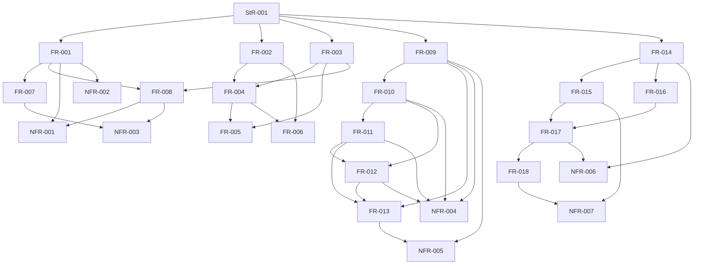

# Dependency review

## Summary

All stakeholder, functional, and non-functional requirements have one logical
classification and form an acyclic prerequisite graph. The issue #10 path starts
only after the architecture foundation, then snapshots inputs before inventory,
parity, impact, and final review.
The issue #4 path then pins its experimental slice before official/custom
emission, joins those paths at compatibility validation, and ends at a
human-gated recommendation.

## Findings

| ID | Severity | Summary | Refs |
|---|---|---|---|
| FND-005 | low | No dependency cycle exists; FR-001, FR-002, and FR-003 are the enabling foundation for the remaining architecture record. | FR-001, FR-002, FR-003 |
| FND-019 | low | No cycle or implementation-before-evidence edge exists in the feasibility slice; FR-018 depends on both emitter paths through FR-017. | FR-014..018 |

## Classification

| Requirement | Class | Rationale |
|---|---|---|
| StR-001 | Feature | Defines the stakeholder-visible governance outcome. |
| FR-001 | Enablement | Establishes record navigation, status, and supersession. |
| FR-002 | Enablement | Establishes concern-specific authority used by later sections. |
| FR-003 | Enablement | Establishes ownership boundaries used by packages and ADRs. |
| FR-004 | Feature | Documents the semantic metamodel and planes. |
| FR-005 | Feature | Documents the generated-package consumer contract. |
| FR-006 | Feature | Documents representations and transformations. |
| FR-007 | Feature | Documents compatibility, feasibility, review, and gates. |
| FR-008 | Feature | Records accepted and conditional decisions and conflicts. |
| NFR-001 | Cross-cutting | Constrains traceability across the record. |
| NFR-002 | Cross-cutting | Constrains readability across the record. |
| NFR-003 | Cross-cutting | Constrains every issue #8 change to documentation and evidence. |
| FR-009 | Enablement | Pins and qualifies every source used by the census. |
| FR-010 | Enablement | Builds the source-cited contract inventory used by all analysis. |
| FR-011 | Feature | Produces parity, conflict, and missing-contract dispositions. |
| FR-012 | Feature | Produces repository and concept impact recommendations. |
| FR-013 | Feature | Publishes the navigable acceptance review. |
| NFR-004 | Cross-cutting | Constrains census evidence to reproducible, validated output. |
| NFR-005 | Cross-cutting | Constrains all census work to read-only behavior. |
| FR-014 | Enablement | Pins the toolchain, packages, representative types, and source identity. |
| FR-015 | Enablement | Establishes official JSON Schema/Protobuf and diagnostic evidence. |
| FR-016 | Feature | Establishes the experimental semantic IR and native/projection outputs. |
| FR-017 | Integration | Joins official/custom outputs through native, golden, deterministic, and compatibility evidence. |
| FR-018 | Feature | Applies the pass rule and publishes a human-gated recommendation. |
| NFR-006 | Cross-cutting | Constrains the spike to pinned, deterministic, isolated, unpublished behavior. |
| NFR-007 | Cross-cutting | Constrains evidence and recommendation honesty after adverse results. |

## Dependency Graph

## Topological Order

1. FR-001, FR-002, and FR-003.
2. FR-004 and FR-007.
3. FR-005 and FR-006.
4. FR-008 and the issue #8 NFR verification gates.
5. FR-009, after the governed corpus baseline is pinned.
6. FR-010.
7. FR-011, then FR-012.
8. FR-013 with NFR-004 and NFR-005 as final issue #10 gates.
9. FR-014 after the architecture and census evidence is available.
10. FR-015 and FR-016 in parallel over the same pinned source.
11. FR-017, then FR-018 with NFR-006 and NFR-007 as final issue #4 gates.

## Cycles

None detected.
