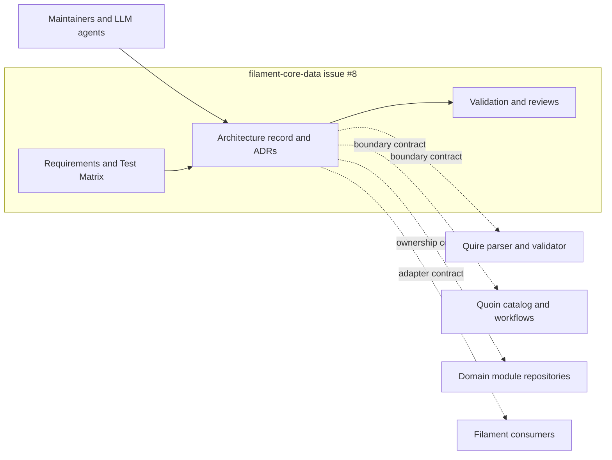

# Scope and boundary review

## Summary

The system under specification is the architecture record in
`filament-core-data`, not the future compiler or any consumer migration. Every
requirement has one owner and Quire, Quoin, module, and consumer boundaries are
explicit.

## Findings

| ID | Severity | Summary | Refs |
|---|---|---|---|
| FND-008 | low | No ownership ambiguity remains; external repository behavior is referenced as dated evidence or an assumed contract and is not reimplemented by issue #8. | FR-003, NFR-003 |

## System Context

## In-Scope Responsibilities

- Define and index architecture principles, vocabulary, mappings, compatibility,
  status, conflicts, and the staged roadmap.
- Record accepted ADRs and the conditional TypeSpec ADR.
- Prove structure, traceability, standalone readability, and non-disruption.

## External Dependencies

| Dependency | Type | Assumed or Guaranteed | Contract |
|---|---|---|---|
| Quire behavior and ADR corpus | Repository boundary | Assumed from dated source snapshot | quire-rs ADR-0003..0005, FR-002, FR-031, docs/USAGE.md |
| Quoin module/workflow ownership | Repository boundary | Assumed from dated source snapshot | quoin#289 and installed module contracts |
| Current Avro consumers | Compatibility boundary | Guaranteed only by existing repository tests | schema/avro/core-data.avpr and test/schema.test.ts |
| TypeSpec capability | Tool feasibility | Not yet guaranteed | filament-core-data#4 with JSON Schema fallback |
| Corpus fitness | Program evidence | Not yet guaranteed | filament-core-data#10 and quoin#288 |

## Responsibility Allocation

| Requirement | Owning Component | Class |
|---|---|---|
| StR-001 | Architecture record | core |
| FR-001 | Architecture index | core |
| FR-002 | Authority document and ADR | core |
| FR-003 | Ownership-boundary document and ADR | core |
| FR-004 | Metamodel document | core |
| FR-005 | Package-generation document and ADR | core |
| FR-006 | Representation/projection document and ADR | core |
| FR-007 | Compatibility, feasibility, review, and roadmap documents | cross-cutting |
| FR-008 | ADR index and conflict register | cross-cutting |
| NFR-001 | Validation evidence | cross-cutting |
| NFR-002 | Review evidence | cross-cutting |
| NFR-003 | Issue #8 merge gate | cross-cutting |
