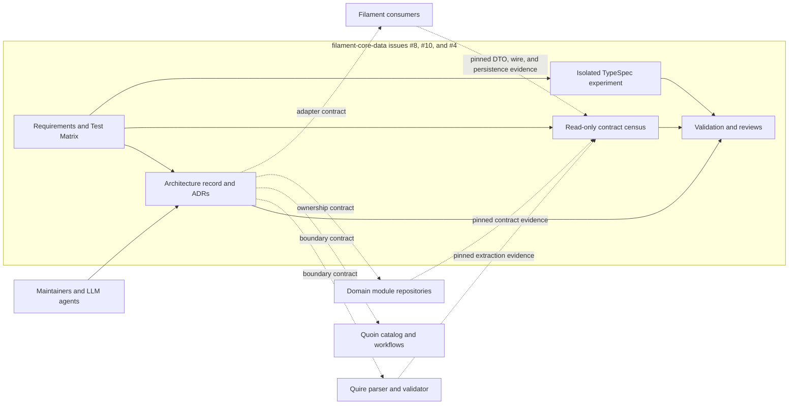

# Scope and boundary review

## Summary

The system under specification is the architecture record and read-only census
in `filament-core-data`, plus one isolated disposable feasibility compiler—not
the future production compiler or any consumer migration.
Every requirement has one owner; external repositories supply pinned evidence
and remain unchanged.

## Findings

| ID | Severity | Summary | Refs |
|---|---|---|---|
| FND-008 | low | No ownership ambiguity remains; external repository behavior is referenced as dated evidence or an assumed contract and is not reimplemented by issue #8. | FR-003, NFR-003 |
| FND-014 | low | Issue #10 owns evidence schemas, audit tooling, inventories, and review only; all examined contract definitions and operational systems remain external and unchanged. | FR-009..013, NFR-005 |
| FND-022 | low | Issue #4 owns experimental source/emitter/output/evidence only; official TypeSpec/native tools remain external and generated spike packages cannot become production or published by implication. | FR-014..018, NFR-006 |

## System Context

## In-Scope Responsibilities

- Define and index architecture principles, vocabulary, mappings, compatibility,
  status, conflicts, and the staged roadmap.
- Record accepted ADRs and the conditional TypeSpec ADR.
- Prove structure, traceability, standalone readability, and non-disruption.
- Snapshot pinned repositories, corpus/catalog inputs, active work, and access
  completeness without modifying their sources.
- Publish validated inventory, parity, conflict, impact, and acceptance-review
  evidence with explicit unknowns and confidence.
- Compile a pinned representative TypeSpec slice through official and disposable
  custom paths; retain native, golden, diagnostic, deterministic, compatibility,
  projection, cost, and recommendation evidence.
- Keep ADR promotion, production compiler selection, publication, consumer
  adoption, and migration outside the spike.

## External Dependencies

| Dependency | Type | Assumed or Guaranteed | Contract |
|---|---|---|---|
| Quire behavior and ADR corpus | Repository boundary | Assumed from dated source snapshot | quire-rs ADR-0003..0005, FR-002, FR-031, docs/USAGE.md |
| Quoin module/workflow ownership | Repository boundary | Assumed from dated source snapshot | quoin#289 and installed module contracts |
| Current Avro consumers | Compatibility boundary | Guaranteed only by existing repository tests | schema/avro/core-data.avpr and test/schema.test.ts |
| TypeSpec compiler/official emitters | Tool feasibility boundary | Guaranteed only at exact tested versions and for retained outputs | filament-core-data#4 with JSON Schema fallback |
| Native Rust/TypeScript/Python toolchains | External compiler boundary | Guaranteed only by exact command/version and successful spike build | FR-017, NFR-006 |
| Corpus fitness | Program evidence | Not yet guaranteed | filament-core-data#10 and quoin#288 |
| Repository and worktree state | Git source evidence | Assumed at recorded immutable HEAD; dirty state recorded separately | FR-009 snapshot |
| GitHub issues, PRs, and projects | Authenticated API evidence | Guaranteed only when access and complete enumeration are recorded | FR-009-AC-6, TC-088 |
| Governed corpus baseline | Pinned repository evidence | Guaranteed at the recorded quire-corpus revision | quire-rs#385, FR-009 |

## Responsibility Allocation

| Requirement | Owning Component | Class |
|---|---|---|
| StR-001 | Architecture record | core |
| FR-001 | Architecture index | core |
| FR-002 | Authority document and ADR | core |
| FR-003 | Ownership-boundary document and ADR | core |
| FR-004 | Metamodel document | core |
| FR-005 | Package-generation document and ADR | core |
| FR-006 | Representation/projection document and ADR | core |
| FR-007 | Compatibility, feasibility, review, and roadmap documents | cross-cutting |
| FR-008 | ADR index and conflict register | cross-cutting |
| NFR-001 | Validation evidence | cross-cutting |
| NFR-002 | Review evidence | cross-cutting |
| NFR-003 | Issue #8 merge gate | cross-cutting |
| FR-009 | Contract-census snapshot collector and evidence | infrastructure |
| FR-010 | Contract-census inventory | core |
| FR-011 | Contract parity and conflict analysis | core |
| FR-012 | Repository/concept impact analysis | core |
| FR-013 | Contract-census SpecReview | core |
| NFR-004 | Contract-census validation evidence | cross-cutting |
| NFR-005 | Issue #10 merge gate | cross-cutting |
| FR-014 | TypeSpec source/package fixture and toolchain inventory | infrastructure |
| FR-015 | Official JSON Schema/Protobuf compilation and diagnostics | infrastructure |
| FR-016 | Disposable semantic IR/native/projection emitter | core experiment |
| FR-017 | Determinism/native/golden/compatibility validation | integration |
| FR-018 | Feasibility report and proposed ADR resolution | decision evidence |
| NFR-006 | Issue #4 isolation/non-publication gate | cross-cutting |
| NFR-007 | Adverse-result evidence gate | cross-cutting |
